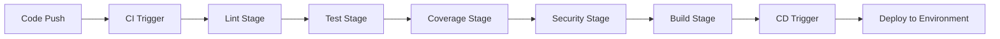

# 🔄 CI/CD Pipeline Documentation

This document describes the comprehensive CI/CD pipeline setup for the VAS-DJ SaaS Backend project.

## 📋 Table of Contents

- [Overview](#overview)
- [Pipeline Architecture](#pipeline-architecture)
- [Local Development](#local-development)
- [CI Pipeline](#ci-pipeline)
- [CD Pipeline](#cd-pipeline)
- [Security](#security)
- [Troubleshooting](#troubleshooting)
- [Configuration](#configuration)

## 🎯 Overview

The CI/CD pipeline provides:

- **Automated code quality checks** (linting, formatting, type checking)
- **Comprehensive testing** with coverage reporting
- **Security scanning** (vulnerabilities, secrets, container security)
- **Multi-platform Docker builds**
- **Cloud-agnostic deployment** (AWS, GCP, Azure, Cloudflare, Docker Registry)
- **Local validation scripts** for monorepo compatibility

### Key Features

✅ **Auto-fixing pre-commit hooks** (won't block commits)  
✅ **Multi-stage CI pipeline**: Lint → Test → Coverage → Security → Build  
✅ **Cloud-agnostic CD** with environment-based deployments  
✅ **Local scripts** that mirror CI pipeline  
✅ **Security-first approach** with multiple scanning tools  
✅ **Monorepo friendly** with path-based triggers  

## 🏗️ Pipeline Architecture



### CI Stages

1. **🎨 Lint**: Code formatting, import sorting, linting, type checking
2. **🧪 Test**: Unit and integration tests with database
3. **📊 Coverage**: Test coverage analysis with reporting
4. **🔒 Security**: Vulnerability scanning, secret detection, container security
5. **🏗️ Build**: Docker image build and validation

### CD Stages

1. **🔍 Pre-deploy**: Environment and condition checks
2. **📦 Artifacts**: Download and prepare deployment artifacts
3. **☁️ Deploy**: Cloud-specific deployment (AWS/GCP/Azure/Cloudflare)
4. **✅ Validate**: Post-deployment validation and reporting

## 🚀 Local Development

### Initial Setup

```bash
# Clone the repository
git clone <repository-url>
cd backend

# Setup development environment
make dev-setup

# This will:
# - Install Python dependencies
# - Install pre-commit hooks
# - Setup development tools
```

### Pre-commit Hooks

The pre-commit hooks will automatically:

- Format code with **Black**
- Sort imports with **isort**
- Fix common issues with **Ruff**
- Check YAML/JSON/TOML files
- Run Django system checks

```bash
# Install hooks
make pre-commit-install

# Run manually
make pre-commit-run

# Test all hooks
pre-commit run --all-files
```

### Local Validation Scripts

Run the same checks as CI pipeline locally:

```bash
# Complete pipeline
make ci-pipeline
./scripts/ci-cd.sh

# Individual stages
make lint              # Code quality
make test-ci           # Tests
make test-coverage-ci  # Coverage
make security          # Security scanning
make build-docker      # Docker build

# With options
./scripts/lint.sh --fix              # Auto-fix issues
./scripts/test.sh --parallel         # Parallel tests
./scripts/security.sh --strict       # Strict security
./scripts/build.sh --push            # Build and push
```

### Monorepo Usage

Scripts detect changes and can be run from monorepo root:

```bash
# From monorepo root
./backend/scripts/ci-cd.sh

# Or use make from backend directory
cd backend && make ci-pipeline
```

## 🔄 CI Pipeline

### Trigger Conditions

The CI pipeline runs on:

- **Push** to `main`, `develop`, `feat/**`, `fix/**`, `hotfix/**`
- **Pull requests** to `main`, `develop`
- **Manual dispatch** with options
- **Path filter**: Only when `backend/**` files change

### Environment Variables

Required for CI:

```yaml
env:
  SECRET_KEY: test-secret-key-for-ci
  DB_NAME: test_db
  DB_USER: test_user
  DB_PASSWORD: test_password
  DB_HOST: localhost
  DB_PORT: 5432
  REDIS_URL: redis://localhost:6379/0
```

### Services

CI pipeline uses:

- **PostgreSQL 16** for database tests
- **Redis 7** for caching tests
- **Docker** for container builds

### Artifacts

Generated artifacts:

- **Test reports**: `pytest-report.xml`
- **Coverage reports**: `coverage.xml`, `htmlcov/`
- **Security reports**: `bandit-report.json`, `safety-report.json`
- **Docker image**: `vas-dj-backend:latest`

### Quality Gates

- **Code formatting**: Must pass Black/isort checks
- **Linting**: Must pass Ruff checks
- **Tests**: All tests must pass
- **Coverage**: Minimum 75% coverage required
- **Security**: No critical vulnerabilities

## 🚀 CD Pipeline

### Deployment Strategy

Cloud-agnostic approach with support for:

- **AWS**: ECR + ECS/EKS
- **Google Cloud**: GCR + Cloud Run
- **Azure**: ACR + Container Instances
- **Cloudflare**: Workers/Pages
- **Generic Docker Registry**

### Environment Configuration

Set up repository variables and secrets:

#### Variables
```yaml
# AWS
AWS_REGION: us-east-1
ECR_REPOSITORY: vas-dj-backend

# GCP
GCP_PROJECT_ID: your-project-id
GCP_REGION: us-central1

# Azure
AZURE_REGISTRY_NAME: yourregistry

# Docker Registry
DOCKER_REGISTRY_URL: docker.io
DOCKER_REPOSITORY: vas-dj-backend
```

#### Secrets
```yaml
# AWS
AWS_ACCESS_KEY_ID: <access-key>
AWS_SECRET_ACCESS_KEY: <secret-key>

# GCP
GCP_SERVICE_ACCOUNT_KEY: <service-account-json>

# Azure
AZURE_CREDENTIALS: <azure-credentials-json>

# Cloudflare
CLOUDFLARE_API_TOKEN: <api-token>
CLOUDFLARE_ACCOUNT_ID: <account-id>

# Docker Registry
DOCKER_USERNAME: <username>
DOCKER_PASSWORD: <password>
```

### Deployment Triggers

- **Automatic**: After successful CI on `main`/`develop`
- **Manual**: Via workflow dispatch with environment selection
- **Environment-specific**: Different configurations per environment

### Deployment Process

1. **Download** CI artifacts
2. **Load** Docker image
3. **Tag** with commit SHA and latest
4. **Push** to cloud-specific registry
5. **Deploy** using cloud-specific tools
6. **Validate** deployment success

## 🔒 Security

### Security Scanning Tools

1. **Bandit**: Python security linter
2. **Safety**: Known vulnerability scanner
3. **CodeQL**: GitHub security analysis
4. **Trivy**: Container vulnerability scanner
5. **Secret detection**: Pattern-based secret scanning

### Security Features

- **Dependency scanning**: Check for known vulnerabilities
- **Code analysis**: Static security analysis
- **Container security**: Multi-layer container scanning
- **Secret detection**: Prevent credential leaks
- **Security reporting**: Detailed vulnerability reports

### Security Configuration

```toml
# pyproject.toml
[tool.bandit]
exclude_dirs = ["tests", "*/migrations/*", "venv", ".venv"]
skips = ["B101", "B601"]  # Skip assert_used and shell injection in tests

[tool.bandit.assert_used]
skips = ["**/test_*.py", "**/tests/*"]
```

### Security Best Practices

- **Environment variables** for secrets
- **Non-root container** user
- **Minimal base images**
- **Regular dependency updates**
- **Security scanning in CI**

## 🔧 Troubleshooting

### Common Issues

#### 1. Pre-commit Hooks Failing

```bash
# Update hooks
pre-commit autoupdate

# Run specific hook
pre-commit run black --all-files

# Skip hooks temporarily
git commit --no-verify
```

#### 2. Tests Failing Locally

```bash
# Check Docker services
docker compose -f docker/docker-compose.yml ps

# Restart services
docker compose -f docker/docker-compose.yml restart

# Check environment variables
./scripts/test.sh --verbose
```

#### 3. Security Scans Failing

```bash
# Update security databases
safety check --full-report

# Ignore specific vulnerabilities
# Add to .safety-policy.yml

# Check Bandit configuration
bandit -r . -v
```

#### 4. Docker Build Issues

```bash
# Clean Docker cache
docker system prune -f

# Build with no cache
docker build --no-cache -f docker/Dockerfile .

# Check Dockerfile syntax
hadolint docker/Dockerfile
```

#### 5. CI Pipeline Failures

- Check **GitHub Actions logs**
- Verify **environment variables**
- Check **service availability**
- Review **artifact uploads**

### Debug Commands

```bash
# Verbose pipeline run
./scripts/ci-cd.sh --verbose

# Run single stage
./scripts/ci-cd.sh --stage lint --verbose

# Continue on failures
./scripts/ci-cd.sh --no-fail-fast

# Skip problematic stage
./scripts/ci-cd.sh --skip-build
```

### Log Analysis

```bash
# CI logs location
cat pytest-report.xml
cat bandit-report.json
open htmlcov/index.html

# Local debug
./scripts/test.sh --verbose
./scripts/security.sh --verbose
```

## ⚙️ Configuration

### Development Tools Configuration

All tools are configured in `pyproject.toml`:

```toml
[tool.black]
line-length = 88
target-version = ['py311']

[tool.isort]
profile = "black"
known_django = "django"

[tool.ruff]
target-version = "py311"
select = ["E", "W", "F", "I", "B", "C4", "UP"]

[tool.mypy]
python_version = "3.11"
plugins = ["mypy_django_plugin.main"]

[tool.coverage.run]
source = "."
omit = ["*/migrations/*", "*/tests/*"]
```

### CI/CD Configuration Files

- **`.github/workflows/ci.yml`**: CI pipeline
- **`.github/workflows/cd.yml`**: CD pipeline
- **`.pre-commit-config.yaml`**: Pre-commit hooks
- **`scripts/`**: Local validation scripts
- **`Makefile`**: Convenience commands

### Environment-Specific Settings

```bash
# Development
export DJANGO_SETTINGS_MODULE=config.settings.development

# Testing
export DJANGO_SETTINGS_MODULE=config.settings.test

# Production
export DJANGO_SETTINGS_MODULE=config.settings.production
```

## 📚 Additional Resources

- [Django Best Practices](https://django-best-practices.readthedocs.io/)
- [Docker Security](https://docs.docker.com/engine/security/)
- [GitHub Actions Documentation](https://docs.github.com/en/actions)
- [Pre-commit Documentation](https://pre-commit.com/)

## 🆘 Getting Help

1. **Check logs** in GitHub Actions
2. **Run locally** with verbose output
3. **Review documentation** above
4. **Open issue** with reproduction steps

---

**Last Updated**: October 15, 2025  
**Version**: 1.0.0  
**Maintainer**: Backend Team
