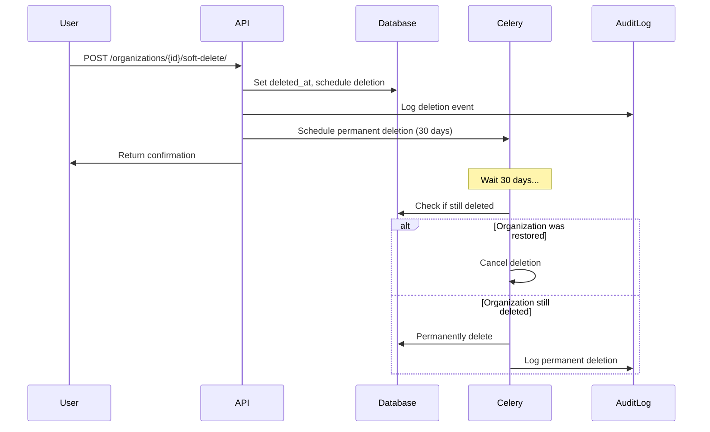

# GDPR Compliance Guide

Comprehensive guide to GDPR (General Data Protection Regulation) compliance features in the VAS-DJ SaaS platform.

## Table of Contents
1. [Overview](#overview)
2. [GDPR Rights Implementation](#gdpr-rights-implementation)
3. [Tenant/Organization Deletion](#tenantorganization-deletion)
4. [User Data Management](#user-data-management)
5. [Data Retention Policies](#data-retention-policies)
6. [API Endpoints](#api-endpoints)
7. [Audit Trail](#audit-trail)
8. [Compliance Checklist](#compliance-checklist)

---

## Overview

The VAS-DJ platform implements GDPR-compliant data management features:

- **Right to Erasure (Art. 17)**: Soft delete with 30-day grace period
- **Right to Data Portability (Art. 20)**: Comprehensive data export
- **Right to Access (Art. 15)**: User can access their personal data
- **Data Minimization (Art. 5.1c)**: Only collect necessary data
- **Storage Limitation (Art. 5.1e)**: Automatic deletion after retention period
- **Accountability (Art. 5.2)**: Comprehensive audit logging

---

## GDPR Rights Implementation

### 1. Right to Access (Article 15)

Users can access all their personal data via API.

**Implementation:**
```python
# GET /api/v1/accounts/users/me/
{
  "id": "uuid",
  "email": "user@example.com",
  "first_name": "John",
  "last_name": "Doe",
  "organizations": [...],
  "created_at": "2025-01-16T10:00:00Z"
}
```

**Code Example:**
```python
from apps.accounts.models import Account

user = Account.objects.get(email='user@example.com')
user_data = {
    'personal_info': {
        'email': user.email,
        'name': user.full_name,
        'phone': user.phone,
    },
    'organizations': user.get_organizations(),
    'auth_providers': list(user.auth_providers.values()),
}
```

### 2. Right to Data Portability (Article 20)

Users can export all their data in machine-readable format (JSON).

**Implementation:**
```bash
# POST /api/v1/organizations/{id}/export-data/
```

**What's Exported:**
- Organization details
- All memberships
- All invites
- Audit logs (last 1000 entries)
- Metadata (timestamps, settings)

**Example Export:**
```json
{
  "organization": {
    "id": "uuid",
    "name": "Acme Corp",
    "slug": "acme-corp",
    "created_at": "2025-01-16T10:00:00Z"
  },
  "members": [
    {
      "email": "user@example.com",
      "role": "owner",
      "joined_at": "2025-01-16T10:00:00Z"
    }
  ],
  "audit_logs": [...],
  "exported_at": "2025-01-16T12:00:00Z",
  "requester": "admin@example.com"
}
```

**Celery Task:**
```python
from apps.organizations.tasks import export_organization_data

# Trigger export
task = export_organization_data.delay(
    organization_id=str(org.id),
    requester_email='admin@example.com'
)
```

### 3. Right to Erasure (Article 17)

Users can request deletion of their data ("right to be forgotten").

**Implementation: Two-Stage Deletion**

#### Stage 1: Soft Delete (30-day grace period)
```bash
# POST /api/v1/organizations/{id}/soft-delete/
{
  "reason": "User requested account closure"
}
```

**What Happens:**
1. `deleted_at` timestamp set
2. `is_active` set to `False`
3. Scheduled permanent deletion after 30 days
4. Audit log created
5. Celery task scheduled

#### Stage 2: Permanent Delete (after 30 days)
- Automatically executed by Celery Beat (daily at 2 AM)
- Irreversible - all data permanently deleted
- Cascades to all related data (memberships, invites, etc.)

**Manual Trigger (Admin Only):**
```python
from apps.organizations.models import Organization

org = Organization.objects.get(id='uuid')
org.permanently_delete()  # Irreversible!
```

### 4. Right to Rectification (Article 16)

Users can update their personal data at any time.

**Implementation:**
```bash
# PATCH /api/v1/accounts/users/update_profile/
{
  "first_name": "Jane",
  "last_name": "Smith",
  "phone": "+1234567890"
}
```

### 5. Right to Restriction of Processing (Article 18)

Users can restrict processing of their data (account suspension).

**Implementation:**
```python
from apps.accounts.models import Account

user = Account.objects.get(email='user@example.com')
user.is_active = False  # Restrict processing
user.save()

# User can still login to reactivate account
```

### 6. Right to Object (Article 21)

Users can object to data processing (opt-out of emails, notifications).

**Implementation:**
```python
# Email preferences
user.email_preferences = {
    'marketing': False,  # Opt-out of marketing emails
    'transactional': True,  # Can't opt-out of critical emails
    'newsletters': False,
}
user.save()
```

---

## Tenant/Organization Deletion

### Soft Delete Workflow



### Code Example: Soft Delete

```python
from apps.organizations.models import Organization

# Soft delete
org = Organization.objects.get(id='uuid')
org.soft_delete(
    deleted_by=request.user,
    reason='Customer requested account closure'
)

# Check deletion status
print(f"Deleted at: {org.deleted_at}")
print(f"Permanent deletion scheduled: {org.scheduled_permanent_deletion}")
print(f"Can be restored: {org.can_be_restored()}")
```

### Code Example: Restore

```python
# Restore within 30-day grace period
if org.can_be_restored():
    org.restore(restored_by=request.user)
    print("Organization restored successfully")
else:
    print("Cannot restore - grace period expired")
```

### Code Example: Check Status

```bash
# GET /api/v1/organizations/{id}/deletion-status/
{
  "is_deleted": true,
  "deleted_at": "2025-01-16T10:00:00Z",
  "deleted_by": "admin@example.com",
  "deletion_reason": "User requested account closure",
  "scheduled_permanent_deletion": "2025-02-15T10:00:00Z",
  "can_be_restored": true,
  "days_until_permanent_deletion": 30
}
```

---

## User Data Management

### User Anonymization

For individual user deletion (not entire organization):

```python
from apps.organizations.tasks import anonymize_user_data

# Trigger anonymization
task = anonymize_user_data.delay(
    user_id=str(user.id),
    reason='User requested account deletion'
)
```

**What's Anonymized:**
- Email → `deleted_<hash>@anonymized.local`
- Name → "Deleted User"
- Phone, bio, avatar → Cleared
- Auth providers → Deleted
- Account → Deactivated

**What's Preserved:**
- User ID (for referential integrity)
- Audit logs (for compliance)
- Organization memberships (anonymized)

### GDPR-Compliant User Deletion

```python
from apps.accounts.models import Account

user = Account.objects.get(email='user@example.com')

# Option 1: Anonymize (preserves audit trail)
from apps.organizations.tasks import anonymize_user_data
anonymize_user_data.delay(str(user.id), reason='GDPR request')

# Option 2: Hard delete (not recommended - breaks audit trail)
user.delete()  # Use only if legally required
```

---

## Data Retention Policies

### Automatic Cleanup Schedule

| Data Type | Retention Period | Cleanup Method |
|-----------|------------------|----------------|
| **Soft-deleted organizations** | 30 days | Automatic (Celery Beat) |
| **Audit logs** | 7 years | Manual archive to S3 |
| **Email verification tokens** | 24 hours | Automatic expiration |
| **Password reset tokens** | 1 hour | Automatic expiration |
| **Session data** | 2 weeks | Redis TTL |
| **Temporary exports** | 7 days | Cron job cleanup |

### Celery Beat Schedule

```python
# config/celery.py

app.conf.beat_schedule = {
    'cleanup-expired-deletions': {
        'task': 'apps.organizations.tasks.cleanup_expired_deletions',
        'schedule': crontab(hour=2, minute=0),  # Daily at 2 AM
    },
}
```

### Manual Cleanup (Admin)

```python
# Run cleanup manually
from apps.organizations.tasks import cleanup_expired_deletions

result = cleanup_expired_deletions.delay()
print(result.get())  # {'deleted_count': 5, 'error_count': 0}
```

---

## API Endpoints

### Organization Deletion & Restoration

#### Soft Delete Organization
```http
POST /api/v1/organizations/{id}/soft-delete/
Content-Type: application/json
Authorization: Bearer <token>

{
  "reason": "Customer requested account closure"
}
```

**Response:**
```json
{
  "message": "Organization has been scheduled for deletion.",
  "organization_id": "uuid",
  "deleted_at": "2025-01-16T10:00:00Z",
  "scheduled_permanent_deletion": "2025-02-15T10:00:00Z",
  "grace_period_days": 30
}
```

#### Restore Organization
```http
POST /api/v1/organizations/{id}/restore/
Authorization: Bearer <token>
```

**Response:**
```json
{
  "message": "Organization has been restored successfully.",
  "organization_id": "uuid",
  "is_active": true
}
```

#### Check Deletion Status
```http
GET /api/v1/organizations/{id}/deletion-status/
Authorization: Bearer <token>
```

**Response:**
```json
{
  "is_deleted": true,
  "deleted_at": "2025-01-16T10:00:00Z",
  "deleted_by": "admin@example.com",
  "deletion_reason": "User requested account closure",
  "scheduled_permanent_deletion": "2025-02-15T10:00:00Z",
  "can_be_restored": true,
  "days_until_permanent_deletion": 30
}
```

### Data Export

#### Export Organization Data
```http
POST /api/v1/organizations/{id}/export-data/
Authorization: Bearer <token>
```

**Response:**
```json
{
  "message": "Data export has been initiated. You will receive an email when the export is ready.",
  "task_id": "celery-task-uuid",
  "organization_id": "uuid"
}
```

---

## Audit Trail

All deletion and export operations are logged for compliance.

### Audit Log Structure

```python
from apps.core.models import AuditLog

# Example audit log for soft delete
{
    'event_type': 'data_deletion',
    'resource_type': 'organization',
    'resource_id': 'uuid',
    'user_email': 'admin@example.com',
    'outcome': 'success',
    'details': {
        'action': 'soft_delete',
        'reason': 'User requested account closure',
        'scheduled_permanent_deletion': '2025-02-15T10:00:00Z'
    },
    'created_at': '2025-01-16T10:00:00Z'
}
```

### Query Audit Logs

```python
from apps.core.models import AuditLog
from datetime import timedelta
from django.utils import timezone

# Get all deletion events in last 30 days
deletions = AuditLog.objects.filter(
    event_type='data_deletion',
    created_at__gte=timezone.now() - timedelta(days=30)
).values('user_email', 'resource_type', 'details', 'created_at')

# Get all data exports
exports = AuditLog.objects.filter(
    event_type='data_export',
    created_at__gte=timezone.now() - timedelta(days=90)
).values('user_email', 'details', 'created_at')
```

### Audit Reports (SOC2 Compliance)

```bash
# Generate monthly audit report
python manage.py shell

from apps.core.models import AuditLog
from datetime import datetime

month = '2025-01'
logs = AuditLog.objects.filter(
    created_at__startswith=month,
    event_type__in=['data_deletion', 'data_export', 'data_restoration']
)

print(f"Total GDPR events: {logs.count()}")
print(f"Deletions: {logs.filter(event_type='data_deletion').count()}")
print(f"Exports: {logs.filter(event_type='data_export').count()}")
print(f"Restorations: {logs.filter(event_type='data_restoration').count()}")
```

---

## Compliance Checklist

### GDPR Requirements

- [x] **Art. 15: Right to Access**
  - Users can view their personal data via API
  - Implemented: `GET /api/v1/accounts/users/me/`

- [x] **Art. 16: Right to Rectification**
  - Users can update their personal data
  - Implemented: `PATCH /api/v1/accounts/users/update_profile/`

- [x] **Art. 17: Right to Erasure**
  - Soft delete with 30-day grace period
  - Automatic permanent deletion after retention period
  - Implemented: `POST /api/v1/organizations/{id}/soft-delete/`

- [x] **Art. 18: Right to Restriction**
  - Account suspension feature
  - Implemented: `is_active` flag

- [x] **Art. 20: Right to Data Portability**
  - Comprehensive JSON export
  - Implemented: `POST /api/v1/organizations/{id}/export-data/`

- [x] **Art. 21: Right to Object**
  - Email opt-out preferences
  - Implemented: Email preferences model

- [x] **Art. 32: Security of Processing**
  - Encryption at rest (database)
  - Encryption in transit (HTTPS)
  - Audit logging
  - Implemented: See [DEPLOYMENT-PLAYBOOK.md](./DEPLOYMENT-PLAYBOOK.md)

- [x] **Art. 33: Breach Notification**
  - Incident response procedures
  - Audit log for security events
  - Implemented: See [RUNBOOK.md](./RUNBOOK.md)

### SOC2 Requirements

- [x] **CC6.1: Logical Access Controls**
  - Role-based permissions
  - Audit logging for all access

- [x] **CC7.2: System Monitoring**
  - Prometheus metrics
  - Sentry error tracking

- [x] **CC8.1: Change Management**
  - Audit logs for all data changes
  - Deployment procedures documented

- [x] **CC9.2: Risk Mitigation**
  - Automated backups
  - Disaster recovery procedures

---

## Testing GDPR Compliance

### Test Soft Delete

```python
from apps.organizations.models import Organization
from apps.accounts.models import Account
from django.utils import timezone

# Create test organization
user = Account.objects.create_user(email='test@example.com')
org = Organization.objects.create(
    name='Test Org',
    slug='test-org',
    sub_domain='test-org',
    creator_email=user.email
)

# Soft delete
org.soft_delete(deleted_by=user, reason='Test deletion')

# Verify soft delete
assert org.is_deleted() == True
assert org.deleted_at is not None
assert org.scheduled_permanent_deletion is not None
assert org.can_be_restored() == True

# Restore
org.restore(restored_by=user)

# Verify restoration
assert org.is_deleted() == False
assert org.is_active == True
```

### Test Data Export

```python
from apps.organizations.tasks import export_organization_data

# Trigger export
result = export_organization_data(str(org.id), user.email)

# Verify export
assert result['status'] == 'success'
assert 'export_filename' in result
```

### Test Permanent Deletion

```python
from apps.organizations.tasks import cleanup_expired_deletions
from datetime import timedelta

# Create expired deletion
org.deleted_at = timezone.now() - timedelta(days=31)
org.scheduled_permanent_deletion = timezone.now() - timedelta(days=1)
org.save()

# Run cleanup
result = cleanup_expired_deletions()

# Verify deletion
assert result['deleted_count'] >= 1
assert not Organization.objects.filter(id=org.id).exists()
```

---

## Production Deployment

### Pre-Deployment Checklist

1. **Run Migrations**
   ```bash
   make migrate
   ```

2. **Verify Celery Beat**
   ```bash
   docker compose -f ./docker/docker-compose.yml ps celery-beat
   ```

3. **Test Deletion Flow on Staging**
   ```bash
   # Create test org, soft delete, verify scheduled task
   ```

4. **Configure Email Templates**
   - Data export notification email
   - Deletion confirmation email

5. **Set Up Monitoring**
   - Sentry alerts for failed deletions
   - Prometheus metrics for deletion count

### Post-Deployment Verification

```bash
# Verify Celery Beat schedule
python manage.py shell
>>> from config.celery import app
>>> print(app.conf.beat_schedule)

# Verify migrations
python manage.py showmigrations organizations

# Test API endpoints
curl -X POST https://api.yourdomain.com/api/v1/organizations/{id}/soft-delete/ \
  -H "Authorization: Bearer $TOKEN" \
  -d '{"reason": "Test"}'
```

---

## Legal Considerations

### Data Processing Agreements (DPA)

Ensure your DPA includes:
- 30-day data retention after deletion request
- Audit log retention for 7 years
- Sub-processor list (AWS, Sentry, etc.)

### Privacy Policy Updates

Update your privacy policy to include:
- How users can request data deletion
- 30-day grace period for organization deletion
- Data retention periods
- Contact information for GDPR requests

### GDPR Request Handling

**Email Template for GDPR Requests:**
```
Subject: GDPR Data Deletion Request - [Organization Name]

Dear [User Name],

We have received your request to delete your organization and all associated data.

Your organization "[Organization Name]" has been scheduled for deletion.

Important Information:
- Deletion scheduled: [Date + 30 days]
- You have 30 days to restore your organization if you change your mind
- To restore, login and visit: [Restore URL]
- After 30 days, all data will be permanently deleted and cannot be recovered

If you have any questions, please contact support@yourdomain.com

Best regards,
VAS-DJ Support Team
```

---

## Monitoring & Alerting

### Key Metrics to Monitor

1. **Deletion Queue Length**
   - Alert if > 100 pending deletions

2. **Failed Deletion Tasks**
   - Alert immediately for any failures

3. **Restore Requests**
   - Track restoration rate (% of soft deletes that are restored)

4. **Export Request Volume**
   - Monitor for abuse/excessive requests

### Grafana Dashboard

Create a dashboard with:
- Total soft-deleted organizations
- Organizations scheduled for permanent deletion (next 7 days)
- Failed deletion tasks (last 24 hours)
- Data export requests (last 30 days)

---

## FAQ

### Q: Can a user restore their organization after 30 days?
**A:** No. After 30 days, the organization is permanently deleted and cannot be restored. This is enforced by the `can_be_restored()` method.

### Q: What happens to audit logs after organization deletion?
**A:** Audit logs are preserved for 7 years for compliance purposes, even after organization deletion.

### Q: Can I manually trigger permanent deletion before 30 days?
**A:** Yes, as a superuser, you can call `organization.permanently_delete()`, but this should only be done in exceptional cases (e.g., legal requirement).

### Q: What if a Celery task fails to delete an organization?
**A:** The task will retry 3 times with exponential backoff. If it still fails, an error will be logged and you should investigate manually. The daily cleanup task will also attempt to delete expired organizations.

### Q: Can users export data for a deleted organization?
**A:** Yes, as long as the organization is still in the 30-day grace period. After permanent deletion, no data is available.

---

**Document Version:** 1.0
**Last Updated:** 2025-01-16
**Owner:** Engineering & Legal Teams
**Review Schedule:** Quarterly (or when GDPR regulations change)
