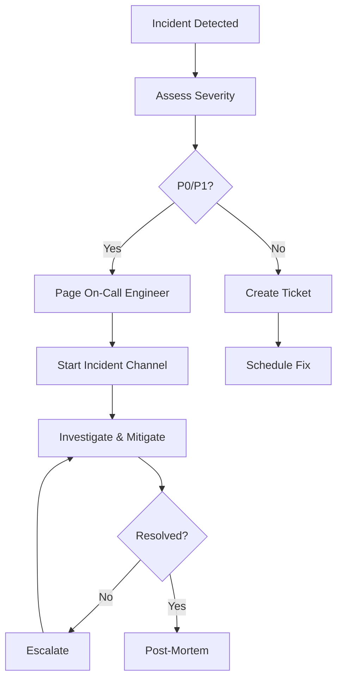

# Runbook & Recovery Documentation

Incident response and operational procedures for VAS-DJ SaaS platform.

## Table of Contents
1. [Incident Response Overview](#incident-response-overview)
2. [Common Incidents & Resolutions](#common-incidents--resolutions)
3. [Database Issues](#database-issues)
4. [Application Issues](#application-issues)
5. [Infrastructure Issues](#infrastructure-issues)
6. [Recovery Procedures](#recovery-procedures)
7. [Audit Evidence Storage](#audit-evidence-storage)
8. [SOC2 Operational Readiness](#soc2-operational-readiness)

---

## Incident Response Overview

### Severity Levels

| Severity | Definition | Response Time | Examples |
|----------|-----------|---------------|----------|
| **P0 - Critical** | Complete service outage | 15 minutes | Database down, authentication broken, data loss |
| **P1 - High** | Major feature unavailable | 1 hour | API endpoint 500s, Celery workers down |
| **P2 - Medium** | Minor feature degraded | 4 hours | Slow queries, partial feature unavailable |
| **P3 - Low** | Cosmetic or low-impact | 24 hours | UI glitch, logging issue |

### Incident Response Process



### On-Call Escalation
1. **Primary On-Call**: Paged via PagerDuty
2. **Secondary On-Call**: Escalate after 15 minutes
3. **Engineering Manager**: Escalate after 30 minutes
4. **CTO**: Escalate for P0 incidents > 1 hour

---

## Common Incidents & Resolutions

### 1. High Error Rate (5xx Errors)

**Symptoms:**
- Sentry alert: Error rate > 5%
- User reports: "Something went wrong" errors
- Monitoring: 5xx response codes spiking

**Investigation:**
```bash
# Check Sentry for recent errors
open https://sentry.io/vas-dj-saas/

# Check application logs
ssh prod-web-1
tail -f /var/log/gunicorn/error.log

# Check Django debug logs
tail -f /var/log/vas-dj-saas/django.log

# Check system resources
htop
df -h  # Disk space
free -m  # Memory
```

**Common Causes & Fixes:**

#### a) Out of Memory (OOM)
```bash
# Check memory usage
free -m

# Check for OOM killer logs
dmesg | grep -i "out of memory"

# Restart Gunicorn workers
sudo systemctl restart gunicorn

# Scale up workers if needed (edit gunicorn config)
sudo vim /etc/systemd/system/gunicorn.service
# workers = (2 * CPU_CORES) + 1
```

#### b) Database Connection Pool Exhausted
```bash
# Check active database connections
psql -h $DB_HOST -U $DB_USER -d $DB_NAME -c \
  "SELECT count(*) FROM pg_stat_activity;"

# Check max connections
psql -h $DB_HOST -U $DB_USER -d $DB_NAME -c \
  "SHOW max_connections;"

# Kill idle connections (if needed)
psql -h $DB_HOST -U $DB_USER -d $DB_NAME -c \
  "SELECT pg_terminate_backend(pid) FROM pg_stat_activity
   WHERE state = 'idle' AND state_change < NOW() - INTERVAL '10 minutes';"

# Increase connection pool (edit settings.py)
DATABASES = {
    'default': {
        'CONN_MAX_AGE': 600,
        'CONN_HEALTH_CHECKS': True,
    }
}
```

#### c) Unhandled Exception in Code
```bash
# Check Sentry for stack traces
# Identify offending endpoint
# Deploy hotfix or rollback

# Emergency rollback
cd /var/www/vas-dj-saas
git log --oneline -5
git checkout <previous-commit>
sudo systemctl reload gunicorn
```

---

### 2. Slow Response Times (High Latency)

**Symptoms:**
- Monitoring: p95 latency > 2 seconds
- User reports: "App is slow"
- APM tool: Slow traces

**Investigation:**
```bash
# Check database query performance
psql -h $DB_HOST -U $DB_USER -d $DB_NAME -c \
  "SELECT query, calls, total_exec_time, mean_exec_time
   FROM pg_stat_statements
   ORDER BY total_exec_time DESC
   LIMIT 10;"

# Check Redis latency
redis-cli --latency

# Check Celery queue backlog
celery -A config inspect active_queues

# Check disk I/O
iostat -x 1 10
```

**Common Causes & Fixes:**

#### a) N+1 Query Problem
```python
# Bad: N+1 queries
organizations = Organization.objects.all()
for org in organizations:
    print(org.owner.email)  # Additional query per org

# Good: Use select_related
organizations = Organization.objects.select_related('owner').all()
for org in organizations:
    print(org.owner.email)  # No additional queries
```

#### b) Missing Database Index
```bash
# Identify slow queries
psql -h $DB_HOST -U $DB_USER -d $DB_NAME -c \
  "SELECT schemaname, tablename, indexname
   FROM pg_indexes
   WHERE tablename = 'accounts_account';"

# Add index concurrently (no downtime)
psql -h $DB_HOST -U $DB_USER -d $DB_NAME -c \
  "CREATE INDEX CONCURRENTLY idx_accounts_email
   ON accounts_account(email);"
```

#### c) Cache Miss Rate High
```bash
# Check Redis cache stats
redis-cli INFO stats | grep keyspace

# Warm up cache
python manage.py shell
>>> from django.core.cache import cache
>>> # Re-populate critical cache keys
```

---

### 3. Authentication Issues (Users Can't Login)

**Symptoms:**
- User reports: "Can't login"
- Sentry: AuthenticationFailed errors
- Monitoring: /api/v1/auth/login/ 401s

**Investigation:**
```bash
# Check audit logs for failed login attempts
python manage.py shell
>>> from apps.core.models import AuditLog
>>> AuditLog.objects.filter(
...     event_type='authentication',
...     outcome='failure',
...     created_at__gte=now() - timedelta(hours=1)
... ).values('user_email', 'details')

# Check account status
>>> from apps.accounts.models import Account
>>> Account.objects.filter(email='user@example.com').values(
...     'is_active', 'is_verified', 'is_suspended'
... )
```

**Common Causes & Fixes:**

#### a) Account Locked/Suspended
```python
# Unlock account
python manage.py shell
>>> from apps.accounts.models import Account
>>> user = Account.objects.get(email='user@example.com')
>>> user.is_suspended = False
>>> user.failed_login_attempts = 0
>>> user.save()
```

#### b) JWT Token Expired
```python
# Verify JWT settings
>>> from django.conf import settings
>>> settings.SIMPLE_JWT['ACCESS_TOKEN_LIFETIME']  # Should be timedelta(minutes=60)
>>> settings.SIMPLE_JWT['REFRESH_TOKEN_LIFETIME']  # Should be timedelta(days=1)

# User needs to refresh token
# Frontend should call /api/v1/auth/token/refresh/
```

#### c) Redis Down (Session Storage)
```bash
# Check Redis status
redis-cli ping
# Should return "PONG"

# Restart Redis if needed
sudo systemctl restart redis

# Verify Django can connect
python manage.py shell
>>> from django.core.cache import cache
>>> cache.set('test', 'value')
>>> cache.get('test')
```

---

### 4. Celery Tasks Not Processing

**Symptoms:**
- User reports: Emails not sent, background jobs stuck
- Monitoring: Celery queue length growing
- Celery Flower: No active workers

**Investigation:**
```bash
# Check Celery worker status
celery -A config inspect active
celery -A config inspect stats

# Check queue lengths
celery -A config inspect active_queues

# Check worker logs
tail -f /var/log/celery/worker.log
```

**Common Causes & Fixes:**

#### a) Celery Workers Down
```bash
# Restart Celery workers
sudo systemctl restart celery-worker

# Check worker status
sudo systemctl status celery-worker

# Check worker logs
journalctl -u celery-worker -f
```

#### b) Redis Broker Unavailable
```bash
# Check Redis connection
redis-cli -h $REDIS_HOST -p $REDIS_PORT ping

# Restart Redis if needed
sudo systemctl restart redis

# Purge stuck tasks (if needed)
celery -A config purge
```

#### c) Task Timeout / Stuck Tasks
```python
# Check for long-running tasks
celery -A config inspect active

# Revoke stuck task
celery -A config revoke <task_id> --terminate

# Increase task timeout (if needed)
@shared_task(time_limit=600, soft_time_limit=540)
def long_running_task():
    pass
```

---

## Database Issues

### Database Connection Issues

**Symptoms:**
- Sentry: OperationalError: could not connect to server
- Application logs: Connection refused

**Resolution:**
```bash
# Check PostgreSQL status
sudo systemctl status postgresql

# Check PostgreSQL logs
tail -f /var/log/postgresql/postgresql-13-main.log

# Restart PostgreSQL (last resort)
sudo systemctl restart postgresql

# Verify connectivity
psql -h $DB_HOST -U $DB_USER -d $DB_NAME -c "SELECT 1;"
```

### Database Lock Contention

**Symptoms:**
- Queries taking unusually long
- Application timeouts

**Investigation:**
```sql
-- Check for blocking queries
SELECT
    blocked.pid AS blocked_pid,
    blocked.query AS blocked_query,
    blocking.pid AS blocking_pid,
    blocking.query AS blocking_query
FROM pg_stat_activity AS blocked
JOIN pg_stat_activity AS blocking
    ON blocking.pid = ANY(pg_blocking_pids(blocked.pid))
WHERE blocked.wait_event_type = 'Lock';

-- Kill blocking query (if safe)
SELECT pg_terminate_backend(<blocking_pid>);
```

### Database Replication Lag

**Symptoms:**
- Read replica serving stale data
- Monitoring: Replication lag > 10 seconds

**Investigation:**
```sql
-- Check replication status (on primary)
SELECT * FROM pg_stat_replication;

-- Check replication lag (in bytes)
SELECT
    client_addr,
    state,
    pg_wal_lsn_diff(pg_current_wal_lsn(), replay_lsn) AS lag_bytes
FROM pg_stat_replication;
```

**Resolution:**
```bash
# Increase wal_sender_timeout (on primary)
ALTER SYSTEM SET wal_sender_timeout = '60s';
SELECT pg_reload_conf();

# Check network connectivity between primary and replica
ping <replica-ip>

# Rebuild replica (if lag is too high)
# This requires downtime for the replica
pg_basebackup -h <primary-ip> -D /var/lib/postgresql/data -U replicator -P
```

---

## Application Issues

### Memory Leak

**Symptoms:**
- Memory usage steadily increasing
- Frequent OOM kills

**Investigation:**
```bash
# Monitor memory usage over time
watch -n 5 'free -m && ps aux --sort=-%mem | head -10'

# Use memory profiler
pip install memory_profiler
python -m memory_profiler manage.py runserver

# Check for unclosed database cursors
# Check for large queryset caching
```

**Resolution:**
```python
# Use iterator() for large querysets
for org in Organization.objects.iterator(chunk_size=100):
    process(org)

# Close cursors explicitly
with connection.cursor() as cursor:
    cursor.execute("SELECT * FROM accounts_account")
    # cursor auto-closes

# Restart Gunicorn workers periodically
# Add to gunicorn config: --max-requests 1000 --max-requests-jitter 50
```

### File Descriptor Exhaustion

**Symptoms:**
- Error: Too many open files
- Application can't create new connections

**Investigation:**
```bash
# Check current file descriptor limit
ulimit -n

# Check open file descriptors
lsof -p <gunicorn-pid> | wc -l

# Check system-wide limit
cat /proc/sys/fs/file-max
```

**Resolution:**
```bash
# Increase file descriptor limit
sudo vim /etc/security/limits.conf
# Add:
# * soft nofile 65536
# * hard nofile 65536

# Increase for systemd service
sudo vim /etc/systemd/system/gunicorn.service
# Add:
# LimitNOFILE=65536

sudo systemctl daemon-reload
sudo systemctl restart gunicorn
```

---

## Infrastructure Issues

### Disk Space Full

**Symptoms:**
- Error: No space left on device
- Application crashes

**Investigation:**
```bash
# Check disk usage
df -h

# Find largest directories
du -h /var --max-depth=1 | sort -hr | head -10

# Find large log files
find /var/log -type f -size +100M -exec ls -lh {} \;
```

**Resolution:**
```bash
# Rotate logs immediately
sudo logrotate -f /etc/logrotate.conf

# Clean up old logs
sudo find /var/log -name "*.gz" -mtime +30 -delete

# Clean up old backups
sudo find /backups -name "*.sql" -mtime +7 -delete

# Clean up Docker images/containers
docker system prune -a --volumes -f
```

### Network Connectivity Issues

**Symptoms:**
- Intermittent connection failures
- Timeouts connecting to external services

**Investigation:**
```bash
# Test DNS resolution
nslookup api.example.com

# Test network connectivity
ping -c 5 api.example.com
traceroute api.example.com

# Test port connectivity
telnet api.example.com 443

# Check firewall rules
sudo iptables -L -n

# Check AWS Security Groups (if on AWS)
aws ec2 describe-security-groups --group-ids sg-xxxxxxxx
```

---

## Recovery Procedures

### Full Database Restore

**Use Case:** Data corruption, accidental deletion, ransomware

**Procedure:**
```bash
# 1. Stop all application servers
for server in prod-web-{1..4}; do
    ssh deploy@$server "sudo systemctl stop gunicorn"
done

# 2. Stop Celery workers
ssh deploy@prod-celery-1 "sudo systemctl stop celery-worker"
ssh deploy@prod-celery-beat "sudo systemctl stop celery-beat"

# 3. Backup current database (just in case)
pg_dump -h $DB_HOST -U $DB_USER $DB_NAME > \
    pre_restore_backup_$(date +%Y%m%d_%H%M%S).sql

# 4. Restore from backup
pg_restore -h $DB_HOST -U $DB_USER -d $DB_NAME \
    --clean --if-exists backup_20250116.sql

# 5. Verify data integrity
psql -h $DB_HOST -U $DB_USER -d $DB_NAME -c \
    "SELECT count(*) FROM accounts_account;"
psql -h $DB_HOST -U $DB_USER -d $DB_NAME -c \
    "SELECT count(*) FROM organizations_organization;"

# 6. Run migrations (in case of schema drift)
python manage.py migrate

# 7. Clear caches
python manage.py shell
>>> from django.core.cache import cache
>>> cache.clear()

# 8. Restart services
for server in prod-web-{1..4}; do
    ssh deploy@$server "sudo systemctl start gunicorn"
done
ssh deploy@prod-celery-1 "sudo systemctl start celery-worker"
ssh deploy@prod-celery-beat "sudo systemctl start celery-beat"

# 9. Verify application health
curl -f https://api.yourdomain.com/health/
```

### Point-in-Time Recovery (PITR)

**Use Case:** Restore database to specific timestamp

**Prerequisites:**
- Continuous WAL archiving enabled
- Base backup + WAL logs available

**Procedure:**
```bash
# 1. Stop PostgreSQL
sudo systemctl stop postgresql

# 2. Move current data directory
sudo mv /var/lib/postgresql/13/main /var/lib/postgresql/13/main.old

# 3. Restore base backup
sudo -u postgres pg_basebackup -h $BACKUP_HOST -D /var/lib/postgresql/13/main

# 4. Create recovery.conf
sudo -u postgres cat > /var/lib/postgresql/13/main/recovery.conf <<EOF
restore_command = 'cp /var/lib/postgresql/wal_archive/%f %p'
recovery_target_time = '2025-01-16 14:30:00'
recovery_target_action = 'promote'
EOF

# 5. Start PostgreSQL (will replay WAL to target time)
sudo systemctl start postgresql

# 6. Verify recovery
psql -h localhost -U postgres -d vas_dj_saas -c \
    "SELECT pg_last_wal_replay_lsn();"
```

### Application Rollback (Emergency)

**Use Case:** Bad deployment causing outages

**Procedure:**
```bash
# See DEPLOYMENT-PLAYBOOK.md for full rollback procedures

# Quick rollback:
cd /var/www/vas-dj-saas
git checkout <previous-stable-commit>
uv pip sync requirements/production.txt
python manage.py migrate <app> <previous_migration>
sudo systemctl reload gunicorn
```

---

## Audit Evidence Storage

### SOC2 Evidence Requirements

For SOC2 compliance, maintain audit evidence for:
- Incident response logs
- Change management records
- Access control logs
- Backup verification records

### Storage Structure
```
/var/audit/
├── incidents/
│   ├── 2025-01/
│   │   ├── incident-001-database-outage.md
│   │   ├── incident-002-high-error-rate.md
│   └── 2025-02/
├── changes/
│   ├── 2025-01/
│   │   ├── deployment-2025-01-16-production.log
│   │   ├── migration-2025-01-16.log
│   └── 2025-02/
├── backups/
│   ├── 2025-01/
│   │   ├── backup-verification-2025-01-16.log
│   └── 2025-02/
└── access/
    ├── 2025-01/
    │   ├── ssh-access-2025-01.log
    │   ├── database-access-2025-01.log
    └── 2025-02/
```

### Incident Report Template

Create report for each P0/P1 incident:

```markdown
# Incident Report: [Incident Title]

**Incident ID:** INC-2025-001
**Severity:** P0
**Date:** 2025-01-16
**Duration:** 45 minutes
**Affected Services:** Production API
**Status:** Resolved

## Summary
Brief description of what happened.

## Timeline
- **14:30 UTC**: Incident detected via Sentry alert
- **14:32 UTC**: On-call engineer paged
- **14:35 UTC**: Investigation started
- **14:50 UTC**: Root cause identified
- **15:00 UTC**: Mitigation deployed
- **15:15 UTC**: Incident resolved

## Root Cause
Detailed explanation of what caused the incident.

## Resolution
Steps taken to resolve the incident.

## Impact
- Users affected: ~500 users
- Data loss: None
- Revenue impact: ~$0

## Action Items
1. [ ] Add monitoring for XYZ (Owner: @engineer, Due: 2025-01-20)
2. [ ] Update runbook with new procedure (Owner: @devops, Due: 2025-01-18)
3. [ ] Add integration test for edge case (Owner: @qa, Due: 2025-01-22)

## SOC2 Evidence
- Incident start: 2025-01-16 14:30 UTC
- Incident end: 2025-01-16 15:15 UTC
- Response time: 2 minutes (target: 15 minutes)
- Resolution time: 45 minutes (target: 1 hour)
- Post-mortem completed: 2025-01-17
```

### Backup Verification Log

Daily backup verification (automated):
```bash
#!/bin/bash
# /usr/local/bin/verify-backup.sh

LOG_FILE="/var/audit/backups/$(date +%Y-%m)/backup-verification-$(date +%Y-%m-%d).log"

echo "=== Backup Verification $(date) ===" >> $LOG_FILE

# List recent backups
aws s3 ls s3://vas-dj-backups/$(date +%Y-%m-%d)/ >> $LOG_FILE

# Verify backup integrity
LATEST_BACKUP=$(aws s3 ls s3://vas-dj-backups/$(date +%Y-%m-%d)/ | sort | tail -1 | awk '{print $4}')
aws s3 cp s3://vas-dj-backups/$(date +%Y-%m-%d)/$LATEST_BACKUP /tmp/test-restore.sql

# Test restore (dry run)
pg_restore --list /tmp/test-restore.sql >> $LOG_FILE 2>&1

if [ $? -eq 0 ]; then
    echo "✅ Backup verification PASSED" >> $LOG_FILE
else
    echo "❌ Backup verification FAILED" >> $LOG_FILE
    # Alert on-call
    curl -X POST $SLACK_WEBHOOK -d '{"text":"🚨 Backup verification failed!"}'
fi

# Cleanup
rm /tmp/test-restore.sql
```

### Change Management Log

Log all production changes:
```bash
# /var/audit/changes/2025-01/deployment-2025-01-16-production.log

=== Deployment to Production ===
Date: 2025-01-16 14:00 UTC
Deployed by: engineer@example.com
Approval: manager@example.com
Ticket: JIRA-1234

Changes:
- Commit: 7f6a1f1 feat: Add tenant filtering
- Commit: ddc7ea0 feat: Enhance environment config

Pre-Deployment Checks:
✅ Tests passed
✅ Database backup completed
✅ Staging deployment successful
✅ Security scan passed

Deployment Steps:
1. Migrations applied: 3 new migrations
2. Static files collected
3. Rolling restart completed
4. Smoke tests passed

Post-Deployment Verification:
✅ Health check passed
✅ Error rate < 1%
✅ Response time p95: 450ms
✅ No Sentry errors

SOC2 Evidence:
- Change approval: JIRA-1234
- Pre-deployment backup: s3://vas-dj-backups/2025-01-16/backup-140000.sql
- Deployment duration: 12 minutes
- Rollback plan: Available (not needed)
```

---

## SOC2 Operational Readiness

### SOC2 Trust Service Criteria Mapping

#### CC6.1: Logical and Physical Access Controls
- **Evidence:** Audit logs in database (`apps/core/models/audit_log.py`)
- **Storage:** PostgreSQL + archived to S3 monthly
- **Retention:** 7 years
- **Access:** Read-only via Django admin + Metabase dashboard

#### CC7.2: System Monitoring
- **Evidence:** Prometheus metrics, Grafana dashboards
- **Storage:** Prometheus TSDB (30 days) + archived to S3 (1 year)
- **Alerts:** PagerDuty integration
- **Review:** Weekly SLA review meeting

#### CC8.1: Change Management
- **Evidence:** Git commits + deployment logs + JIRA tickets
- **Storage:** `/var/audit/changes/` + S3 archive
- **Approval:** Pull request approval required
- **Testing:** Automated test suite + staging deployment

#### CC9.2: Risk Mitigation
- **Evidence:** Incident reports + post-mortems
- **Storage:** `/var/audit/incidents/` + Notion wiki
- **Review:** Monthly security review meeting
- **Action Items:** Tracked in JIRA with SLA

### SOC2 Audit Queries

Common queries auditors will request:

```python
# 1. All privileged access in last 30 days
from apps.core.models import AuditLog
from datetime import timedelta
from django.utils import timezone

AuditLog.objects.filter(
    created_at__gte=timezone.now() - timedelta(days=30),
    is_superuser_action=True
).values('user_email', 'event_type', 'resource_type', 'created_at', 'outcome')

# 2. All failed authentication attempts
AuditLog.objects.filter(
    event_type='authentication',
    outcome='failure',
    created_at__gte=timezone.now() - timedelta(days=30)
).values('user_email', 'ip_address', 'details', 'created_at')

# 3. All organization access denials
AuditLog.objects.filter(
    event_type='authorization',
    outcome='failure',
    resource_type='organization',
    created_at__gte=timezone.now() - timedelta(days=30)
).values('user_email', 'organization_id', 'details', 'created_at')

# 4. All data exports (for GDPR)
AuditLog.objects.filter(
    event_type__in=['data_export', 'data_deletion'],
    created_at__gte=timezone.now() - timedelta(days=90)
).values('user_email', 'event_type', 'details', 'created_at')
```

### Audit Evidence Archival (Automated)

```bash
#!/bin/bash
# /usr/local/bin/archive-audit-evidence.sh
# Run monthly via cron: 0 0 1 * * /usr/local/bin/archive-audit-evidence.sh

LAST_MONTH=$(date -d "last month" +%Y-%m)
ARCHIVE_DIR="/var/audit"
S3_BUCKET="s3://vas-dj-audit-archive"

# Archive audit logs from database
python manage.py dumpdata core.AuditLog \
    --output=/tmp/audit-logs-$LAST_MONTH.json \
    --indent=2 \
    --filter="created_at__month=$(date -d 'last month' +%-m)"

# Compress and upload to S3
tar -czf /tmp/audit-evidence-$LAST_MONTH.tar.gz $ARCHIVE_DIR/$LAST_MONTH/
aws s3 cp /tmp/audit-evidence-$LAST_MONTH.tar.gz $S3_BUCKET/$LAST_MONTH/

# Cleanup local files older than 90 days
find $ARCHIVE_DIR -type f -mtime +90 -delete

# Log archival
echo "$(date): Archived audit evidence for $LAST_MONTH" >> /var/log/audit-archival.log
```

---

## Runbook Maintenance

### Review Schedule
- **Weekly:** Update incident response procedures based on recent incidents
- **Monthly:** Review and update common troubleshooting steps
- **Quarterly:** Full runbook review with engineering team
- **Annually:** SOC2 audit preparation review

### Contribution Guidelines
1. Add new incidents to "Common Incidents" section
2. Update resolution steps based on learnings
3. Keep commands up-to-date with current infrastructure
4. Test procedures before documenting
5. Include SOC2 evidence collection steps

### Document Ownership
- **Owner:** DevOps Team
- **Reviewers:** Engineering Manager, Security Team
- **Last Updated:** 2025-01-16
- **Version:** 1.0

---

## Emergency Contacts

### On-Call Rotation
- **Primary:** Check PagerDuty schedule
- **Secondary:** Check PagerDuty schedule
- **Escalation:** Engineering Manager

### External Vendors
- **AWS Support:** +1-800-000-0000 (Enterprise Support)
- **Database Vendor:** support@database-vendor.com
- **CDN Provider:** support@cdn-provider.com

### Internal Contacts
- **Security Team:** security@yourdomain.com
- **Compliance Team:** compliance@yourdomain.com
- **Executive Team:** exec@yourdomain.com

---

**Document Version:** 1.0
**Last Updated:** 2025-01-16
**Owner:** DevOps Team
**Review Schedule:** Monthly
