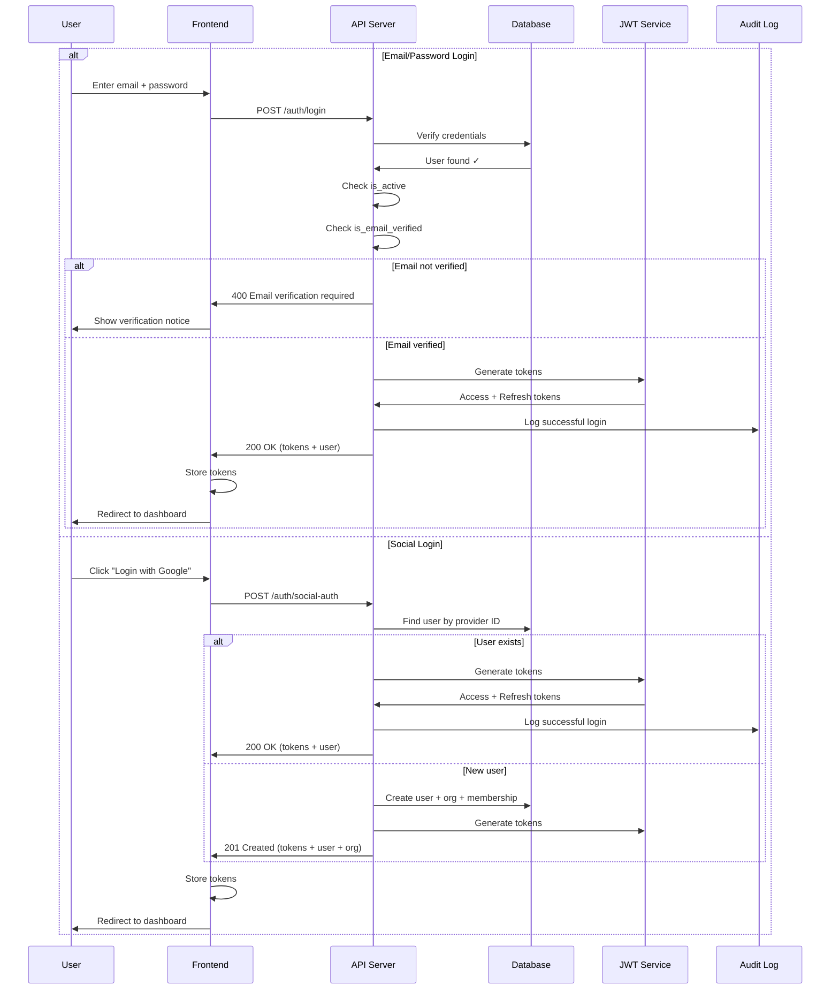
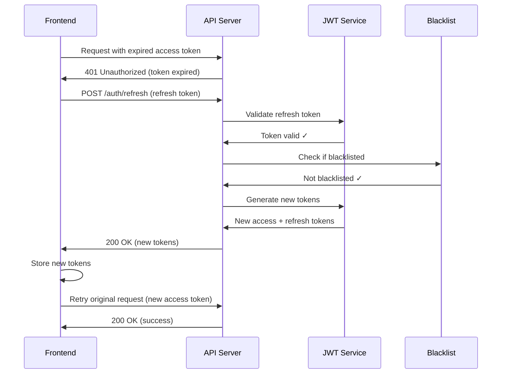
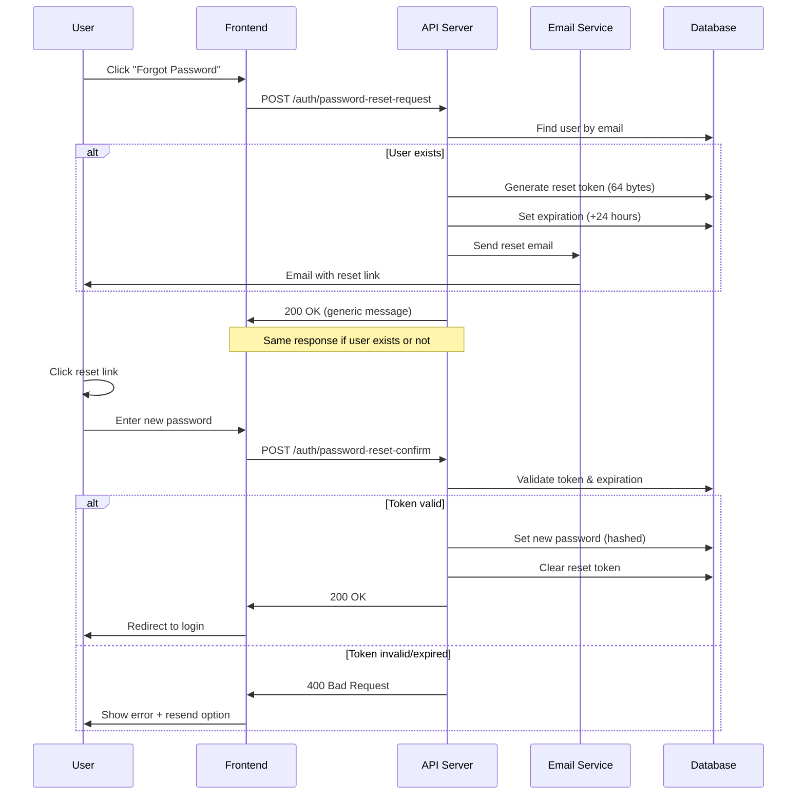

# Authentication & Authorization

## Overview

The VAS-DJ SaaS platform implements a comprehensive authentication and authorization system based on JWT (JSON Web Tokens) with support for multiple authentication providers (email/password, Google, GitHub, Facebook, Twitter), role-based access control, and organization-scoped permissions. The system is designed for security, scalability, and excellent user experience.

## Key Features

- **JWT Token System**: Stateless authentication with access and refresh tokens
- **Multi-Provider Auth**: Email/password + social authentication (OAuth)
- **Custom Token Claims**: Organization ID, role, trial information
- **Token Refresh**: Secure token renewal without re-authentication
- **Rate Limiting**: Protection against brute force attacks
- **Email Verification**: Required for email/password accounts
- **Password Security**: Django validators + custom strength requirements
- **Audit Logging**: Complete authentication event tracking
- **Session Management**: Token blacklisting for logout
- **Multi-Factor Ready**: Architecture supports 2FA addition

## Authentication Flow



---

## Data Models

### Account Model (Custom User)

**File**: [apps/accounts/models/account.py](apps/accounts/models/account.py)

```python
class Account(AbstractBaseUser, BaseFields):
    """Custom user model extending AbstractBaseUser."""

    # Identity
    email = models.EmailField(unique=True, db_index=True)
    first_name = models.CharField(max_length=255, blank=True)
    last_name = models.CharField(max_length=255, blank=True)

    # Profile
    avatar = models.URLField(blank=True, null=True)
    phone = models.CharField(max_length=20, blank=True, null=True)
    bio = models.TextField(blank=True, null=True)
    date_of_birth = models.DateField(blank=True, null=True)
    gender = models.CharField(max_length=20, blank=True, null=True)

    # Role & Permissions
    role = models.CharField(
        max_length=20,
        choices=[
            ('USER', 'User'),
            ('ADMIN', 'Admin'),
            ('SUPERUSER', 'Superuser'),
        ],
        default='USER'
    )

    # Status
    is_active = models.BooleanField(default=True)
    is_email_verified = models.BooleanField(default=False)
    is_phone_verified = models.BooleanField(default=False)
    is_2fa_enabled = models.BooleanField(default=False)
    status = models.CharField(
        max_length=20,
        choices=[
            ('PENDING', 'Pending'),
            ('ACTIVE', 'Active'),
            ('SUSPENDED', 'Suspended'),
            ('DELETED', 'Deleted'),
        ],
        default='PENDING'
    )

    # Email Verification
    email_verification_token = models.CharField(
        max_length=64,
        blank=True,
        null=True
    )
    email_verification_token_expires = models.DateTimeField(
        blank=True,
        null=True
    )

    # Password Reset
    password_reset_token = models.CharField(
        max_length=64,
        blank=True,
        null=True
    )
    password_reset_token_expires = models.DateTimeField(
        blank=True,
        null=True
    )

    # Organization
    organization = models.ForeignKey(
        'organizations.Organization',
        on_delete=models.SET_NULL,
        null=True,
        blank=True,
        related_name='members'
    )

    # Timestamps
    date_joined = models.DateTimeField(auto_now_add=True)
    last_login = models.DateTimeField(blank=True, null=True)

    USERNAME_FIELD = 'email'
    REQUIRED_FIELDS = []

    @property
    def is_admin(self):
        """Check if user has admin privileges."""
        return (
            self.role == 'ADMIN'
            or self.role == 'SUPERUSER'
            or self.is_org_admin
        )
```

### AccountAuthProvider Model

**File**: [apps/accounts/models/account.py](apps/accounts/models/account.py)

```python
class AccountAuthProvider(models.Model):
    """Links social authentication providers to user accounts."""

    user = models.ForeignKey(
        Account,
        on_delete=models.CASCADE,
        related_name='auth_providers'
    )
    provider = models.CharField(
        max_length=50,
        choices=[
            ('google', 'Google'),
            ('github', 'GitHub'),
            ('facebook', 'Facebook'),
            ('twitter', 'Twitter'),
        ]
    )
    provider_user_id = models.CharField(max_length=255)
    email = models.EmailField()
    is_primary = models.BooleanField(default=False)
    linked_at = models.DateTimeField(auto_now_add=True)

    class Meta:
        unique_together = [['provider', 'provider_user_id']]
```

---

## JWT Token System

### Token Structure

**Access Token** (Short-lived: 15 minutes):
```json
{
  "token_type": "access",
  "exp": 1706097600,
  "iat": 1706096700,
  "jti": "unique-token-id",
  "user_id": "123e4567-e89b-12d3-a456-426614174000",
  "email": "user@example.com",
  "role": "USER",
  "is_admin": false,
  "org_id": "456e7890-e89b-12d3-a456-426614174001",
  "trial_ends_on": "2024-02-01"
}
```

**Refresh Token** (Long-lived: 7 days):
```json
{
  "token_type": "refresh",
  "exp": 1706702400,
  "iat": 1706096700,
  "jti": "unique-refresh-id",
  "user_id": "123e4567-e89b-12d3-a456-426614174000"
}
```

### Token Generation

**File**: [apps/accounts/views/auth.py:257-264](apps/accounts/views/auth.py#L257-L264)

```python
# Generate tokens
refresh = RefreshToken.for_user(user)
access = refresh.access_token

# Add custom claims
access["email"] = user.email
access["role"] = user.role
access["is_admin"] = user.is_admin
access["org_id"] = str(user.organization.id) if user.organization else None
access["trial_ends_on"] = (
    user.organization.trial_ends_on.isoformat()
    if user.organization and user.organization.trial_ends_on
    else None
)
```

### Token Refresh Flow



---

## API Endpoints

### Authentication Endpoints

| Endpoint | Method | Auth | Description |
|----------|--------|------|-------------|
| `/api/v1/auth/register/` | POST | No | Email/password registration |
| `/api/v1/auth/login/` | POST | No | Email/password login |
| `/api/v1/auth/social-auth/` | POST | No | Social provider auth (register/login) |
| `/api/v1/auth/logout/` | POST | Yes | Logout (blacklist refresh token) |
| `/api/v1/auth/refresh/` | POST | No | Refresh access token |
| `/api/v1/auth/verify-token/` | GET | Yes | Verify current token |
| `/api/v1/auth/verify-email/` | POST | No | Verify email with token |
| `/api/v1/auth/resend-verification/` | POST | Yes | Resend verification (authenticated) |
| `/api/v1/auth/resend-verification-by-email/` | POST | No | Resend verification (unauthenticated) |
| `/api/v1/auth/password-reset-request/` | POST | No | Request password reset |
| `/api/v1/auth/password-reset-confirm/` | POST | No | Confirm password reset |

### Login

**Endpoint**: `POST /api/v1/auth/login/`

**Request**:
```json
{
  "email": "user@example.com",
  "password": "SecurePassword123!"
}
```

**Response** (200 OK):
```json
{
  "code": "AUTH_LOGIN_200",
  "message": "Login successful",
  "data": {
    "access": "eyJ0eXAiOiJKV1QiLCJhbGc...",
    "refresh": "eyJ0eXAiOiJKV1QiLCJhbGc...",
    "user": {
      "id": "123e4567-e89b-12d3-a456-426614174000",
      "email": "user@example.com",
      "firstName": "John",
      "lastName": "Doe",
      "role": "USER",
      "isAdmin": false,
      "isEmailVerified": true,
      "status": "ACTIVE"
    }
  }
}
```

**Response** (400 Bad Request - Email Not Verified):
```json
{
  "code": "VALIDATION_ERROR",
  "message": "Email verification required",
  "issues": [
    {
      "message": "Please verify your email address before logging in.",
      "path": [],
      "type": "email_verification_required"
    }
  ],
  "extra": {
    "email_verification_required": true,
    "user_id": "123e4567-e89b-12d3-a456-426614174000"
  }
}
```

### Social Authentication

**Endpoint**: `POST /api/v1/auth/social-auth/`

**Request**:
```json
{
  "provider": "google",
  "providerUserId": "123456789012345678901",
  "email": "john.doe@gmail.com",
  "firstName": "John",
  "lastName": "Doe",
  "avatar": "https://lh3.googleusercontent.com/a/example"
}
```

**Response** (201 Created - New User):
```json
{
  "code": "AUTH_SOCIAL_REGISTER_201",
  "message": "Account created successfully",
  "data": {
    "access": "eyJ0eXAiOiJKV1QiLCJhbGc...",
    "refresh": "eyJ0eXAiOiJKV1QiLCJhbGc...",
    "user": {
      "id": "123e4567-e89b-12d3-a456-426614174000",
      "email": "john.doe@gmail.com",
      "firstName": "John",
      "lastName": "Doe",
      "isEmailVerified": true,
      "status": "ACTIVE"
    },
    "organization": {
      "id": "456e7890-e89b-12d3-a456-426614174001",
      "name": "John Doe",
      "subdomain": "john-doe",
      "onTrial": true,
      "trialEndsOn": "2024-02-03"
    }
  }
}
```

**Response** (200 OK - Existing User):
```json
{
  "code": "AUTH_SOCIAL_LOGIN_200",
  "message": "Login successful",
  "data": {
    "access": "eyJ0eXAiOiJKV1QiLCJhbGc...",
    "refresh": "eyJ0eXAiOiJKV1QiLCJhbGc...",
    "user": {
      "id": "123e4567-e89b-12d3-a456-426614174000",
      "email": "john.doe@gmail.com",
      "firstName": "John",
      "lastName": "Doe"
    }
  }
}
```

### Token Refresh

**Endpoint**: `POST /api/v1/auth/refresh/`

**Request**:
```json
{
  "refresh": "eyJ0eXAiOiJKV1QiLCJhbGc..."
}
```

**Response** (200 OK):
```json
{
  "code": "AUTH_REFRESH_200",
  "data": {
    "access": "eyJ0eXAiOiJKV1QiLCJhbGc...",
    "refresh": "eyJ0eXAiOiJKV1QiLCJhbGc..."
  }
}
```

### Logout

**Endpoint**: `POST /api/v1/auth/logout/`

**Request**:
```json
{
  "refresh": "eyJ0eXAiOiJKV1QiLCJhbGc..."
}
```

**Response** (200 OK):
```json
{
  "code": "AUTH_LOGOUT_200",
  "data": {
    "message": "Successfully logged out"
  }
}
```

---

## Password Security

### Password Requirements

**Custom Validation** ([apps/accounts/serializers.py:184-214](apps/accounts/serializers.py#L184-L214)):

1. **Minimum Length**: 8 characters
2. **Character Variety**: At least 2 types (letters, digits, symbols)
3. **Unique Characters**: At least 4 different characters
4. **Common Passwords**: Rejected if in common list
5. **Django Validators**: Additional built-in checks

```python
def validate(self, attrs):
    password = attrs.get('password')
    password_errors = []

    # Check length
    if len(password) < 8:
        password_errors.append("Password must be at least 8 characters long.")

    # Check common passwords
    common_passwords = ['password', 'password123', '12345678', 'qwerty', 'abc123']
    if password.lower() in common_passwords:
        password_errors.append("This password is too common.")

    # Check variety
    has_digit = any(c.isdigit() for c in password)
    has_alpha = any(c.isalpha() for c in password)
    has_special = any(c in '!@#$%^&*(),.?":{}|<>' for c in password)

    char_types = sum([has_digit, has_alpha, has_special])
    if char_types < 2:
        password_errors.append(
            "Password must contain at least 2 different types of characters."
        )

    # Check repetition
    if len(set(password)) < 4:
        password_errors.append("Password contains too many repeated characters.")

    if password_errors:
        raise serializers.ValidationError({"password": password_errors})

    return attrs
```

### Password Reset Flow



---

## Rate Limiting

### Rate Limit Configuration

**File**: [apps/accounts/views/auth.py](apps/accounts/views/auth.py)

| Endpoint | Rate Limit | Scope |
|----------|------------|-------|
| Login | Default | Per IP |
| Registration | Default | Per IP |
| Password Reset Request | 5/hour | Per IP |
| Password Reset Confirm | 10/hour | Per IP |
| Resend Verification | 100/hour | Per IP + Email |
| Social Auth | Default | Per IP |

**Implementation Example**:
```python
from apps.core.utils.rate_limiting import rate_limit

@api_view(['POST'])
@permission_classes([AllowAny])
@rate_limit(per_ip='5/hour')
def password_reset_request(request):
    """Request password reset with rate limiting."""
    # Implementation
```

---

## Authorization & Permissions

### Permission Classes

**Organization Membership Check**:
```python
from apps.core.permissions import IsOrgMember

class OrganizationViewSet(viewsets.ModelViewSet):
    permission_classes = [IsAuthenticated, IsOrgMember]

    def get_queryset(self):
        # Only return organizations user is a member of
        return self.request.user.organizations.all()
```

### Role-Based Access

```python
def check_admin_permission(user, organization):
    """Check if user has admin privileges in organization."""
    membership = OrganizationMembership.objects.filter(
        user=user,
        organization=organization,
        status='active'
    ).first()

    if not membership:
        return False

    return membership.role in ['owner', 'admin']
```

---

## Security Features

### 1. Token Security

- **Short-lived access tokens** (15 min) reduce exposure
- **Secure refresh tokens** (7 days) with blacklist
- **Token rotation** on refresh
- **JTI (JWT ID)** for tracking and revocation

### 2. Email Verification

**File**: [apps/accounts/views/auth.py:241-255](apps/accounts/views/auth.py#L241-L255)

```python
# Check if email is verified for login
if not user.is_email_verified and user.status == 'PENDING':
    issues = [{
        "message": "Please verify your email address before logging in.",
        "path": [],
        "type": "email_verification_required",
    }]
    raise ValidationException(
        detail="Email verification required",
        issues=issues,
        email_verification_required=True,
        user_id=str(user.id)
    )
```

### 3. Timing Attack Protection

**Constant-Time Comparison**:
```python
import hmac

def verify_token(stored_token, provided_token):
    """Verify token with timing attack protection."""
    return hmac.compare_digest(stored_token, provided_token)
```

### 4. Audit Logging

**File**: [apps/accounts/views/auth.py:274-281](apps/accounts/views/auth.py#L274-L281)

```python
# Log successful login
log_authentication_event(
    request=request,
    action=AuditAction.LOGIN_SUCCESS,
    user=user,
    success=True,
    details={"email": email, "method": "email_password"}
)
```

---

## Frontend Integration

### Axios Interceptor Pattern

```typescript
// lib/axios.ts
import axios from 'axios';

const api = axios.create({
  baseURL: process.env.NEXT_PUBLIC_API_URL,
});

// Request interceptor - add token
api.interceptors.request.use((config) => {
  const token = localStorage.getItem('access_token');
  if (token) {
    config.headers.Authorization = `Bearer ${token}`;
  }
  return config;
});

// Response interceptor - handle token refresh
api.interceptors.response.use(
  (response) => response,
  async (error) => {
    const originalRequest = error.config;

    // If 401 and not already retried
    if (error.response?.status === 401 && !originalRequest._retry) {
      originalRequest._retry = true;

      try {
        const refreshToken = localStorage.getItem('refresh_token');
        const { data } = await axios.post('/api/v1/auth/refresh/', {
          refresh: refreshToken,
        });

        // Store new tokens
        localStorage.setItem('access_token', data.access);
        localStorage.setItem('refresh_token', data.refresh);

        // Retry original request
        originalRequest.headers.Authorization = `Bearer ${data.access}`;
        return api(originalRequest);
      } catch (refreshError) {
        // Refresh failed - redirect to login
        localStorage.clear();
        window.location.href = '/login';
        return Promise.reject(refreshError);
      }
    }

    return Promise.reject(error);
  }
);

export default api;
```

---

## Testing

### Unit Tests

**File**: `apps/accounts/tests/test_auth_flow.py`

```python
def test_login_success():
    """Test successful login with valid credentials"""

def test_login_unverified_email():
    """Test login blocked for unverified email"""

def test_login_invalid_credentials():
    """Test login fails with wrong password"""

def test_token_refresh():
    """Test refreshing access token"""

def test_social_auth_new_user():
    """Test social auth creates new user"""

def test_social_auth_existing_user():
    """Test social auth logs in existing user"""

def test_password_reset_flow():
    """Test complete password reset flow"""

def test_rate_limiting():
    """Test rate limiting on auth endpoints"""
```

### Running Tests

```bash
# All auth tests
make test-auth

# Specific test
docker compose -f ./docker/docker-compose.yml run --rm web pytest apps/accounts/tests/test_auth_flow.py -v
```

---

## Troubleshooting

### Issue: Token Expired

**Symptom**: 401 Unauthorized error

**Solution**:
1. Frontend automatically refreshes token
2. If refresh token expired, user redirected to login
3. User logs in again

### Issue: Email Verification Not Received

**Symptom**: User can't verify email

**Solutions**:
1. Check spam folder
2. Use resend verification endpoint
3. Check email service logs

### Issue: Social Auth Fails

**Symptom**: Error during social login

**Solutions**:
1. Verify OAuth credentials configured
2. Check redirect URI matches
3. Ensure provider is enabled
4. Check provider account status

---

## Related Documentation

- [User Registration Flow](./user-registration-flow.md) - Complete registration process
- [Organization Membership](./organization-membership.md) - Role-based permissions
- [Audit Logging](./audit-logging.md) - Authentication event tracking
- [Email Service](./email-service.md) - Verification email delivery

---

## Conclusion

The authentication and authorization system provides enterprise-grade security with JWT tokens, multi-provider support, comprehensive rate limiting, and role-based access control. The architecture is designed for scalability, security, and excellent developer experience with clear separation between authentication (who you are) and authorization (what you can do).
