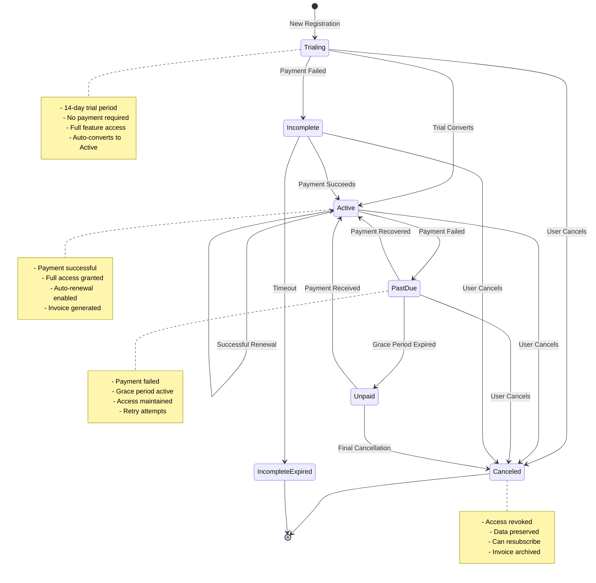
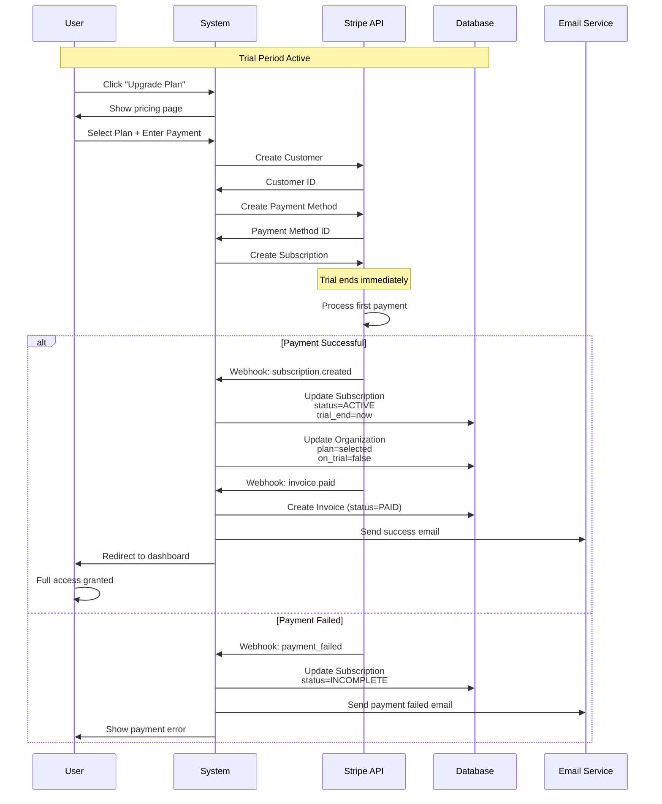
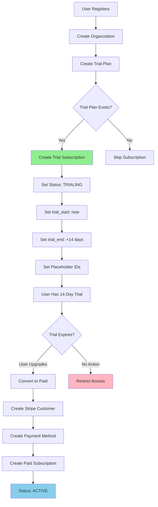
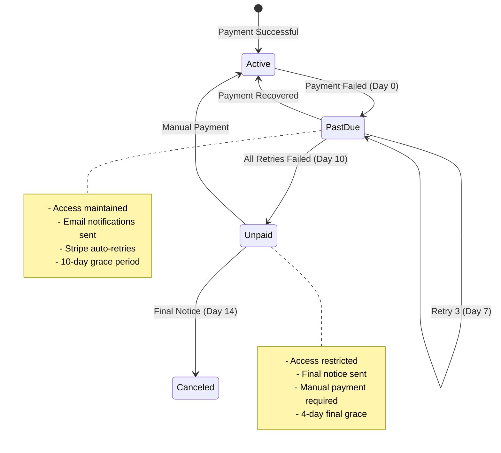

# Billing & Subscriptions

## Overview

The VAS-DJ SaaS platform includes a comprehensive billing and subscription management system with multi-provider payment support (Stripe primary), subscription lifecycle management, trial-to-paid conversions, invoice generation, and automated payment handling. The system is designed for scalability and supports multiple payment providers through a unified interface.

## Key Features

- **Multi-Provider Support**: Stripe primary, extensible to PayPal, Square, etc.
- **Subscription Plans**: Monthly and yearly billing intervals
- **Trial Management**: 14-day free trials with automatic conversion
- **Subscription States**: Trialing, Active, Canceled, Past Due, Incomplete
- **Invoice Generation**: Automatic invoice creation and tracking
- **Payment Webhooks**: Real-time payment event processing
- **Grace Periods**: Failed payment retry logic
- **Plan Features**: JSON-based feature limits per plan
- **Backward Compatibility**: Legacy Stripe fields maintained

## Subscription Lifecycle



---

## Data Models

### Plan Model

**File**: [apps/billing/models.py:32-103](apps/billing/models.py#L32-L103)

```python
class Plan(BaseFields):
    # Override organization to be nullable for global plans
    organization = models.ForeignKey(
        'organizations.Organization',
        on_delete=models.CASCADE,
        null=True,
        blank=True,
        help_text="If null, this is a global plan available to all organizations"
    )

    name = models.CharField(max_length=100)
    slug = models.SlugField(max_length=100, unique=True)
    description = models.TextField(blank=True)

    # Payment provider fields
    provider = models.CharField(
        max_length=50,
        default='stripe',
        help_text="Payment provider (stripe, paypal, etc.)"
    )
    external_price_id = models.CharField(
        max_length=255,
        blank=True,
        help_text="External price/plan ID from payment provider"
    )
    external_product_id = models.CharField(
        max_length=255,
        blank=True,
        help_text="External product ID from payment provider"
    )

    # Legacy Stripe fields (for backward compatibility)
    stripe_price_id = models.CharField(max_length=255, blank=True)
    stripe_product_id = models.CharField(max_length=255, blank=True)

    # Pricing
    amount = models.DecimalField(max_digits=10, decimal_places=2)
    currency = models.CharField(max_length=3, default='usd')
    interval = models.CharField(
        max_length=20,
        choices=PlanInterval.choices,
        default=PlanInterval.MONTH
    )
    interval_count = models.PositiveIntegerField(default=1)

    # Trial
    trial_period_days = models.PositiveIntegerField(default=0)

    # Features & Limits
    is_active = models.BooleanField(default=True)
    features = models.JSONField(
        default=dict,
        blank=True,
        help_text="Plan features and limits"
    )

    class Meta:
        ordering = ['amount']
        unique_together = [['provider', 'external_price_id']]
```

### Subscription Model

**File**: [apps/billing/models.py:106-195](apps/billing/models.py#L106-L195)

```python
class Subscription(models.Model):
    id = models.UUIDField(primary_key=True, default=uuid.uuid4)

    # Organization-based subscription (1:1 relationship)
    organization = models.OneToOneField(
        'organizations.Organization',
        on_delete=models.CASCADE,
        related_name='subscription'
    )
    plan = models.ForeignKey(
        Plan,
        on_delete=models.PROTECT,
        related_name='subscriptions'
    )

    # Payment provider fields
    provider = models.CharField(
        max_length=50,
        default='stripe',
        help_text="Payment provider (stripe, paypal, etc.)"
    )
    external_subscription_id = models.CharField(
        max_length=255,
        unique=True,
        null=True,
        blank=True,
        help_text="External subscription ID from payment provider"
    )
    external_customer_id = models.CharField(
        max_length=255,
        null=True,
        blank=True,
        help_text="External customer ID from payment provider"
    )

    # Legacy Stripe fields
    stripe_subscription_id = models.CharField(
        max_length=255,
        unique=True,
        null=True,
        blank=True
    )
    stripe_customer_id = models.CharField(
        max_length=255,
        null=True,
        blank=True
    )

    # Status
    status = models.CharField(
        max_length=50,
        choices=SubscriptionStatus.choices,
        default=SubscriptionStatus.ACTIVE
    )

    # Billing periods
    current_period_start = models.DateTimeField()
    current_period_end = models.DateTimeField()

    # Trial
    trial_start = models.DateTimeField(null=True, blank=True)
    trial_end = models.DateTimeField(null=True, blank=True)

    # Cancellation
    canceled_at = models.DateTimeField(null=True, blank=True)
    cancel_at_period_end = models.BooleanField(default=False)

    # Grace period for failed payments
    grace_period_end = models.DateTimeField(null=True, blank=True)

    # Metadata
    metadata = models.JSONField(default=dict, blank=True)

    # Timestamps
    created_at = models.DateTimeField(auto_now_add=True)
    updated_at = models.DateTimeField(auto_now=True)

    @property
    def is_active(self):
        return self.status == SubscriptionStatus.ACTIVE

    @property
    def is_trialing(self):
        return self.status == SubscriptionStatus.TRIALING

    @property
    def is_canceled(self):
        return self.status == SubscriptionStatus.CANCELED
```

### Invoice Model

**File**: [apps/billing/models.py:198-283](apps/billing/models.py#L198-L283)

```python
class Invoice(models.Model):
    id = models.UUIDField(primary_key=True, default=uuid.uuid4)

    # Relationships
    organization = models.ForeignKey(
        'organizations.Organization',
        on_delete=models.CASCADE,
        related_name='invoices'
    )
    subscription = models.ForeignKey(
        Subscription,
        on_delete=models.CASCADE,
        related_name='invoices',
        null=True,
        blank=True
    )

    # Payment provider
    provider = models.CharField(
        max_length=50,
        default='stripe'
    )
    external_invoice_id = models.CharField(
        max_length=255,
        unique=True,
        null=True,
        blank=True
    )
    external_payment_intent_id = models.CharField(
        max_length=255,
        blank=True
    )

    # Invoice details
    number = models.CharField(max_length=100)
    status = models.CharField(
        max_length=50,
        choices=InvoiceStatus.choices,
        default=InvoiceStatus.DRAFT
    )

    # Amounts
    subtotal = models.DecimalField(max_digits=10, decimal_places=2)
    tax = models.DecimalField(
        max_digits=10,
        decimal_places=2,
        default=Decimal('0.00')
    )
    total = models.DecimalField(max_digits=10, decimal_places=2)
    currency = models.CharField(max_length=3, default='usd')

    # Periods
    period_start = models.DateTimeField()
    period_end = models.DateTimeField()

    # Payment
    due_date = models.DateTimeField(null=True, blank=True)
    paid_at = models.DateTimeField(null=True, blank=True)

    # URLs
    hosted_invoice_url = models.URLField(blank=True)
    invoice_pdf_url = models.URLField(blank=True)

    # Metadata
    metadata = models.JSONField(default=dict, blank=True)

    # Timestamps
    created_at = models.DateTimeField(auto_now_add=True)
    updated_at = models.DateTimeField(auto_now=True)

    @property
    def is_paid(self):
        return self.status == InvoiceStatus.PAID
```

---

## Plan Configuration

### Available Plans

| Plan | Price | Interval | Trial | Members | Features |
|------|-------|----------|-------|---------|----------|
| **Free Trial** | $0 | 14 days | Yes | 5 | Basic features |
| **Starter** | $29 | Monthly | No | 10 | Standard features |
| **Starter Annual** | $290 | Yearly | No | 10 | Standard + 17% discount |
| **Pro** | $99 | Monthly | No | 50 | Advanced features |
| **Pro Annual** | $990 | Yearly | No | 50 | Advanced + 17% discount |
| **Enterprise** | Custom | Custom | No | Unlimited | All features + custom |

### Plan Features JSON Structure

```json
{
  "members_limit": 10,
  "projects_limit": 100,
  "storage_gb": 100,
  "api_calls_per_month": 100000,
  "features": {
    "custom_domain": true,
    "sso": false,
    "advanced_analytics": true,
    "priority_support": true,
    "audit_logs": true,
    "api_access": true
  },
  "integrations": {
    "slack": true,
    "github": true,
    "jira": true
  }
}
```

---

## Trial to Paid Conversion



---

## Webhook Handling

### Webhook Events

**File**: `apps/billing/webhooks.py` (implementation)

| Event | Status Change | Action |
|-------|---------------|--------|
| `customer.subscription.created` | → ACTIVE/TRIALING | Create/update subscription |
| `customer.subscription.updated` | → Current status | Update subscription details |
| `customer.subscription.deleted` | → CANCELED | Cancel subscription |
| `invoice.paid` | Invoice → PAID | Mark invoice paid, extend access |
| `invoice.payment_failed` | Subscription → PAST_DUE | Start grace period, notify user |
| `invoice.payment_action_required` | → INCOMPLETE | Notify user, require action |
| `customer.subscription.trial_will_end` | - | Send reminder email (3 days before) |

### Webhook Security

```python
def verify_stripe_webhook(payload, signature):
    """Verify webhook signature from Stripe"""
    import stripe

    endpoint_secret = settings.STRIPE_WEBHOOK_SECRET

    try:
        event = stripe.Webhook.construct_event(
            payload, signature, endpoint_secret
        )
        return event
    except ValueError:
        # Invalid payload
        raise ValidationError("Invalid payload")
    except stripe.error.SignatureVerificationError:
        # Invalid signature
        raise ValidationError("Invalid signature")
```

---

## Payment Flow

### Initial Subscription Creation



---

## API Endpoints

### Billing Management

| Endpoint | Method | Auth | Description |
|----------|--------|------|-------------|
| `/api/v1/billing/plans/` | GET | No | List available plans |
| `/api/v1/billing/plans/{id}/` | GET | No | Get plan details |
| `/api/v1/billing/subscriptions/current/` | GET | Yes | Get current subscription |
| `/api/v1/billing/subscriptions/upgrade/` | POST | Yes | Upgrade/change plan |
| `/api/v1/billing/subscriptions/cancel/` | POST | Yes | Cancel subscription |
| `/api/v1/billing/invoices/` | GET | Yes | List invoices |
| `/api/v1/billing/invoices/{id}/` | GET | Yes | Get invoice details |
| `/api/v1/billing/payment-methods/` | GET | Yes | List payment methods |
| `/api/v1/billing/payment-methods/` | POST | Yes | Add payment method |

### List Plans

**Endpoint**: `GET /api/v1/billing/plans/`

**Response** (200 OK):
```json
{
  "code": "PLANS_LIST_200",
  "data": [
    {
      "id": "plan_starter_monthly",
      "name": "Starter",
      "slug": "starter-monthly",
      "description": "Perfect for small teams",
      "amount": "29.00",
      "currency": "usd",
      "interval": "month",
      "intervalCount": 1,
      "trialPeriodDays": 0,
      "features": {
        "members_limit": 10,
        "projects_limit": 100,
        "storage_gb": 100,
        "features": {
          "advanced_analytics": true,
          "priority_support": false
        }
      },
      "isActive": true
    },
    {
      "id": "plan_pro_monthly",
      "name": "Pro",
      "slug": "pro-monthly",
      "amount": "99.00",
      "currency": "usd",
      "interval": "month",
      "features": {
        "members_limit": 50,
        "projects_limit": 500,
        "storage_gb": 500,
        "features": {
          "advanced_analytics": true,
          "priority_support": true,
          "sso": false
        }
      }
    }
  ]
}
```

### Get Current Subscription

**Endpoint**: `GET /api/v1/billing/subscriptions/current/`

**Response** (200 OK):
```json
{
  "code": "SUBSCRIPTION_GET_200",
  "data": {
    "id": "sub_123e4567",
    "organization": {
      "id": "org_123",
      "name": "Acme Corp"
    },
    "plan": {
      "id": "plan_pro_monthly",
      "name": "Pro",
      "amount": "99.00",
      "interval": "month"
    },
    "status": "active",
    "currentPeriodStart": "2024-01-01T00:00:00Z",
    "currentPeriodEnd": "2024-02-01T00:00:00Z",
    "cancelAtPeriodEnd": false,
    "trialStart": null,
    "trialEnd": null,
    "createdAt": "2024-01-01T00:00:00Z"
  }
}
```

### Upgrade/Change Plan

**Endpoint**: `POST /api/v1/billing/subscriptions/upgrade/`

**Request**:
```json
{
  "planId": "plan_pro_monthly",
  "paymentMethodId": "pm_1234567890"
}
```

**Response** (200 OK):
```json
{
  "code": "SUBSCRIPTION_UPGRADED_200",
  "message": "Plan upgraded successfully",
  "data": {
    "subscription": {
      "id": "sub_123e4567",
      "plan": {
        "name": "Pro",
        "amount": "99.00"
      },
      "status": "active",
      "currentPeriodEnd": "2024-02-01T00:00:00Z"
    },
    "invoice": {
      "id": "inv_987654",
      "amount": "99.00",
      "status": "paid",
      "paidAt": "2024-01-20T10:00:00Z"
    }
  }
}
```

### Cancel Subscription

**Endpoint**: `POST /api/v1/billing/subscriptions/cancel/`

**Request**:
```json
{
  "cancelAtPeriodEnd": true,
  "reason": "Switching to another service"
}
```

**Response** (200 OK):
```json
{
  "code": "SUBSCRIPTION_CANCELED_200",
  "message": "Subscription will be canceled at the end of the billing period",
  "data": {
    "subscription": {
      "id": "sub_123e4567",
      "status": "active",
      "cancelAtPeriodEnd": true,
      "currentPeriodEnd": "2024-02-01T00:00:00Z",
      "canceledAt": "2024-01-20T10:00:00Z"
    },
    "accessUntil": "2024-02-01T00:00:00Z"
  }
}
```

### List Invoices

**Endpoint**: `GET /api/v1/billing/invoices/`

**Query Parameters**:
- `status` - Filter by status (draft, open, paid, void, uncollectible)
- `limit` - Number of results (default: 10)
- `starting_after` - Pagination cursor

**Response** (200 OK):
```json
{
  "code": "INVOICES_LIST_200",
  "data": [
    {
      "id": "inv_123",
      "number": "INV-2024-001",
      "status": "paid",
      "subtotal": "99.00",
      "tax": "0.00",
      "total": "99.00",
      "currency": "usd",
      "periodStart": "2024-01-01T00:00:00Z",
      "periodEnd": "2024-02-01T00:00:00Z",
      "dueDate": "2024-01-01T00:00:00Z",
      "paidAt": "2024-01-01T10:30:00Z",
      "hostedInvoiceUrl": "https://invoice.stripe.com/i/inv_123",
      "invoicePdfUrl": "https://invoice.stripe.com/i/inv_123/pdf"
    }
  ],
  "meta": {
    "total": 12,
    "hasMore": true
  }
}
```

---

## Grace Period & Dunning

### Failed Payment Handling



### Email Notifications

| Day | Event | Email Template |
|-----|-------|----------------|
| 0 | Payment failed | "Payment Failed - Please Update" |
| 3 | Retry 1 failed | "Payment Still Failed - Action Required" |
| 7 | Retry 2 failed | "Urgent: Update Payment Method" |
| 10 | All retries failed | "Access Suspended - Immediate Action" |
| 14 | Final cancellation | "Subscription Canceled - Reactivate Anytime" |

---

## Testing

### Unit Tests

**File**: `apps/billing/tests/test_subscriptions.py`

```python
def test_create_trial_subscription():
    """Test trial subscription creation"""

def test_trial_to_paid_conversion():
    """Test converting trial to paid plan"""

def test_subscription_cancellation():
    """Test subscription cancellation"""

def test_failed_payment_handling():
    """Test payment failure and grace period"""

def test_plan_upgrade():
    """Test upgrading to higher plan"""

def test_plan_downgrade():
    """Test downgrading to lower plan"""

def test_invoice_generation():
    """Test automatic invoice creation"""

def test_webhook_processing():
    """Test Stripe webhook handling"""
```

### Running Tests

```bash
# All billing tests
make test-billing

# Specific test
docker compose -f ./docker/docker-compose.yml run --rm web pytest apps/billing/tests/test_subscriptions.py::test_trial_to_paid_conversion -v
```

---

## Security Considerations

### 1. Webhook Verification

- All webhooks verify signature before processing
- Protects against replay attacks
- Validates event authenticity

### 2. Payment Data

- Never store credit card numbers
- Use Stripe Customer and Payment Method IDs
- PCI compliance maintained through Stripe

### 3. Subscription Access

- Middleware checks subscription status
- Expired subscriptions blocked immediately
- Grace period enforced at API level

### 4. Audit Logging

- All billing changes logged
- Payment failures tracked
- Subscription modifications audited

---

## Troubleshooting

### Issue: Trial Not Converting

**Symptom**: Trial ended but subscription not active

**Solutions**:
1. Check Stripe webhook delivery
2. Verify payment method attached
3. Check payment processing errors
4. Review webhook logs

### Issue: Payment Failed

**Symptom**: Subscription moved to past_due

**Solutions**:
1. User updates payment method
2. Stripe auto-retries (3, 5, 7 days)
3. Manual retry via dashboard
4. Contact support for assistance

### Issue: Invoice Not Generated

**Symptom**: Missing invoice after payment

**Solutions**:
1. Check webhook processing logs
2. Verify Stripe event received
3. Manually trigger invoice creation
4. Check for processing errors

---

## Related Documentation

- [Organization Management](./organization-management.md) - Plan tiers and limits
- [User Registration Flow](./user-registration-flow.md) - Trial setup during registration
- [Audit Logging](./audit-logging.md) - Billing event tracking

---

## Conclusion

The billing and subscription system provides enterprise-grade payment processing with multi-provider support, comprehensive lifecycle management, and automated dunning. The grace period system ensures users have time to update payment methods while maintaining security and compliance.
