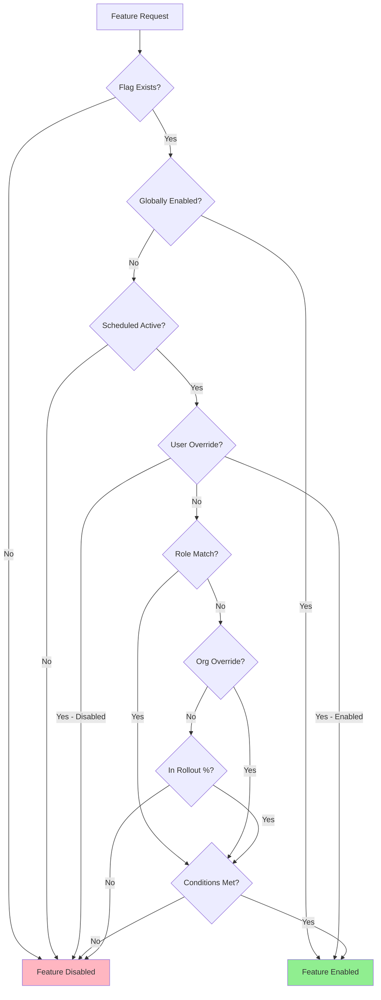
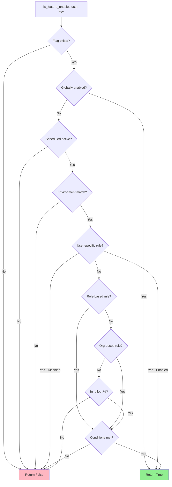
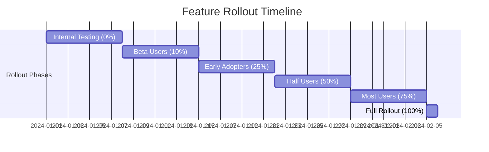

# Feature Flags

## Overview

The VAS-DJ SaaS platform implements a comprehensive feature flag system that enables dynamic feature toggling, progressive rollout, A/B testing, and role-based feature access. This system allows for controlled feature releases, environment-specific configurations, and user-targeted experiments without code deployments.

## Key Features

- **Global Toggles**: Enable/disable features for all users
- **User-Specific Overrides**: Target specific users for beta testing
- **Role-Based Access**: Feature access based on user roles
- **Organization Scoping**: Organization-specific feature control
- **Progressive Rollout**: Percentage-based gradual rollout (0-100%)
- **Scheduled Activation**: Time-based feature enablement
- **Environment Controls**: Environment-specific flags (dev, staging, prod)
- **Conditional Access**: Rule-based feature access (account age, email verification, etc.)
- **Permanent Flags**: Protected flags that cannot be deleted

## Feature Flag Architecture



---

## Data Models

### FeatureFlag Model

**File**: [apps/feature_flags/models.py:19-136](apps/feature_flags/models.py#L19-L136)

```python
class FeatureFlag(BaseFields):
    """
    Core feature flag model for controlling feature access.
    """

    key = models.SlugField(
        unique=True,
        max_length=100,
        help_text="Unique identifier (e.g., 'advanced_analytics')"
    )
    name = models.CharField(
        max_length=255,
        help_text="Human-readable name"
    )
    description = models.TextField(
        blank=True,
        help_text="Detailed description"
    )

    # Global control
    is_enabled_globally = models.BooleanField(
        default=False,
        help_text="Enable for all users regardless of other settings"
    )

    # Progressive rollout
    rollout_percentage = models.PositiveIntegerField(
        default=0,
        help_text="Percentage of users (0-100)"
    )

    # Metadata
    is_permanent = models.BooleanField(
        default=False,
        help_text="Cannot be deleted (core system feature)"
    )
    requires_restart = models.BooleanField(
        default=False,
        help_text="Application restart required when flag changes"
    )

    # Environment controls
    environments = models.JSONField(
        default=list,
        blank=True,
        help_text="List of environments where active"
    )

    # Scheduling
    active_from = models.DateTimeField(
        null=True,
        blank=True,
        help_text="Feature becomes active from this date"
    )
    active_until = models.DateTimeField(
        null=True,
        blank=True,
        help_text="Feature is active until this date"
    )

    def is_active_now(self):
        """Check if flag is currently active based on scheduling."""
        now = timezone.now()

        if self.active_from and now < self.active_from:
            return False

        if self.active_until and now > self.active_until:
            return False

        return True

    def is_in_rollout_percentage(self, user_id):
        """Check if user falls within rollout percentage."""
        if self.rollout_percentage == 0:
            return False
        if self.rollout_percentage == 100:
            return True

        # Deterministic hash for consistent experience
        import hashlib
        hash_input = f"{self.key}-{user_id}"
        hash_value = int(hashlib.md5(hash_input.encode()).hexdigest(), 16)
        return (hash_value % 100) < self.rollout_percentage
```

### FeatureAccess Model

**File**: [apps/feature_flags/models.py:139-255](apps/feature_flags/models.py#L139-L255)

```python
class FeatureAccess(BaseFields):
    """
    Specific access rules for feature flags.
    """

    feature = models.ForeignKey(
        FeatureFlag,
        on_delete=models.CASCADE,
        related_name='access_rules'
    )

    # Access targets (one should be set)
    user = models.ForeignKey(
        settings.AUTH_USER_MODEL,
        on_delete=models.CASCADE,
        null=True,
        blank=True,
        help_text="Specific user this rule applies to"
    )
    role = models.CharField(
        max_length=100,
        blank=True,
        null=True,
        help_text="User role (e.g., 'ADMIN', 'MANAGER')"
    )

    # Access control
    enabled = models.BooleanField(
        default=True,
        help_text="Grant (True) or deny (False) access"
    )

    # Conditional access
    conditions = models.JSONField(
        default=dict,
        blank=True,
        help_text="Additional conditions (account age, actions, etc.)"
    )

    # Metadata
    reason = models.CharField(
        max_length=255,
        blank=True,
        help_text="Reason for this access rule"
    )

    def applies_to_user(self, user):
        """Check if this access rule applies to the given user."""
        # Direct user assignment
        if self.user and self.user == user:
            return True

        # Role-based assignment
        if self.role and hasattr(user, 'role') and user.role == self.role:
            return True

        # Organization-based assignment
        if self.organization:
            user_org = user.get_primary_organization()
            if user_org and user_org == self.organization:
                return True

        return False

    def check_conditions(self, user):
        """Check if user meets the conditions."""
        if not self.conditions:
            return True

        # Account age check
        if 'min_account_age_days' in self.conditions:
            account_age = (timezone.now() - user.date_joined).days
            if account_age < self.conditions['min_account_age_days']:
                return False

        # Email verification check
        if 'requires_email_verified' in self.conditions:
            if (self.conditions['requires_email_verified']
                and not user.is_email_verified):
                return False

        return True
```

---

## Feature Evaluation Logic

### Evaluation Flow



### Implementation Example

**File**: `apps/feature_flags/services.py`

```python
def is_feature_enabled(user, key: str) -> bool:
    """
    Check if a feature is enabled for the given user.

    Evaluation order:
    1. Global flag
    2. Scheduled activation
    3. Environment check
    4. User-specific override
    5. Role-based access
    6. Organization-specific access
    7. Rollout percentage
    """
    # 1. Check if flag exists
    try:
        flag = FeatureFlag.objects.get(key=key)
    except FeatureFlag.DoesNotExist:
        return False

    # 2. Global flag check
    if flag.is_enabled_globally:
        return True

    # 3. Scheduled activation check
    if not flag.is_active_now():
        return False

    # 4. Environment check
    if flag.environments:
        from django.conf import settings
        current_env = getattr(settings, 'ENVIRONMENT', 'development')
        if current_env not in flag.environments:
            return False

    # 5. User-specific override
    user_access = FeatureAccess.objects.filter(
        feature=flag,
        user=user
    ).first()

    if user_access:
        if user_access.enabled and user_access.check_conditions(user):
            return True
        else:
            return False

    # 6. Role-based access
    if hasattr(user, 'role'):
        role_access = FeatureAccess.objects.filter(
            feature=flag,
            role=user.role,
            enabled=True
        ).first()

        if role_access and role_access.check_conditions(user):
            return True

    # 7. Organization-specific access
    user_org = user.get_primary_organization()
    if user_org:
        org_access = FeatureAccess.objects.filter(
            feature=flag,
            organization=user_org,
            enabled=True
        ).first()

        if org_access and org_access.check_conditions(user):
            return True

    # 8. Rollout percentage
    if flag.rollout_percentage > 0:
        if flag.is_in_rollout_percentage(user.id):
            # Still check conditions if any role/org rules exist
            return True

    return False
```

---

## API Endpoints

### Feature Flag Management

| Endpoint | Method | Auth | Description |
|----------|--------|------|-------------|
| `/api/v1/feature-flags/` | GET | Yes | List all feature flags |
| `/api/v1/feature-flags/enabled/` | GET | Yes | List enabled flags for current user |
| `/api/v1/feature-flags/{key}/` | GET | Yes | Get flag details |
| `/api/v1/feature-flags/{key}/check/` | GET | Yes | Check if flag enabled for user |
| `/api/v1/feature-flags/` | POST | Admin | Create feature flag |
| `/api/v1/feature-flags/{key}/` | PATCH | Admin | Update feature flag |
| `/api/v1/feature-flags/{key}/` | DELETE | Admin | Delete feature flag |
| `/api/v1/feature-flags/{key}/access-rules/` | GET | Admin | List access rules |
| `/api/v1/feature-flags/{key}/access-rules/` | POST | Admin | Create access rule |

### List Enabled Flags for User

**Endpoint**: `GET /api/v1/feature-flags/enabled/`

**Response** (200 OK):
```json
{
  "code": "FEATURE_FLAGS_200",
  "data": {
    "user": {
      "id": "123e4567-e89b-12d3-a456-426614174000",
      "email": "user@example.com",
      "role": "ADMIN"
    },
    "enabledFeatures": [
      {
        "key": "advanced_analytics",
        "name": "Advanced Analytics",
        "description": "Access to advanced analytics dashboard",
        "enabledReason": "role_based"
      },
      {
        "key": "api_access",
        "name": "API Access",
        "description": "Access to REST API",
        "enabledReason": "global"
      },
      {
        "key": "beta_features",
        "name": "Beta Features",
        "description": "Early access to beta features",
        "enabledReason": "user_override"
      }
    ],
    "meta": {
      "total": 3,
      "timestamp": "2024-01-20T10:00:00Z"
    }
  }
}
```

### Check Feature Flag

**Endpoint**: `GET /api/v1/feature-flags/{key}/check/`

**Response** (200 OK - Enabled):
```json
{
  "code": "FEATURE_CHECK_200",
  "data": {
    "key": "advanced_analytics",
    "enabled": true,
    "reason": "role_based",
    "details": {
      "flag": {
        "name": "Advanced Analytics",
        "globallyEnabled": false,
        "rolloutPercentage": 50
      },
      "matchedRule": {
        "type": "role",
        "role": "ADMIN",
        "conditions": {
          "requires_email_verified": true
        }
      }
    }
  }
}
```

**Response** (200 OK - Disabled):
```json
{
  "code": "FEATURE_CHECK_200",
  "data": {
    "key": "enterprise_sso",
    "enabled": false,
    "reason": "not_in_plan",
    "details": {
      "flag": {
        "name": "Enterprise SSO",
        "requiresPlan": "enterprise"
      },
      "userPlan": "pro"
    }
  }
}
```

### Create Feature Flag (Admin)

**Endpoint**: `POST /api/v1/feature-flags/`

**Request**:
```json
{
  "key": "dark_mode",
  "name": "Dark Mode",
  "description": "Enable dark mode UI theme",
  "isEnabledGlobally": false,
  "rolloutPercentage": 25,
  "environments": ["development", "staging"],
  "activeFrom": "2024-02-01T00:00:00Z",
  "activeUntil": null,
  "isPermanent": false
}
```

**Response** (201 Created):
```json
{
  "code": "FEATURE_FLAG_CREATED_201",
  "message": "Feature flag created successfully",
  "data": {
    "id": "789e0123-e89b-12d3-a456-426614174002",
    "key": "dark_mode",
    "name": "Dark Mode",
    "isEnabledGlobally": false,
    "rolloutPercentage": 25,
    "createdAt": "2024-01-20T10:00:00Z"
  }
}
```

### Create Access Rule (Admin)

**Endpoint**: `POST /api/v1/feature-flags/{key}/access-rules/`

**Request**:
```json
{
  "role": "ADMIN",
  "enabled": true,
  "conditions": {
    "min_account_age_days": 7,
    "requires_email_verified": true
  },
  "reason": "Admins with verified email after 7 days"
}
```

**Response** (201 Created):
```json
{
  "code": "ACCESS_RULE_CREATED_201",
  "data": {
    "id": "012e3456-e89b-12d3-a456-426614174003",
    "feature": "advanced_analytics",
    "role": "ADMIN",
    "enabled": true,
    "conditions": {
      "min_account_age_days": 7,
      "requires_email_verified": true
    },
    "reason": "Admins with verified email after 7 days"
  }
}
```

---

## Progressive Rollout Strategies

### Percentage-Based Rollout



### Rollout Patterns

**Pattern 1: Gradual Rollout**
```python
# Week 1: 5% rollout
flag.rollout_percentage = 5

# Week 2: 25% rollout
flag.rollout_percentage = 25

# Week 3: 50% rollout
flag.rollout_percentage = 50

# Week 4: 100% rollout (or global enable)
flag.is_enabled_globally = True
```

**Pattern 2: Canary Deployment**
```python
# Step 1: Specific users first
FeatureAccess.objects.create(
    feature=flag,
    user=beta_tester,
    enabled=True
)

# Step 2: Internal team (role-based)
FeatureAccess.objects.create(
    feature=flag,
    role='ADMIN',
    enabled=True
)

# Step 3: Specific organizations
FeatureAccess.objects.create(
    feature=flag,
    organization=beta_org,
    enabled=True
)

# Step 4: Gradual percentage rollout
flag.rollout_percentage = 10  # Then 25, 50, 100
```

**Pattern 3: Environment-Specific**
```python
# Development only
flag.environments = ['development']

# Development + Staging
flag.environments = ['development', 'staging']

# All environments
flag.environments = ['development', 'staging', 'production']
```

---

## Use Cases

### Use Case 1: A/B Testing New Dashboard

**Scenario**: Test new dashboard design with 50% of users

**Implementation**:
```python
# Create feature flag
flag = FeatureFlag.objects.create(
    key='new_dashboard_design',
    name='New Dashboard Design',
    is_enabled_globally=False,
    rollout_percentage=50  # 50% of users
)

# Frontend check
if is_feature_enabled(request.user, 'new_dashboard_design'):
    return render(request, 'dashboard_v2.html')
else:
    return render(request, 'dashboard_v1.html')
```

### Use Case 2: Beta Feature for Specific Users

**Scenario**: Give beta access to selected power users

**Implementation**:
```python
# Create flag (disabled globally)
flag = FeatureFlag.objects.create(
    key='advanced_reporting',
    name='Advanced Reporting',
    is_enabled_globally=False,
    rollout_percentage=0
)

# Add specific users
for beta_user in beta_users:
    FeatureAccess.objects.create(
        feature=flag,
        user=beta_user,
        enabled=True,
        reason='Beta tester'
    )
```

### Use Case 3: Role-Based Feature Access

**Scenario**: Advanced analytics only for admins

**Implementation**:
```python
# Create flag
flag = FeatureFlag.objects.create(
    key='advanced_analytics',
    name='Advanced Analytics',
    is_enabled_globally=False
)

# Enable for admin role
FeatureAccess.objects.create(
    feature=flag,
    role='ADMIN',
    enabled=True,
    conditions={
        'requires_email_verified': True
    }
)
```

### Use Case 4: Time-Limited Feature

**Scenario**: Holiday promotion feature (Dec 1 - Dec 31)

**Implementation**:
```python
from datetime import datetime

flag = FeatureFlag.objects.create(
    key='holiday_promotion',
    name='Holiday Promotion 2024',
    is_enabled_globally=True,
    active_from=datetime(2024, 12, 1),
    active_until=datetime(2024, 12, 31, 23, 59, 59)
)
```

---

## Frontend Integration

### React/Next.js Example

```typescript
// hooks/useFeatureFlag.ts
import { useState, useEffect } from 'react';
import { api } from '@/lib/api';

export function useFeatureFlag(key: string): boolean {
  const [enabled, setEnabled] = useState(false);

  useEffect(() => {
    api.get(`/feature-flags/${key}/check/`)
      .then(res => setEnabled(res.data.enabled))
      .catch(() => setEnabled(false));
  }, [key]);

  return enabled;
}

// Usage in component
function Dashboard() {
  const hasAdvancedAnalytics = useFeatureFlag('advanced_analytics');

  return (
    <div>
      <h1>Dashboard</h1>
      {hasAdvancedAnalytics && (
        <AdvancedAnalyticsPanel />
      )}
    </div>
  );
}
```

### Context Provider Pattern

```typescript
// context/FeatureFlagsContext.tsx
import React, { createContext, useContext, useEffect, useState } from 'react';

interface FeatureFlags {
  [key: string]: boolean;
}

const FeatureFlagsContext = createContext<FeatureFlags>({});

export function FeatureFlagsProvider({ children }) {
  const [flags, setFlags] = useState<FeatureFlags>({});

  useEffect(() => {
    // Load all enabled flags on mount
    api.get('/feature-flags/enabled/')
      .then(res => {
        const enabledFlags = res.data.enabledFeatures.reduce(
          (acc, flag) => ({ ...acc, [flag.key]: true }),
          {}
        );
        setFlags(enabledFlags);
      });
  }, []);

  return (
    <FeatureFlagsContext.Provider value={flags}>
      {children}
    </FeatureFlagsContext.Provider>
  );
}

export function useFeatureFlags() {
  return useContext(FeatureFlagsContext);
}
```

---

## Testing

### Unit Tests

**File**: `apps/feature_flags/tests/test_feature_flags.py`

```python
def test_global_flag_enabled():
    """Test globally enabled flag"""

def test_user_specific_override():
    """Test user-specific flag override"""

def test_role_based_access():
    """Test role-based feature access"""

def test_rollout_percentage():
    """Test percentage-based rollout"""

def test_scheduled_activation():
    """Test time-based activation"""

def test_environment_filtering():
    """Test environment-specific flags"""

def test_conditional_access():
    """Test conditional access rules"""

def test_permanent_flag_protection():
    """Test permanent flags cannot be deleted"""
```

### Running Tests

```bash
# All feature flag tests
docker compose -f ./docker/docker-compose.yml run --rm web pytest apps/feature_flags/tests/ -v
```

---

## Security Considerations

### 1. Admin-Only Management

- Only admins can create/modify flags
- Audit logging for all flag changes
- Prevent unauthorized flag manipulation

### 2. Permanent Flag Protection

- Core system flags marked as permanent
- Cannot be deleted accidentally
- Prevents system breakage

### 3. Condition Validation

- Validate condition JSON structure
- Sanitize condition inputs
- Prevent injection attacks

---

## Troubleshooting

### Issue: Feature Not Enabling

**Diagnostic Steps**:
1. Check if flag exists: `GET /api/v1/feature-flags/{key}/`
2. Check global status: `is_enabled_globally`
3. Check schedule: `active_from`, `active_until`
4. Check environment: `environments` array
5. Check user-specific rules
6. Check rollout percentage
7. Verify conditions are met

### Issue: Inconsistent Behavior

**Cause**: User ID hashing for rollout percentage

**Solution**: Rollout percentage uses deterministic hashing, so the same user will always get the same result for a given flag.

---

## Related Documentation

- [Progressive Onboarding](./progressive-onboarding.md) - Stage-based feature unlocking
- [Authentication & Authorization](./authentication-authorization.md) - Role-based access
- [Audit Logging](./audit-logging.md) - Flag change tracking

---

## Conclusion

The feature flag system provides powerful capabilities for controlled feature releases, A/B testing, and progressive rollout. The multi-level evaluation logic (global → user → role → org → percentage) ensures flexible and secure feature management across the platform.
