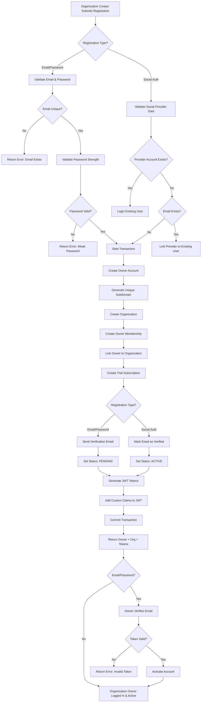
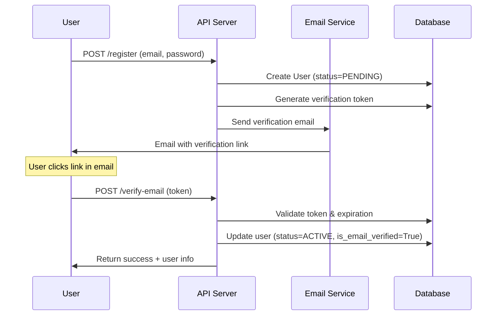
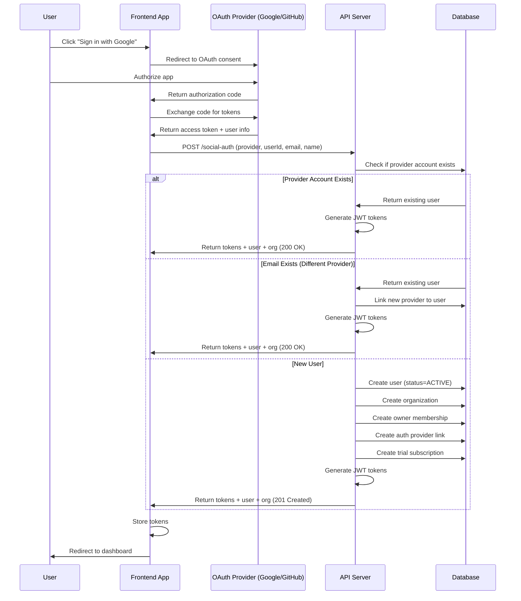

# Organization Registration Flow

## Overview

The VAS-DJ SaaS platform implements a comprehensive organization registration system where business owners, team leads, and decision makers can create a new organization along with their owner account. This document describes the complete organization registration flow, including both traditional email/password registration and social authentication (Google, GitHub, etc.).

## Key Features

- **Organization Creation**: Creates a new organization with custom branding and subdomain
- **Automatic Owner Setup**: Organization creator automatically becomes the owner/admin
- **14-Day Free Trial**: Automatic trial setup with trial subscription
- **Custom Subdomain**: Unique subdomain for organization branding and routing
- **Email Verification**: Security-focused email verification workflow (for email/password)
- **Social Authentication**: Support for Google, GitHub, Facebook, Twitter
- **Multi-Tenancy Ready**: Organization-scoped data from day one
- **Transaction Safety**: Atomic operations ensure data consistency

## Registration Target Audience

This registration flow is designed for:
- **Business Owners**: Creating their company's organization
- **Team Leaders**: Setting up departmental or project organizations  
- **Decision Makers**: Individuals who will manage billing and user invitations
- **Enterprise Users**: Organizations requiring custom branding and multi-user support

## Organization Registration vs User Invitation

**Important Distinction**: This flow is for creating NEW organizations, not joining existing ones.

### Organization Registration (This Document)
- **Purpose**: Create a new organization + first owner account
- **Who**: Business owners, team leads, decision makers
- **Frontend**: Dedicated organization registration page
- **Result**: New organization + user becomes owner/admin
- **Fields**: Personal info + organization details + subdomain

### User Invitation Flow (Separate Process)
- **Purpose**: Join an existing organization via invitation
- **Who**: Team members, employees, invited users  
- **Frontend**: Simple user signup via invite link
- **Result**: User joins existing organization as member
- **Fields**: Personal info only (organization pre-determined)

## Registration Methods

### 1. Email/Password Organization Registration
Organization creator provides both personal details and organization information, with email verification required.

### 2. Social Organization Registration
OAuth-based registration (Google, GitHub, Facebook, Twitter) with automatic email verification and organization setup.

---

## Data Flow Diagram



---

## Organization Registration Flow Steps

### Step 1: Organization Registration Submission

**Endpoint**: `POST /api/v1/auth/register/`

**Required Fields** (Email/Password):
- `email`: Organization owner's email address
- `password`: Minimum 8 characters
- `passwordConfirm`: Must match password
- `firstName`: Owner's first name
- `lastName`: Owner's last name

**Optional Fields**:
- `phone`: Owner's phone number
- `organizationName`: Custom organization name (defaults to "FirstName LastName")
- `preferredSubdomain`: Custom subdomain for organization (auto-generated if not provided)

**Required Fields** (Social Auth):
- `provider`: Social provider (google, github, facebook, twitter)
- `providerUserId`: Unique ID from social provider
- `email`: Owner's email from social provider
- `firstName`: Owner's first name
- `lastName`: Owner's last name

**Optional Fields** (Social Auth):
- `avatar`: Owner's profile picture URL
- `organizationName`: Custom organization name
- `preferredSubdomain`: Custom subdomain for organization

### Step 2: Validation

#### Email/Password Validation
1. **Email Uniqueness**: Check if email already exists
2. **Password Strength**: Validate password requirements:
   - Minimum 8 characters
   - At least 2 different character types (letters, digits, symbols)
   - Not a common password
   - At least 4 unique characters
3. **Password Confirmation**: Ensure `password` matches `passwordConfirm`

#### Social Auth Validation
1. **Provider Account Check**: Verify if provider account already exists
2. **Email Check**: Check if email exists with different provider
3. **Subdomain Validation**: Ensure subdomain is unique and follows format rules

### Step 3: Transaction Begin

All registration steps are wrapped in a database transaction (`@transaction.atomic`) to ensure atomicity:
- If any step fails, everything rolls back
- No partial accounts or orphaned organizations

### Step 4: Owner Account Creation

**Implementation**: [`apps/accounts/serializers.py:308-324`](apps/accounts/serializers.py#L308-L324)

```python
user = Account.objects.create_user(
    email=email,
    password=password,  # or None for social auth
    first_name=first_name,
    last_name=last_name,
    status="PENDING",  # ACTIVE for social auth
    is_email_verified=False,  # True for social auth
)
```

**Owner Account Fields Set**:
- `email`: Organization owner's email address
- `password`: Hashed password (or unusable for social-only)
- `first_name`, `last_name`: Owner's name
- `status`: "PENDING" (email/password) or "ACTIVE" (social auth)
- `is_email_verified`: False (email/password) or True (social auth)
- `date_joined`: Auto-set to current timestamp
- `is_active`: True (allows login after email verification)

### Step 5: Organization Creation

**Implementation**: [`apps/accounts/serializers.py:326-338`](apps/accounts/serializers.py#L326-L338)

#### Organization Name
- If provided: Use `organizationName` from request
- If not provided: Default to `"FirstName LastName"` or `"Personal Organization"`
- Maximum length: 100 characters

#### Subdomain Generation
**Implementation**: [`apps/accounts/serializers.py:218-279`](apps/accounts/serializers.py#L218-L279)

1. **Preferred Subdomain**: Use if provided and available
2. **Auto-Generated**: Create from `firstname-lastname`
3. **Sanitization**:
   - Convert to lowercase
   - Transliterate unicode characters (é → e, ü → u)
   - Remove non-alphanumeric characters (except hyphens)
   - Remove leading/trailing hyphens
   - Ensure minimum 3 characters
   - Maximum 50 characters
4. **Uniqueness**: Add numeric suffix if collision (e.g., `john-doe-2`)
5. **Fallback**: Use UUID suffix after 100 attempts

```python
organization = Organization.objects.create(
    name=organization_name,
    slug=subdomain,
    sub_domain=subdomain,
    creator_email=user.email,
    creator_name=f"{first_name} {last_name}",
    created_by=user,
    plan="free_trial",
    on_trial=True,
    trial_ends_on=timezone.now().date() + timedelta(days=14),
    is_active=True,
)
```

**Organization Fields**:
- `name`: Organization display name
- `slug`: URL-safe slug (same as subdomain)
- `sub_domain`: Unique subdomain for tenant routing
- `creator_email`: User's email
- `creator_name`: User's full name
- `created_by`: Reference to user account
- `plan`: "free_trial"
- `on_trial`: True
- `trial_ends_on`: Current date + 14 days
- `is_active`: True

### Step 6: Organization Membership

**Implementation**: [`apps/accounts/serializers.py:340-347`](apps/accounts/serializers.py#L340-L347)

```python
OrganizationMembership.objects.create(
    organization=organization,
    user=user,
    role="owner",
    status="active"
)

user.organization = organization
user.save(update_fields=["organization"])
```

**Membership Details**:
- `role`: "owner" (highest privilege level)
- `status`: "active"
- Creates bidirectional relationship between user and organization

**Owner Permissions**:
- `is_org_admin`: True
- `is_org_creator`: True
- `can_invite_users`: True
- `can_manage_billing`: True
- `can_delete_org`: True

### Step 7: Trial Subscription

**Implementation**: [`apps/accounts/serializers.py:349-366`](apps/accounts/serializers.py#L349-L366)

```python
trial_plan = Plan.objects.filter(amount=0, trial_period_days__gt=0).first()
if trial_plan:
    Subscription.objects.create(
        organization=organization,
        plan=trial_plan,
        status=SubscriptionStatus.TRIALING,
        current_period_start=timezone.now(),
        current_period_end=timezone.now() + timedelta(days=14),
        trial_start=timezone.now(),
        trial_end=timezone.now() + timedelta(days=14),
        stripe_subscription_id="trial_" + str(user.id),
        stripe_customer_id="trial_customer_" + str(user.id),
    )
```

**Subscription Details**:
- Status: `TRIALING`
- Duration: 14 days
- Placeholder Stripe IDs (to be replaced when user upgrades)

### Step 8: Email Verification (Email/Password Only)

**Implementation**: [`apps/accounts/serializers.py:368-373`](apps/accounts/serializers.py#L368-L373)

For email/password registrations:
1. Generate secure 512-bit (64-byte) verification token
2. Set token expiration (typically 24-48 hours)
3. Send verification email with token link
4. User status remains "PENDING" until verified

**Email Verification Flow**:


### Step 9: Social Auth Provider Linking (Social Auth Only)

**Implementation**: [`apps/accounts/serializers.py:593-600`](apps/accounts/serializers.py#L593-L600)

For social authentication:
```python
AccountAuthProvider.objects.create(
    user=user,
    provider=provider,  # google, github, etc.
    provider_user_id=provider_user_id,
    email=email,
    is_primary=True,
)
```

**Provider Details**:
- Links social account to user
- Stores provider-specific user ID
- Marks as primary authentication method
- Enables future multi-provider support

### Step 10: JWT Token Generation

**Implementation**: [`apps/accounts/views/auth.py:545-564`](apps/accounts/views/auth.py#L545-L564)

```python
refresh = RefreshToken.for_user(user)
access = refresh.access_token

# Add custom claims
access["email"] = user.email
access["role"] = user.role
access["is_admin"] = user.is_admin
access["org_id"] = str(user.organization.id)
access["trial_ends_on"] = user.organization.trial_ends_on.isoformat()
```

**JWT Claims**:
- `user_id`: User's UUID
- `email`: User's email
- `role`: User's role (e.g., "USER", "ADMIN")
- `is_admin`: Boolean admin flag
- `org_id`: Organization UUID
- `trial_ends_on`: Trial expiration date
- `exp`: Token expiration timestamp
- `iat`: Token issued at timestamp

### Step 11: Transaction Commit

If all steps succeed:
- Database transaction commits
- All changes persisted atomically
- User + Organization + Membership + Subscription created

If any step fails:
- Transaction rolls back
- No data persisted
- Error returned to client

### Step 12: Response

**Success Response** (HTTP 201 Created):
```json
{
  "code": "AUTH_REGISTER_201",
  "message": "Organization registration successful",
  "data": {
    "access": "eyJ0eXAiOiJKV1QiLCJhbGc...",
    "refresh": "eyJ0eXAiOiJKV1QiLCJhbGc...",
    "user": {
      "id": "123e4567-e89b-12d3-a456-426614174000",
      "email": "john.doe@example.com",
      "firstName": "John",
      "lastName": "Doe",
      "fullName": "John Doe",
      "role": "USER",
      "isAdmin": true,
      "isOrgAdmin": true,
      "isOrgCreator": true,
      "status": "PENDING",
      "isEmailVerified": false,
      "dateJoined": "2024-01-15T10:30:00Z"
    },
    "organization": {
      "id": "456e7890-e89b-12d3-a456-426614174001",
      "name": "John Doe",
      "subdomain": "john-doe",
      "onTrial": true,
      "trialEndsOn": "2024-01-29"
    }
  }
}
```

---

## Email Verification Flow

### Verification Email Sent

**Trigger**: Immediately after email/password registration

**Email Contents**:
- Verification link with token
- Token validity period (24-48 hours)
- Instructions for resending if expired

**Token Security**:
- 512-bit (64 bytes) cryptographically random token
- Stored hashed in database
- One-time use only
- Expires after set period

### User Clicks Verification Link

**Endpoint**: `POST /api/v1/auth/verify-email/`

**Request Body**:
```json
{
  "token": "abc123def456ghi789jkl012mno345pqr678stu901vwx234yz"
}
```

### Verification Process

1. **Token Validation**:
   - Find user with matching token
   - Check token hasn't expired
   - Use constant-time comparison (timing attack protection)

2. **Account Activation**:
   ```python
   user.is_email_verified = True
   user.status = "ACTIVE"
   user.email_verification_token = None  # Clear token
   user.email_verification_token_expires = None
   user.save()
   ```

3. **Response**:
   ```json
   {
     "code": "EMAIL_VERIFY_200",
     "message": "Email verified successfully! Your account is now active.",
     "data": {
       "user": {
         "id": "123e4567-e89b-12d3-a456-426614174000",
         "email": "john.doe@example.com",
         "isEmailVerified": true,
         "status": "ACTIVE"
       }
     }
   }
   ```

### Resend Verification Email

**Endpoint (Authenticated)**: `POST /api/v1/auth/resend-verification/`

**Endpoint (Unauthenticated)**: `POST /api/v1/auth/resend-verification-by-email/`

**Features**:
- Rate limited (100/hour per IP and per email)
- Constant response time (prevents email enumeration)
- New token generated on each request
- Security-focused error handling

---

## Social Authentication Flow



### Key Differences from Email/Password

1. **No Email Verification Required**: Email trusted from OAuth provider
2. **Status**: User immediately set to "ACTIVE"
3. **Password**: Set as unusable (`set_unusable_password()`)
4. **Provider Linking**: Creates `AccountAuthProvider` record
5. **Multi-Provider Support**: Can link multiple providers to one account

---

## Security Features

### 1. Transaction Safety
- All operations wrapped in `@transaction.atomic`
- Ensures data consistency (all-or-nothing)
- Prevents partial account creation

### 2. Password Security
- Minimum 8 characters
- Must contain 2+ character types
- Common password validation
- Repetitive character detection
- Django's built-in password validators

### 3. Email Verification
- 512-bit cryptographically random tokens
- Time-limited validity
- One-time use only
- Constant-time token comparison (timing attack protection)

### 4. Rate Limiting
- Login attempts: Rate limited per IP
- Email verification resend: 100/hour per IP and email
- Password reset: 5/hour per IP
- Prevents brute force attacks

### 5. Audit Logging
- All authentication events logged
- Login success/failure tracking
- Account creation events
- Email verification events

### 6. Input Validation
- Email format validation
- Subdomain format validation (lowercase, alphanumeric, hyphens)
- Organization name length limits
- SQL injection protection (ORM)
- XSS protection (serializer escaping)

---

## User Roles & Permissions

### Organization Owner (First User)

**Automatic Permissions**:
- `is_org_admin`: True
- `is_org_creator`: True
- `can_invite_users`: True
- `can_manage_billing`: True
- `can_delete_org`: True

**Capabilities**:
- Full organization control
- User invitation and management
- Billing and subscription management
- Organization settings
- Can transfer ownership
- Can delete organization

### Future Role Additions

The system supports adding additional users with different roles:
- **Admin**: Can manage users and settings (not delete org)
- **Member**: Standard user with limited permissions
- **Guest**: Read-only access (future)

---

## Multi-Tenancy Architecture

### Organization Scoping

**From Day One**:
- Every user belongs to at least one organization
- All user data is organization-scoped
- Tenant isolation enforced via middleware
- Subdomain-based routing supported

### Tenant Middleware

**Implementation**: `apps/core.middleware.TenantMiddleware`

- Extracts organization from request (subdomain, header, or JWT)
- Scopes all queries to user's organization
- Prevents cross-tenant data leaks
- Enforces organization membership on all requests

---

## Error Handling

### Common Registration Errors

| Error Code              | HTTP Status | Reason                              | User Action                             |
| ----------------------- | ----------- | ----------------------------------- | --------------------------------------- |
| `EMAIL_EXISTS`          | 400         | Email already registered            | Use different email or login            |
| `WEAK_PASSWORD`         | 400         | Password doesn't meet requirements  | Choose stronger password                |
| `PASSWORD_MISMATCH`     | 400         | Password confirmation doesn't match | Re-enter passwords                      |
| `SUBDOMAIN_TAKEN`       | 400         | Preferred subdomain unavailable     | Choose different subdomain              |
| `INVALID_SUBDOMAIN`     | 400         | Subdomain format invalid            | Use lowercase letters, numbers, hyphens |
| `SOCIAL_PROVIDER_ERROR` | 400         | Social auth provider issue          | Try again or use different method       |

### Email Verification Errors

| Error Code               | HTTP Status | Reason                   | User Action                    |
| ------------------------ | ----------- | ------------------------ | ------------------------------ |
| `INVALID_TOKEN`          | 400         | Token invalid or expired | Request new verification email |
| `EMAIL_ALREADY_VERIFIED` | 200         | Email already verified   | Proceed to login               |
| `EMAIL_SERVICE_ERROR`    | 500         | Email sending failed     | Contact support or try again   |

---

## API Endpoints Reference

### Registration Endpoints

| Endpoint                                     | Method | Auth | Description                            |
| -------------------------------------------- | ------ | ---- | -------------------------------------- |
| `/api/v1/auth/register/`                     | POST   | No   | Email/password registration            |
| `/api/v1/auth/social-auth/`                  | POST   | No   | Social authentication (register/login) |
| `/api/v1/auth/verify-email/`                 | POST   | No   | Verify email with token                |
| `/api/v1/auth/resend-verification/`          | POST   | Yes  | Resend verification (authenticated)    |
| `/api/v1/auth/resend-verification-by-email/` | POST   | No   | Resend verification (unauthenticated)  |

### Login Endpoints

| Endpoint                     | Method | Auth | Description                            |
| ---------------------------- | ------ | ---- | -------------------------------------- |
| `/api/v1/auth/login/`        | POST   | No   | Email/password login                   |
| `/api/v1/auth/social-login/` | POST   | No   | Social provider login (existing users) |
| `/api/v1/auth/refresh/`      | POST   | No   | Refresh JWT access token               |
| `/api/v1/auth/logout/`       | POST   | Yes  | Logout (blacklist refresh token)       |
| `/api/v1/auth/verify-token/` | GET    | Yes  | Verify current JWT token               |

---

## Database Schema

### Affected Tables

1. **accounts_account** (User)
   - Stores user credentials and profile
   - Links to organization via FK

2. **organizations_organization**
   - Stores organization details
   - Links to creator via FK

3. **organizations_organizationmembership**
   - Maps users to organizations
   - Stores role and status

4. **accounts_accountauthprovider**
   - Links social auth providers to users
   - Supports multi-provider authentication

5. **billing_subscription**
   - Tracks trial and paid subscriptions
   - Links to organization

6. **billing_plan**
   - Defines available subscription plans
   - Includes trial plan configuration

---

## Testing

### Test Coverage

**Test Files**:
- `apps/accounts/tests/test_registration_flow.py`: Organization registration flow tests
- `apps/accounts/tests/test_auth_edge_cases.py`: Edge cases and error scenarios
- `apps/accounts/tests/test_views.py`: API endpoint tests
- `apps/accounts/tests/test_models.py`: Model tests

### Test Scenarios

1. **Successful Organization Registration**
   - Email/password organization registration
   - Social auth organization registration
   - Organization creation with custom subdomain
   - Trial setup verification

2. **Validation Errors**
   - Duplicate email
   - Weak password
   - Invalid subdomain
   - Missing required fields

3. **Email Verification**
   - Valid token verification
   - Expired token handling
   - Invalid token handling
   - Resend verification

4. **Social Auth**
   - New organization registration
   - Existing user login
   - Provider linking
   - Multi-provider support

5. **Security**
   - Transaction rollback on error
   - Rate limiting enforcement
   - Token security
   - Timing attack protection

### Running Tests

```bash
# All registration tests
make test-accounts

# Specific test file
docker compose -f ./docker/docker-compose.yml run --rm web pytest apps/accounts/tests/test_registration_flow.py -v

# With coverage
make test-coverage
```

---

## Future Enhancements

### Planned Features

1. **Phone Verification**: SMS-based verification option
2. **2FA Support**: Two-factor authentication for enhanced security
3. **Custom Trial Periods**: Organization-specific trial durations
4. **Invite-Only Registration**: Restrict registration to invited users
5. **SSO Integration**: Enterprise SSO (SAML, LDAP)
6. **Custom Domains**: Organization custom domain support
7. **Email Templates**: Customizable verification email templates
8. **Onboarding Flow**: Guided post-registration onboarding
9. **Team Invitations**: Allow owners to invite team members during registration

### Potential Optimizations

1. **Async Email Sending**: Use Celery for background email delivery
2. **Caching**: Cache organization lookups for performance
3. **Bulk Operations**: Optimize for team registration scenarios
4. **Analytics**: Track registration funnel metrics
5. **A/B Testing**: Test different onboarding flows

---

## Related Documentation

- [Authentication Guide](../api/authentication.md)
- [Multi-Tenancy Architecture](../architecture/multi-tenancy.md)
- [Organization Management](./organization-management.md)
- [Billing & Subscriptions](./billing-subscriptions.md)
- [Security Best Practices](../security/security-best-practices.md)
- [API Documentation](http://localhost:8000/api/docs/)

---

## Support & Troubleshooting

### Common Issues

**Issue**: Email verification not received
- Check spam folder
- Verify email service configuration
- Check rate limiting hasn't been exceeded
- Use resend verification endpoint

**Issue**: Social auth fails
- Verify OAuth credentials configured
- Check redirect URI matches OAuth app settings
- Ensure social provider is enabled

**Issue**: Subdomain already taken
- Try different subdomain
- System will auto-generate if not provided

**Issue**: Transaction rollback
- Check database logs
- Verify all required fields provided
- Check for database constraints

### Getting Help

- **Documentation**: http://localhost:8000/api/docs/
- **Error Logs**: Check Sentry or application logs
- **Database Issues**: Review PostgreSQL logs
- **Email Issues**: Check email service logs (Celery worker logs)

---

## Conclusion

The organization registration flow is designed to provide business owners and team leaders with a seamless onboarding experience to create their organization while maintaining security and multi-tenancy from day one. Every new organization automatically receives:

✅ Custom organization setup with branding
✅ Owner/admin privileges for the creator
✅ 14-day free trial with full features
✅ Professional subdomain for organization identity
✅ Secure authentication and email verification
✅ Multi-tenant architecture ready for team growth
✅ Immediate billing and user management capabilities

This architecture ensures that organization creators can immediately start managing their business with full control over their organization, billing, and team member invitations. The atomic transaction design guarantees data consistency, while the separation from user invitation flows provides a clear distinction between organization creation and team member onboarding.
