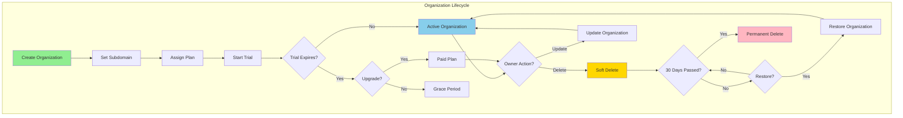
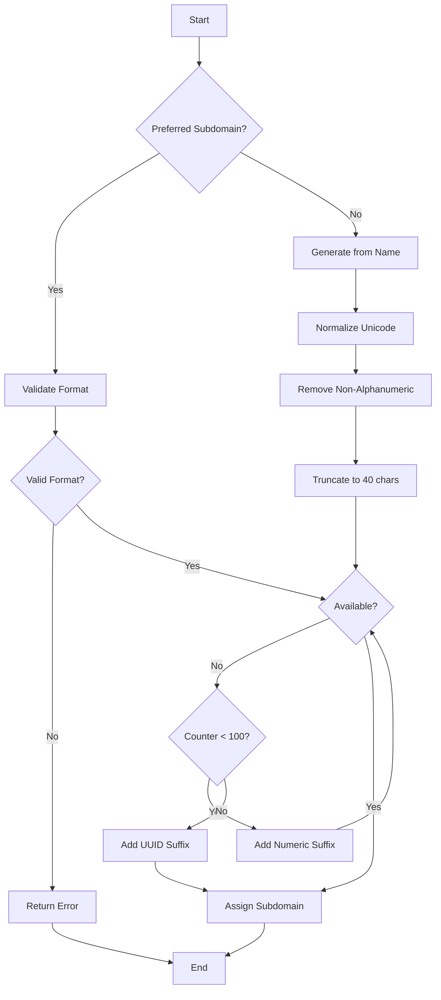
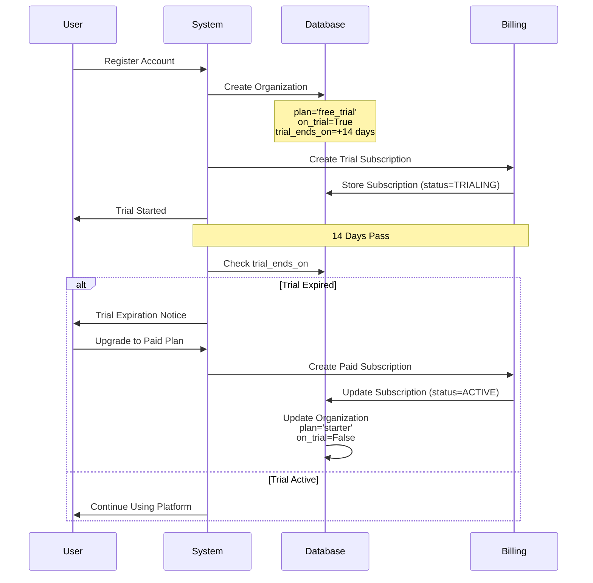
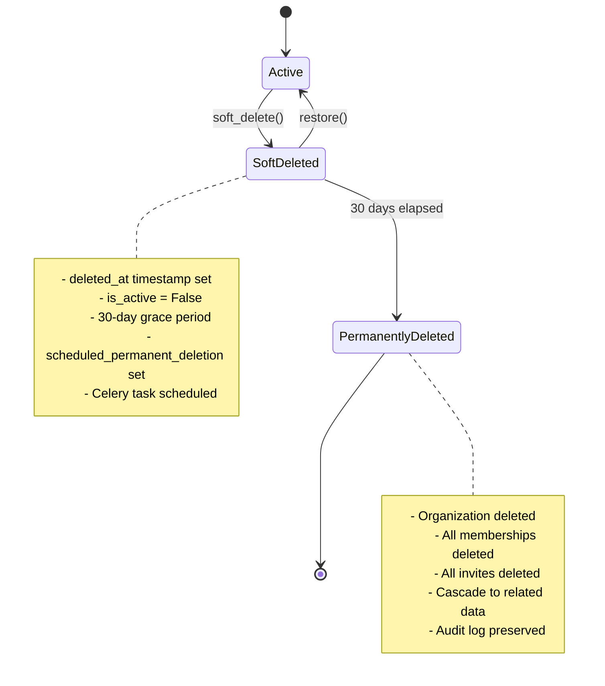

# Organization Management

## Overview

The VAS-DJ SaaS platform implements a comprehensive multi-tenant organization system where each organization represents a distinct tenant with isolated data, unique subdomain, and independent subscription. Organizations serve as the top-level entity in the platform's hierarchy, with all user data scoped to their organization context.

## Key Features

- **Multi-Tenant Architecture**: Complete data isolation per organization
- **Subdomain System**: Unique subdomain for each organization (3-50 characters)
- **Plan Tiers**: Four plan levels (free_trial, starter, pro, enterprise)
- **Trial Management**: Automatic 14-day trial for new organizations
- **GDPR Compliance**: Soft delete with 30-day grace period
- **Member Limits**: Plan-based restrictions on team size
- **Organization Restoration**: Recover soft-deleted organizations within 30 days
- **Audit Trail**: Complete history of organization changes

## Architecture Diagram



---

## Data Model

### Organization Model

**File**: [apps/organizations/models/organization.py](apps/organizations/models/organization.py)

```python
class Organization(models.Model):
    # Identity
    id = models.UUIDField(primary_key=True, default=uuid.uuid4)
    name = models.CharField(max_length=100)
    slug = models.SlugField(unique=True, max_length=50)
    sub_domain = models.CharField(max_length=50, unique=True)
    description = models.TextField(blank=True, null=True)
    logo = models.URLField(blank=True, null=True)

    # Ownership
    created_by = models.ForeignKey('accounts.Account', on_delete=models.SET_NULL)
    creator_email = models.EmailField()
    creator_name = models.CharField(max_length=255)

    # Billing & Plans
    plan = models.CharField(max_length=20, default='free_trial',
        choices=[
            ('free_trial', 'Free Trial'),
            ('starter', 'Starter'),
            ('pro', 'Pro'),
            ('enterprise', 'Enterprise'),
        ])
    paid_until = models.DateField(blank=True, null=True)
    on_trial = models.BooleanField(default=False)
    trial_ends_on = models.DateField(blank=True, null=True)

    # Status
    is_active = models.BooleanField(default=True)

    # Soft Delete (GDPR)
    deleted_at = models.DateTimeField(null=True, blank=True)
    deleted_by = models.ForeignKey('accounts.Account', on_delete=models.SET_NULL)
    deletion_reason = models.TextField(blank=True, null=True)
    scheduled_permanent_deletion = models.DateTimeField(null=True, blank=True)

    # Timestamps
    created_at = models.DateTimeField(auto_now_add=True)
    updated_at = models.DateTimeField(auto_now=True)
```

---

## Subdomain System

### Subdomain Rules

1. **Length**: 3-50 characters
2. **Format**: Lowercase letters, numbers, and hyphens only
3. **Pattern**: `^[a-z0-9]([a-z0-9-]*[a-z0-9])?$`
4. **Cannot**: Start or end with hyphen
5. **Must**: Be globally unique across all organizations

### Reserved Subdomains

The following subdomains are reserved and cannot be used:

```python
reserved_subdomains = {
    'www', 'api', 'admin', 'mail', 'ftp',
    'app', 'apps', 'support', 'help', 'blog',
    'docs', 'status', 'dev', 'test', 'staging'
}
```

### Subdomain Generation

**Auto-Generation Logic** ([apps/accounts/serializers.py:218-279](apps/accounts/serializers.py#L218-L279)):



**Example Transformations**:
- `John Doe` → `john-doe`
- `Café París` → `cafe-paris` (unicode normalized)
- `My   Company!!!` → `my-company`
- `john-doe` (taken) → `john-doe-2`
- `john-doe-99` (taken) → `john-doe-abc12345` (UUID suffix)

---

## Plan Tiers & Limits

### Plan Comparison

| Feature | Free Trial | Starter | Pro | Enterprise |
|---------|-----------|---------|-----|------------|
| **Duration** | 14 days | Unlimited | Unlimited | Unlimited |
| **Team Members** | 5 | 10 | 50 | Unlimited |
| **Projects** | 3 | 10 | 100 | Unlimited |
| **Storage** | 1 GB | 10 GB | 100 GB | Custom |
| **Support** | Email | Email + Chat | Priority | Dedicated |
| **Custom Domain** | ❌ | ❌ | ✅ | ✅ |
| **SSO** | ❌ | ❌ | ❌ | ✅ |
| **SLA** | None | 99% | 99.9% | 99.99% |

### Member Limits Implementation

**File**: [apps/organizations/models/organization.py:190-200](apps/organizations/models/organization.py#L190-L200)

```python
def can_add_member(self):
    """Check if organization can add more members based on plan limits."""
    if self.plan == "free_trial":
        return self.get_active_members_count() < 5
    elif self.plan == "starter":
        return self.get_active_members_count() < 10
    elif self.plan == "pro":
        return self.get_active_members_count() < 50
    # Enterprise has no limit
    return True
```

---

## Trial Management

### Trial Flow



### Trial Expiration Check

**File**: [apps/organizations/models/organization.py:172-180](apps/organizations/models/organization.py#L172-L180)

```python
def is_trial_expired(self):
    """Check if trial period has expired."""
    from django.utils import timezone

    return (
        self.on_trial
        and self.trial_ends_on
        and self.trial_ends_on < timezone.now().date()
    )
```

---

## Soft Delete & GDPR Compliance

### Soft Delete Flow



### Soft Delete Implementation

**File**: [apps/organizations/models/organization.py:202-248](apps/organizations/models/organization.py#L202-L248)

```python
def soft_delete(self, deleted_by=None, reason=None):
    """
    Soft delete the organization (GDPR compliance).
    Sets deleted_at timestamp and schedules permanent deletion after 30 days.
    """
    from datetime import timedelta
    from django.utils import timezone

    self.deleted_at = timezone.now()
    self.deleted_by = deleted_by
    self.deletion_reason = reason
    self.scheduled_permanent_deletion = timezone.now() + timedelta(days=30)
    self.is_active = False
    self.save(update_fields=[
        'deleted_at', 'deleted_by', 'deletion_reason',
        'scheduled_permanent_deletion', 'is_active'
    ])

    # Log audit event
    from apps.core.models import AuditLog
    AuditLog.log_event(
        event_type='data_deletion',
        resource_type='organization',
        resource_id=str(self.id),
        user=deleted_by,
        organization=self,
        outcome='success',
        details={
            'action': 'soft_delete',
            'reason': reason,
            'scheduled_permanent_deletion': self.scheduled_permanent_deletion.isoformat()
        }
    )

    # Schedule Celery task for permanent deletion
    from apps.organizations.tasks import schedule_permanent_deletion
    schedule_permanent_deletion.apply_async(
        args=[str(self.id)],
        eta=self.scheduled_permanent_deletion
    )
```

### Restoration

**File**: [apps/organizations/models/organization.py:250-286](apps/organizations/models/organization.py#L250-L286)

```python
def restore(self, restored_by=None):
    """
    Restore a soft-deleted organization.
    Only works if permanent deletion hasn't been executed yet.
    """
    if not self.deleted_at:
        return False

    self.deleted_at = None
    self.deleted_by = None
    self.deletion_reason = None
    self.scheduled_permanent_deletion = None
    self.is_active = True
    self.save(update_fields=[
        'deleted_at', 'deleted_by', 'deletion_reason',
        'scheduled_permanent_deletion', 'is_active'
    ])

    # Log audit event
    from apps.core.models import AuditLog
    AuditLog.log_event(
        event_type='data_restoration',
        resource_type='organization',
        resource_id=str(self.id),
        user=restored_by,
        organization=self,
        outcome='success',
        details={'action': 'restore'}
    )

    return True
```

---

## API Endpoints

### Organization CRUD

| Endpoint | Method | Auth | Description |
|----------|--------|------|-------------|
| `/api/v1/organizations/` | GET | Yes | List user's organizations |
| `/api/v1/organizations/` | POST | Yes | Create new organization |
| `/api/v1/organizations/{id}/` | GET | Yes | Get organization details |
| `/api/v1/organizations/{id}/` | PATCH | Yes | Update organization |
| `/api/v1/organizations/{id}/` | DELETE | Yes | Soft delete organization |
| `/api/v1/organizations/{id}/stats/` | GET | Yes | Organization statistics |
| `/api/v1/organizations/{id}/restore/` | POST | Yes | Restore soft-deleted org |

### Create Organization

**Endpoint**: `POST /api/v1/organizations/`

**Request**:
```json
{
  "name": "Acme Corporation",
  "subdomain": "acme-corp",
  "description": "We make everything",
  "logo": "https://example.com/logo.png"
}
```

**Response** (201 Created):
```json
{
  "code": "ORG_CREATE_201",
  "message": "Organization created successfully",
  "data": {
    "id": "123e4567-e89b-12d3-a456-426614174000",
    "name": "Acme Corporation",
    "slug": "acme-corp",
    "subdomain": "acme-corp",
    "description": "We make everything",
    "logo": "https://example.com/logo.png",
    "plan": "free_trial",
    "onTrial": true,
    "trialEndsOn": "2024-02-01",
    "isActive": true,
    "createdAt": "2024-01-18T10:00:00Z",
    "memberCount": 1,
    "inviteCount": 0
  }
}
```

### Update Organization

**Endpoint**: `PATCH /api/v1/organizations/{id}/`

**Request**:
```json
{
  "name": "Acme Inc.",
  "description": "Updated description",
  "logo": "https://example.com/new-logo.png"
}
```

**Response** (200 OK):
```json
{
  "code": "ORG_UPDATE_200",
  "message": "Organization updated successfully",
  "data": {
    "id": "123e4567-e89b-12d3-a456-426614174000",
    "name": "Acme Inc.",
    "slug": "acme-corp",
    "subdomain": "acme-corp",
    "description": "Updated description",
    "logo": "https://example.com/new-logo.png",
    "updatedAt": "2024-01-20T15:30:00Z"
  }
}
```

### Soft Delete Organization

**Endpoint**: `DELETE /api/v1/organizations/{id}/`

**Request**:
```json
{
  "reason": "Company shutting down"
}
```

**Response** (200 OK):
```json
{
  "code": "ORG_DELETE_200",
  "message": "Organization deleted successfully. You have 30 days to restore.",
  "data": {
    "id": "123e4567-e89b-12d3-a456-426614174000",
    "deletedAt": "2024-01-20T16:00:00Z",
    "scheduledPermanentDeletion": "2024-02-19T16:00:00Z",
    "canBeRestored": true
  }
}
```

### Restore Organization

**Endpoint**: `POST /api/v1/organizations/{id}/restore/`

**Response** (200 OK):
```json
{
  "code": "ORG_RESTORE_200",
  "message": "Organization restored successfully",
  "data": {
    "id": "123e4567-e89b-12d3-a456-426614174000",
    "name": "Acme Corporation",
    "isActive": true,
    "deletedAt": null,
    "restoredAt": "2024-01-25T10:00:00Z"
  }
}
```

### Organization Statistics

**Endpoint**: `GET /api/v1/organizations/{id}/stats/`

**Response** (200 OK):
```json
{
  "code": "ORG_STATS_200",
  "data": {
    "organization": {
      "id": "123e4567-e89b-12d3-a456-426614174000",
      "name": "Acme Corporation",
      "plan": "pro"
    },
    "members": {
      "total": 25,
      "active": 23,
      "invited": 2,
      "suspended": 0,
      "limit": 50
    },
    "invites": {
      "pending": 3,
      "accepted": 20,
      "expired": 2,
      "revoked": 1
    },
    "subscription": {
      "status": "active",
      "currentPeriodEnd": "2024-02-18T00:00:00Z",
      "nextBillingDate": "2024-02-18"
    },
    "usage": {
      "storageUsed": "45 GB",
      "storageLimit": "100 GB",
      "percentUsed": 45
    }
  }
}
```

---

## Business Rules & Validation

### Organization Creation Rules

1. **Name Requirements**:
   - Minimum 3 characters
   - Maximum 100 characters
   - Not empty or whitespace only

2. **Subdomain Requirements**:
   - Minimum 3 characters
   - Maximum 50 characters
   - Lowercase alphanumeric and hyphens only
   - Cannot start or end with hyphen
   - Must be unique globally
   - Cannot be reserved subdomain

3. **Plan Consistency**:
   - If `on_trial=True`, must have `plan='free_trial'`
   - If `paid_until` is set, must not be on trial
   - Trial organizations must have `trial_ends_on` date

### Deletion Rules

1. **Soft Delete**:
   - Only organization owners can delete
   - Must provide deletion reason (optional)
   - 30-day grace period before permanent deletion
   - Organization becomes inactive immediately
   - Members lose access immediately
   - Can be restored within 30 days

2. **Permanent Delete**:
   - Executed automatically after 30 days
   - Cannot be reversed
   - Deletes all related data:
     - Memberships
     - Invitations
     - Subscriptions
     - Invoices
     - Organization-scoped data
   - Preserves audit logs for compliance

### Update Restrictions

1. **Cannot Change**:
   - Subdomain (once set, immutable)
   - Slug (derived from subdomain)
   - Creator fields (historical record)

2. **Owner-Only Fields**:
   - Plan changes
   - Deletion
   - Restoration
   - Member limits (indirect via plan)

---

## Security Considerations

### 1. Subdomain Hijacking Prevention

- Subdomains are unique and cannot be reused
- Reserved subdomains prevent system conflicts
- Validation prevents malicious patterns

### 2. Data Isolation

- All organization data is scoped via foreign keys
- Middleware enforces organization context
- Cross-tenant data access prevented
- UUID primary keys prevent enumeration

### 3. Soft Delete Security

- Deleted organizations immediately lose access
- Grace period allows data recovery
- Permanent deletion is irreversible
- Audit logs track all deletion actions

### 4. Permission Enforcement

- Only owners can delete organizations
- Only owners can restore organizations
- Membership checked on all operations
- Superuser access audited

---

## Testing

### Unit Tests

**File**: `apps/organizations/tests/test_models.py`

```python
def test_subdomain_validation():
    """Test subdomain format validation"""

def test_reserved_subdomain():
    """Test reserved subdomain rejection"""

def test_subdomain_uniqueness():
    """Test subdomain must be unique"""

def test_plan_consistency():
    """Test trial plan validation"""

def test_member_limits():
    """Test plan-based member limits"""

def test_soft_delete():
    """Test soft delete functionality"""

def test_organization_restore():
    """Test restoration of deleted organization"""

def test_permanent_delete():
    """Test permanent deletion after grace period"""
```

### Integration Tests

```python
def test_create_organization_flow():
    """Test complete organization creation"""

def test_trial_expiration():
    """Test trial expiration handling"""

def test_upgrade_from_trial():
    """Test trial to paid plan upgrade"""

def test_delete_and_restore_flow():
    """Test soft delete and restoration"""
```

### Running Tests

```bash
# All organization tests
make test-organizations

# Specific test file
docker compose -f ./docker/docker-compose.yml run --rm web pytest apps/organizations/tests/test_models.py -v

# With coverage
make test-coverage
```

---

## Common Use Cases

### Use Case 1: Creating Organization During Registration

**Scenario**: New user signs up and automatically gets an organization

**Flow**:
1. User submits registration form
2. System creates user account
3. System auto-generates organization:
   - Name: "John Doe" (from user's name)
   - Subdomain: "john-doe" (auto-generated)
   - Plan: "free_trial"
   - Trial: 14 days
4. System creates owner membership
5. System creates trial subscription
6. User receives welcome email

**Reference**: See [user-registration-flow.md](./user-registration-flow.md)

### Use Case 2: Upgrading from Trial

**Scenario**: Organization owner upgrades to paid plan

**Flow**:
1. Owner navigates to billing settings
2. Selects "Pro" plan
3. Enters payment information
4. System creates Stripe subscription
5. System updates organization:
   - `plan='pro'`
   - `on_trial=False`
   - `trial_ends_on=NULL`
   - `paid_until=<next billing date>`
6. Member limit increases to 50

### Use Case 3: Soft Delete & Restore

**Scenario**: Owner deletes organization but changes mind

**Flow**:
1. Owner clicks "Delete Organization"
2. System prompts for confirmation
3. Owner confirms and provides reason
4. System soft deletes:
   - Sets `deleted_at` timestamp
   - Sets `is_active=False`
   - Schedules permanent deletion in 30 days
   - Sends confirmation email
5. **Within 30 days**, owner clicks "Restore"
6. System restores organization:
   - Clears `deleted_at`
   - Sets `is_active=True`
   - Cancels scheduled deletion
   - Sends restoration email

### Use Case 4: Checking Member Limits

**Scenario**: Admin tries to invite new team member

**Flow**:
1. Admin clicks "Invite Member"
2. System checks `organization.can_add_member()`
3. Current plan: "Starter" (limit: 10)
4. Current members: 10 (at limit)
5. System returns error: "Upgrade to add more members"
6. Admin upgrades to "Pro" plan
7. Limit increases to 50
8. Invite succeeds

---

## Troubleshooting

### Issue: Subdomain Already Taken

**Symptom**: Error when creating organization with desired subdomain

**Solution**:
1. Try different subdomain
2. System will auto-generate if not provided
3. Add numeric suffix (e.g., `company-2`)

**Prevention**: Use organization name with unique suffix

### Issue: Cannot Delete Organization

**Symptom**: Delete button disabled or returns error

**Solution**:
1. Verify you are the organization owner
2. Check if you're the last owner (transfer ownership first)
3. Ensure organization is not already deleted

### Issue: Trial Expired but Still Active

**Symptom**: Trial ended but organization still has access

**Solution**:
1. Grace period may be in effect
2. Check `trial_ends_on` date
3. System may have automatic extension policy
4. Contact support if unexpected

### Issue: Cannot Restore Deleted Organization

**Symptom**: Restore button not working

**Solution**:
1. Check if 30 days have passed (permanent deletion)
2. Verify you have owner permissions
3. Ensure organization hasn't been permanently deleted
4. Check `can_be_restored()` method

---

## Related Documentation

- [User Registration Flow](./user-registration-flow.md) - How organizations are created
- [Organization Membership](./organization-membership.md) - Managing team members
- [Team Invitations](./team-invitations.md) - Inviting new members
- [Billing & Subscriptions](./billing-subscriptions.md) - Plan management
- [Audit Logging](./audit-logging.md) - Tracking organization changes

---

## API Reference

**Full API Documentation**: http://localhost:8000/api/docs/

**Organization Endpoints**: `/api/v1/organizations/`

---

## Conclusion

The organization management system provides a robust foundation for multi-tenancy with comprehensive lifecycle management, GDPR compliance, and flexible plan tiers. The soft delete feature ensures data can be recovered while maintaining compliance, and the subdomain system provides unique, memorable identifiers for each organization.
