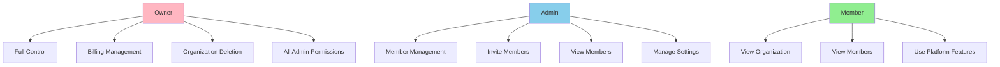
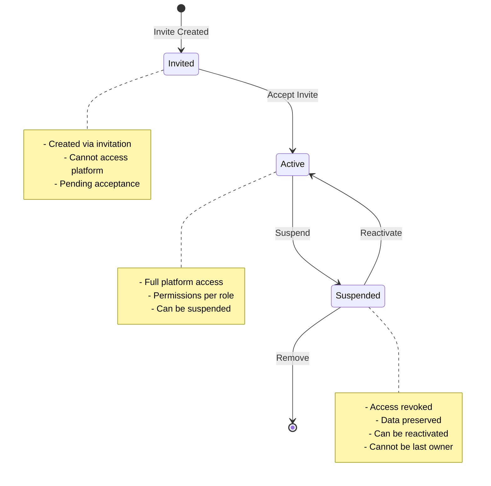
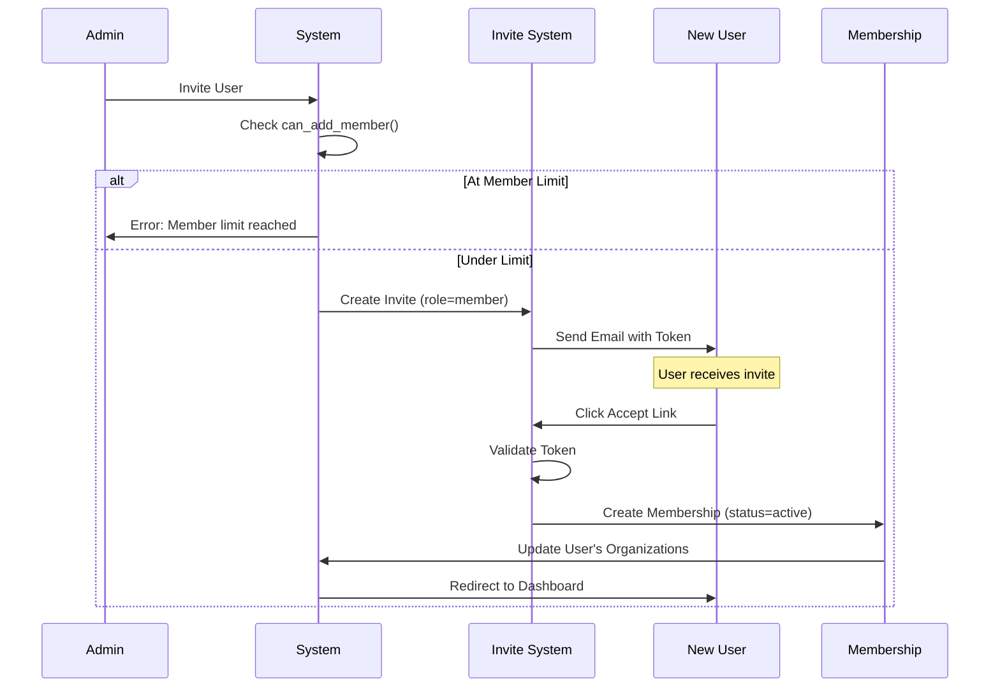
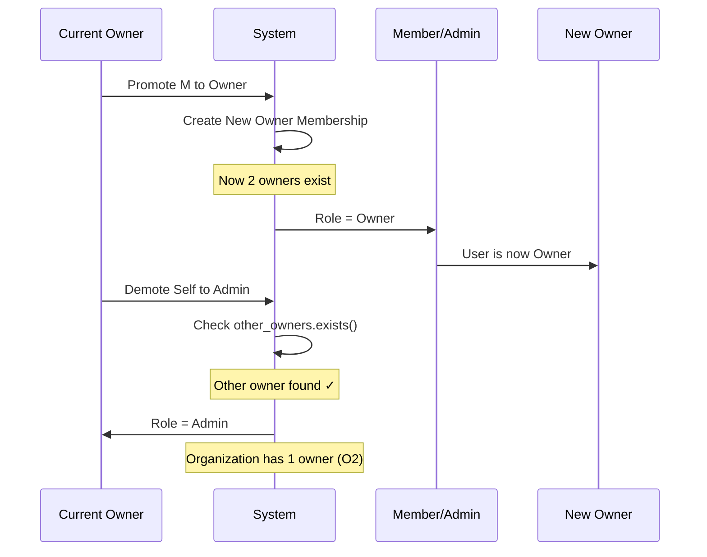

# Organization Membership

## Overview

The organization membership system manages the many-to-many relationship between users and organizations with role-based permissions and status management. This system enables teams to collaborate within organizations while maintaining clear permission boundaries and access control.

## Key Features

- **Role-Based Access**: Three distinct roles (Owner, Admin, Member)
- **Status Management**: Invited, Active, and Suspended states
- **Permission System**: Granular permissions per role
- **Business Rules**: At least one active owner required
- **Role Transitions**: Validated role changes with safety checks
- **Member Lifecycle**: Invitation → Activation → Suspension → Reactivation
- **Audit Trail**: Complete history of membership changes

## Role Hierarchy



---

## Data Model

### OrganizationMembership Model

**File**: [apps/organizations/models/membership.py](apps/organizations/models/membership.py)

```python
class OrganizationMembership(models.Model):
    # Identity
    id = models.UUIDField(primary_key=True, default=uuid.uuid4)

    # Relationships
    organization = models.ForeignKey(
        'organizations.Organization',
        on_delete=models.CASCADE,
        related_name='memberships'
    )
    user = models.ForeignKey(
        settings.AUTH_USER_MODEL,
        on_delete=models.CASCADE,
        related_name='organization_memberships'
    )

    # Role & Status
    role = models.CharField(
        max_length=10,
        choices=[
            ('owner', 'Owner'),
            ('admin', 'Admin'),
            ('member', 'Member'),
        ],
        default='member'
    )
    status = models.CharField(
        max_length=10,
        choices=[
            ('invited', 'Invited'),
            ('active', 'Active'),
            ('suspended', 'Suspended'),
        ],
        default='active'
    )

    # Metadata
    invited_by = models.ForeignKey(
        settings.AUTH_USER_MODEL,
        on_delete=models.SET_NULL,
        null=True,
        blank=True,
        related_name='sent_membership_invites'
    )

    # Timestamps
    created_at = models.DateTimeField(auto_now_add=True)
    updated_at = models.DateTimeField(auto_now=True)
    joined_at = models.DateTimeField(default=timezone.now)

    class Meta:
        unique_together = [['organization', 'user']]
```

---

## Role System

### Roles & Permissions Matrix

| Permission | Owner | Admin | Member |
|-----------|-------|-------|--------|
| **Organization** ||||
| View organization | ✅ | ✅ | ✅ |
| Update settings | ✅ | ✅ | ❌ |
| Delete organization | ✅ | ❌ | ❌ |
| **Members** ||||
| View members | ✅ | ✅ | ✅ |
| Invite members | ✅ | ✅ | ❌ |
| Manage members | ✅ | ✅ | ❌ |
| Remove members | ✅ | ✅ | ❌ |
| Change roles | ✅ | ✅ (not to owner) | ❌ |
| **Billing** ||||
| View billing | ✅ | ❌ | ❌ |
| Manage billing | ✅ | ❌ | ❌ |
| Change plan | ✅ | ❌ | ❌ |
| **Projects** ||||
| Create projects | ✅ | ✅ | ✅ |
| Edit own projects | ✅ | ✅ | ✅ |
| Edit all projects | ✅ | ✅ | ❌ |
| Delete projects | ✅ | ✅ | ❌ |

### Permission Implementation

**File**: [apps/organizations/models/membership.py:162-183](apps/organizations/models/membership.py#L162-L183)

```python
def get_permissions(self):
    """Get list of permissions for this membership."""
    permissions = ['view_organization']

    if self.is_active():
        if self.role == 'member':
            permissions.extend(['view_members'])
        elif self.role == 'admin':
            permissions.extend([
                'view_members',
                'manage_members',
                'invite_members'
            ])
        elif self.role == 'owner':
            permissions.extend([
                'view_members',
                'manage_members',
                'invite_members',
                'manage_billing',
                'delete_organization',
                'manage_settings',
            ])

    return permissions
```

---

## Status State Machine



### Status Transitions

| From | To | Trigger | Validation |
|------|----|---------| -----------|
| - | Invited | Create invite | Organization member limit |
| Invited | Active | Accept invite | Valid invite token |
| Active | Suspended | Admin action | Not last owner |
| Suspended | Active | Reactivate | Organization member limit |
| Any | Removed | Delete membership | Not last owner |

---

## Membership Lifecycle



---

## Business Rules

### Rule 1: At Least One Owner

**Enforcement**: Every organization must have at least one active owner at all times.

**Validation** ([apps/organizations/models/membership.py:113-129](apps/organizations/models/membership.py#L113-L129)):

```python
# Prevent removing/changing last owner
if self.role != 'owner' and self.pk and self.status == 'active':
    other_owners = OrganizationMembership.objects.filter(
        organization=self.organization,
        role='owner',
        status='active'
    ).exclude(pk=self.pk)

    if not other_owners.exists():
        try:
            current = OrganizationMembership.objects.get(pk=self.pk)
            if current.role == 'owner' and current.status == 'active':
                raise ValidationError(
                    "Organization must have at least one active owner."
                )
        except OrganizationMembership.DoesNotExist:
            pass
```

**Scenarios Protected**:
- ❌ Removing last owner
- ❌ Changing last owner to admin/member
- ❌ Suspending last owner
- ✅ Transferring ownership (add new owner first)

### Rule 2: Organization Member Limits

**Enforcement**: Organizations cannot exceed their plan's member limit.

**Validation** ([apps/organizations/models/membership.py:131-136](apps/organizations/models/membership.py#L131-L136)):

```python
if not self.pk and self.organization and self.status == 'active':
    if not self.organization.can_add_member():
        raise ValidationError(
            "Organization has reached its member limit for the current plan."
        )
```

**Plan Limits** (see [organization-management.md](./organization-management.md#plan-tiers--limits)):
- Free Trial: 5 members
- Starter: 10 members
- Pro: 50 members
- Enterprise: Unlimited

### Rule 3: One Membership Per User Per Organization

**Enforcement**: A user can only have one membership in each organization.

**Database Constraint**:
```python
class Meta:
    unique_together = [['organization', 'user']]
```

### Rule 4: Status Transition Validation

**Enforcement**: Certain status transitions are not allowed.

**Example** ([apps/organizations/models/membership.py:99-111](apps/organizations/models/membership.py#L99-L111)):

```python
# Cannot change active membership back to invited
if self.pk:
    try:
        current = OrganizationMembership.objects.get(pk=self.pk)
        if current.status == 'active' and self.status == 'invited':
            raise ValidationError(
                "Cannot change active membership back to invited status."
            )
    except OrganizationMembership.DoesNotExist:
        pass
```

---

## API Endpoints

### Membership Management

| Endpoint | Method | Auth | Description |
|----------|--------|------|-------------|
| `/api/v1/organizations/{org_id}/members/` | GET | Yes | List organization members |
| `/api/v1/organizations/{org_id}/members/{id}/` | GET | Yes | Get member details |
| `/api/v1/organizations/{org_id}/members/{id}/` | PATCH | Yes | Update member role |
| `/api/v1/organizations/{org_id}/members/{id}/` | DELETE | Yes | Remove member |
| `/api/v1/organizations/{org_id}/members/{id}/suspend/` | POST | Yes | Suspend member |
| `/api/v1/organizations/{org_id}/members/{id}/reactivate/` | POST | Yes | Reactivate member |
| `/api/v1/organizations/{org_id}/members/{id}/change-role/` | POST | Yes | Change member role |

### List Members

**Endpoint**: `GET /api/v1/organizations/{org_id}/members/`

**Response** (200 OK):
```json
{
  "code": "MEMBERS_LIST_200",
  "data": [
    {
      "id": "123e4567-e89b-12d3-a456-426614174000",
      "user": {
        "id": "456e7890-e89b-12d3-a456-426614174001",
        "email": "john@example.com",
        "firstName": "John",
        "lastName": "Doe",
        "avatar": "https://example.com/avatar.jpg"
      },
      "role": "owner",
      "status": "active",
      "joinedAt": "2024-01-15T10:00:00Z",
      "permissions": [
        "view_organization",
        "view_members",
        "manage_members",
        "invite_members",
        "manage_billing",
        "delete_organization",
        "manage_settings"
      ]
    },
    {
      "id": "789e0123-e89b-12d3-a456-426614174002",
      "user": {
        "id": "012e3456-e89b-12d3-a456-426614174003",
        "email": "jane@example.com",
        "firstName": "Jane",
        "lastName": "Smith",
        "avatar": null
      },
      "role": "admin",
      "status": "active",
      "invitedBy": {
        "id": "456e7890-e89b-12d3-a456-426614174001",
        "email": "john@example.com"
      },
      "joinedAt": "2024-01-20T14:30:00Z",
      "permissions": [
        "view_organization",
        "view_members",
        "manage_members",
        "invite_members"
      ]
    }
  ],
  "meta": {
    "total": 2,
    "active": 2,
    "invited": 0,
    "suspended": 0
  }
}
```

### Change Member Role

**Endpoint**: `POST /api/v1/organizations/{org_id}/members/{id}/change-role/`

**Request**:
```json
{
  "newRole": "admin"
}
```

**Response** (200 OK):
```json
{
  "code": "MEMBER_ROLE_CHANGED_200",
  "message": "Member role changed successfully",
  "data": {
    "id": "789e0123-e89b-12d3-a456-426614174002",
    "role": "admin",
    "previousRole": "member",
    "updatedAt": "2024-01-25T16:00:00Z"
  }
}
```

**Error Response** (400 Bad Request - Last Owner):
```json
{
  "code": "VALIDATION_ERROR",
  "message": "Organization must have at least one active owner.",
  "issues": [
    {
      "message": "Cannot change role of the last owner",
      "path": ["role"],
      "type": "business_rule_violation"
    }
  ]
}
```

### Suspend Member

**Endpoint**: `POST /api/v1/organizations/{org_id}/members/{id}/suspend/`

**Response** (200 OK):
```json
{
  "code": "MEMBER_SUSPENDED_200",
  "message": "Member suspended successfully",
  "data": {
    "id": "789e0123-e89b-12d3-a456-426614174002",
    "status": "suspended",
    "previousStatus": "active",
    "suspendedAt": "2024-01-26T10:00:00Z"
  }
}
```

### Reactivate Member

**Endpoint**: `POST /api/v1/organizations/{org_id}/members/{id}/reactivate/`

**Response** (200 OK):
```json
{
  "code": "MEMBER_REACTIVATED_200",
  "message": "Member reactivated successfully",
  "data": {
    "id": "789e0123-e89b-12d3-a456-426614174002",
    "status": "active",
    "previousStatus": "suspended",
    "reactivatedAt": "2024-01-27T09:00:00Z"
  }
}
```

---

## Role Change Operations

### Change Role Method

**File**: [apps/organizations/models/membership.py:225-245](apps/organizations/models/membership.py#L225-L245)

```python
def change_role(self, new_role):
    """Change membership role with validation."""
    if new_role not in dict(self.ROLE_CHOICES):
        raise ValidationError("Invalid role specified.")

    if self.role == new_role:
        return  # No change needed

    # If changing from owner, ensure there's another owner
    if self.role == 'owner' and new_role != 'owner':
        other_owners = OrganizationMembership.objects.filter(
            organization=self.organization,
            role='owner',
            status='active'
        ).exclude(pk=self.pk)

        if not other_owners.exists():
            raise ValidationError(
                "Organization must have at least one active owner."
            )

    self.role = new_role
    self.save(update_fields=['role', 'updated_at'])
```

### Safe Owner Transfer Flow



---

## Suspension & Reactivation

### Suspend Method

**File**: [apps/organizations/models/membership.py:191-208](apps/organizations/models/membership.py#L191-L208)

```python
def suspend(self):
    """Suspend this membership."""
    if self.status == 'suspended':
        raise ValidationError("Membership is already suspended.")

    if self.is_owner():
        # Check if there are other owners
        other_owners = OrganizationMembership.objects.filter(
            organization=self.organization,
            role='owner',
            status='active'
        ).exclude(pk=self.pk)

        if not other_owners.exists():
            raise ValidationError(
                "Cannot suspend the last active owner of an organization."
            )

    self.status = 'suspended'
    self.save(update_fields=['status', 'updated_at'])
```

### Reactivate Method

**File**: [apps/organizations/models/membership.py:210-223](apps/organizations/models/membership.py#L210-L223)

```python
def reactivate(self):
    """Reactivate a suspended membership."""
    if self.status != 'suspended':
        raise ValidationError("Can only reactivate suspended memberships.")

    # Check organization member limits
    if not self.organization.can_add_member():
        raise ValidationError(
            "Organization has reached its member limit for the current plan."
        )

    self.status = 'active'
    self.joined_at = timezone.now()
    self.save(update_fields=['status', 'joined_at', 'updated_at'])
```

---

## Testing

### Unit Tests

**File**: `apps/organizations/tests/test_membership.py`

```python
def test_create_membership():
    """Test membership creation"""

def test_role_permissions():
    """Test permission calculation per role"""

def test_one_owner_rule():
    """Test at least one owner validation"""

def test_change_role_validation():
    """Test role change with validation"""

def test_suspend_member():
    """Test member suspension"""

def test_cannot_suspend_last_owner():
    """Test last owner cannot be suspended"""

def test_reactivate_member():
    """Test member reactivation"""

def test_member_limit_validation():
    """Test organization member limits"""

def test_unique_membership():
    """Test one membership per user per org"""
```

### Running Tests

```bash
# All membership tests
docker compose -f ./docker/docker-compose.yml run --rm web pytest apps/organizations/tests/test_membership.py -v

# Specific test
docker compose -f ./docker/docker-compose.yml run --rm web pytest apps/organizations/tests/test_membership.py::test_one_owner_rule -v
```

---

## Common Use Cases

### Use Case 1: Promoting Member to Admin

**Scenario**: Owner wants to give a team member admin privileges

**Flow**:
1. Owner navigates to Members page
2. Clicks "Change Role" on member
3. Selects "Admin"
4. System validates:
   - Owner has permission ✓
   - New role is valid ✓
   - No business rule violations ✓
5. Membership updated
6. Audit log entry created
7. Member receives notification email

### Use Case 2: Transferring Ownership

**Scenario**: Current owner wants to transfer ownership to another member

**Safe Flow**:
1. Owner promotes Admin to Owner (now 2 owners)
2. Owner demotes self to Admin
3. Result: New owner, old owner is admin

**Unsafe Flow (Prevented)**:
1. Owner attempts to demote self to Admin
2. System checks: Is this last owner? YES
3. System blocks with error: "Cannot change last owner"

### Use Case 3: Removing Inactive Member

**Scenario**: Admin removes a team member who left the company

**Flow**:
1. Admin clicks "Remove Member"
2. System validates:
   - Admin has `manage_members` permission ✓
   - Member is not last owner ✓
3. System soft deletes membership
4. User loses access immediately
5. Audit log records removal
6. Organization member count decrements

### Use Case 4: Suspending Member Temporarily

**Scenario**: Admin temporarily suspends a member's access

**Flow**:
1. Admin clicks "Suspend" on member
2. System validates member is not last owner
3. Membership status → "suspended"
4. User's next API request fails authorization
5. User sees "Access Suspended" message
6. Admin can reactivate later

---

## Security Considerations

### 1. Permission Enforcement

- Every API endpoint checks membership permissions
- Middleware validates organization context
- Superuser access is audited
- Permission checks use role-based evaluation

### 2. Last Owner Protection

- Prevents organizational lockout
- Blocks deletion of last owner
- Blocks suspension of last owner
- Blocks role change of last owner

### 3. Audit Trailing

- All role changes logged
- All suspensions logged
- All reactivations logged
- IP address and user agent captured

### 4. Member Limit Enforcement

- Prevents over-provisioning
- Enforced at database level
- Checked on invitation
- Checked on reactivation

---

## Troubleshooting

### Issue: Cannot Remove Member

**Symptom**: Delete button disabled or error returned

**Possible Causes**:
1. Member is the last active owner
2. You don't have `manage_members` permission
3. Member is already removed

**Solution**:
1. If last owner, promote another member first
2. Ask current owner/admin for permission
3. Refresh page to see current state

### Issue: Cannot Change Role

**Symptom**: Role change fails with validation error

**Possible Causes**:
1. Trying to demote last owner
2. Insufficient permissions
3. Invalid role specified

**Solution**:
1. Add another owner before demoting
2. Request owner/admin access
3. Use valid role: owner, admin, or member

### Issue: Member Limit Reached

**Symptom**: Cannot invite new members

**Solution**:
1. Check current plan member limit
2. Remove inactive members
3. Upgrade organization plan
4. Contact support for enterprise plan

---

## Related Documentation

- [Organization Management](./organization-management.md) - Organization overview
- [Team Invitations](./team-invitations.md) - Inviting new members
- [User Registration Flow](./user-registration-flow.md) - Creating first owner
- [Audit Logging](./audit-logging.md) - Tracking membership changes

---

## Conclusion

The organization membership system provides fine-grained access control with role-based permissions while enforcing critical business rules like the "at least one owner" requirement. The status management system allows for flexible member lifecycle management including temporary suspension and reactivation.
