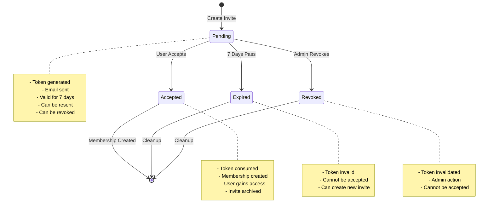
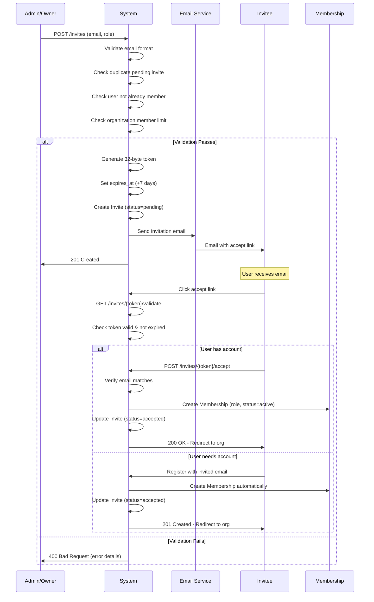

# Team Invitations

## Overview

The team invitation system provides a secure, token-based mechanism for adding new members to organizations. This decoupled approach separates the invitation process from membership creation, allowing users to be invited before they have accounts and supporting flexible onboarding workflows.

## Key Features

- **Token-Based Security**: 32-byte cryptographically secure tokens
- **Email Invitations**: Automatic email delivery with accept links
- **7-Day Expiration**: Default expiry with configurable duration
- **Role Pre-Assignment**: Specify member role before acceptance
- **Status Tracking**: Pending, Accepted, Expired, Revoked states
- **Resend Capability**: Generate new tokens for pending invites
- **Duplicate Prevention**: One pending invite per email per organization
- **Personal Messages**: Optional custom message from inviter

## Invitation Lifecycle



---

## Data Model

### Invite Model

**File**: [apps/organizations/models/invite.py](apps/organizations/models/invite.py)

```python
class Invite(models.Model):
    # Identity
    id = models.UUIDField(primary_key=True, default=uuid.uuid4)

    # Relationships
    organization = models.ForeignKey(
        'organizations.Organization',
        on_delete=models.CASCADE,
        related_name='invites'
    )
    invited_by = models.ForeignKey(
        settings.AUTH_USER_MODEL,
        on_delete=models.CASCADE,
        related_name='sent_invites'
    )

    # Invite Details
    email = models.EmailField(
        validators=[EmailValidator()],
        help_text="Email address of the person being invited"
    )
    role = models.CharField(
        max_length=10,
        choices=[
            ('owner', 'Owner'),
            ('admin', 'Admin'),
            ('member', 'Member'),
        ],
        default='member'
    )

    # Security
    token = models.CharField(
        max_length=255,
        unique=True,
        help_text="Unique token for accepting the invite"
    )
    expires_at = models.DateTimeField(
        help_text="When this invite expires"
    )

    # Status
    status = models.CharField(
        max_length=10,
        choices=[
            ('pending', 'Pending'),
            ('accepted', 'Accepted'),
            ('expired', 'Expired'),
            ('revoked', 'Revoked'),
        ],
        default='pending'
    )

    # Acceptance
    accepted_at = models.DateTimeField(null=True, blank=True)
    accepted_by = models.ForeignKey(
        settings.AUTH_USER_MODEL,
        on_delete=models.SET_NULL,
        null=True,
        blank=True,
        related_name='accepted_invites'
    )

    # Optional
    message = models.TextField(
        blank=True,
        help_text="Optional personal message from the inviter"
    )

    # Timestamps
    created_at = models.DateTimeField(auto_now_add=True)
    updated_at = models.DateTimeField(auto_now=True)

    class Meta:
        unique_together = [['organization', 'email', 'status']]
```

---

## Invitation Flow



---

## Token Security

### Token Generation

**File**: [apps/organizations/models/invite.py:168-176](apps/organizations/models/invite.py#L168-L176)

```python
def generate_token(self):
    """Generate a secure random token for the invite."""
    token = secrets.token_urlsafe(32)  # 32 bytes = 256 bits

    # Ensure token is unique (extremely unlikely collision, but safe)
    while Invite.objects.filter(token=token).exists():
        token = secrets.token_urlsafe(32)

    return token
```

**Security Properties**:
- **Length**: 32 bytes (256 bits of entropy)
- **Encoding**: URL-safe base64
- **Uniqueness**: Database-checked
- **Unpredictability**: Cryptographically secure random
- **One-Time Use**: Token consumed on acceptance

### Token Format Example

```
Example token: q7Y3zK9mP4xR8vW2nL5jH6tD1sF0gB3cA9eU7iO4pM2wQ8rT6yE1xN5hK3vC7bZ9
Length: 43 characters (URL-safe)
Entropy: 256 bits
```

---

## Business Rules

### Rule 1: Email Validation

**Enforcement**: Email must be valid format and unique per organization per status

**Validation** ([apps/organizations/models/invite.py:106-137](apps/organizations/models/invite.py#L106-L137)):

```python
def clean(self):
    # Validate email format
    if self.email:
        from django.core.validators import validate_email
        try:
            validate_email(self.email)
        except ValidationError:
            raise ValidationError({"email": "Enter a valid email address."})

    # Check for duplicate pending invites
    if not self.pk and self.email and self.organization:
        existing_invite = Invite.objects.filter(
            organization=self.organization,
            email__iexact=self.email,
            status='pending'
        ).first()

        if existing_invite:
            raise ValidationError(
                "A pending invite already exists for this email address."
            )
```

### Rule 2: User Already Member Check

**Enforcement**: Cannot invite user who already has membership

**Validation** ([apps/organizations/models/invite.py:139-154](apps/organizations/models/invite.py#L139-L154)):

```python
# Check if user already has membership
if self.email and self.organization and self.status == 'pending':
    from apps.accounts.models import Account

    try:
        user = Account.objects.get(email__iexact=self.email)
        existing_membership = self.organization.memberships.filter(
            user=user
        ).first()

        if existing_membership:
            raise ValidationError(
                "User already has a membership in this organization."
            )
    except Account.DoesNotExist:
        pass  # User doesn't exist yet, which is fine
```

### Rule 3: Organization Member Limit

**Enforcement**: Organization must have capacity for new member

**Validation** ([apps/organizations/models/invite.py:196-202](apps/organizations/models/invite.py#L196-L202)):

```python
def accept(self, user):
    # Check if organization can add more members
    if not self.organization.can_add_member():
        raise ValidationError(
            "Organization has reached its member limit for the current plan."
        )
```

### Rule 4: Expiration Validation

**Enforcement**: Expired invites cannot be accepted

**Implementation** ([apps/organizations/models/invite.py:178-184](apps/organizations/models/invite.py#L178-L184)):

```python
def is_valid(self):
    """Check if this invite is still valid."""
    return self.status == 'pending' and self.expires_at > timezone.now()

def is_expired(self):
    """Check if this invite has expired."""
    return timezone.now() > self.expires_at
```

---

## API Endpoints

### Invitation Management

| Endpoint | Method | Auth | Description |
|----------|--------|------|-------------|
| `/api/v1/organizations/{org_id}/invites/` | GET | Yes | List organization invites |
| `/api/v1/organizations/{org_id}/invites/` | POST | Yes | Create new invite |
| `/api/v1/organizations/{org_id}/invites/{id}/` | GET | Yes | Get invite details |
| `/api/v1/organizations/{org_id}/invites/{id}/` | DELETE | Yes | Revoke invite |
| `/api/v1/invites/{token}/validate/` | GET | No | Validate invite token |
| `/api/v1/invites/{token}/accept/` | POST | Yes | Accept invite |
| `/api/v1/organizations/{org_id}/invites/{id}/resend/` | POST | Yes | Resend invite email |

### Create Invite

**Endpoint**: `POST /api/v1/organizations/{org_id}/invites/`

**Request**:
```json
{
  "email": "newmember@example.com",
  "role": "member",
  "message": "Welcome to our team! Looking forward to working with you."
}
```

**Response** (201 Created):
```json
{
  "code": "INVITE_CREATED_201",
  "message": "Invitation sent successfully",
  "data": {
    "id": "789e0123-e89b-12d3-a456-426614174002",
    "email": "newmember@example.com",
    "role": "member",
    "status": "pending",
    "expiresAt": "2024-01-27T10:00:00Z",
    "invitedBy": {
      "id": "456e7890-e89b-12d3-a456-426614174001",
      "email": "admin@example.com",
      "name": "Jane Admin"
    },
    "message": "Welcome to our team! Looking forward to working with you.",
    "acceptUrl": "https://app.example.com/invite/q7Y3zK9mP4xR8vW2nL5jH6tD1sF0gB3cA9eU7iO4pM2wQ8rT6yE1xN5hK3vC7bZ9",
    "createdAt": "2024-01-20T10:00:00Z"
  }
}
```

### List Invites

**Endpoint**: `GET /api/v1/organizations/{org_id}/invites/`

**Query Parameters**:
- `status` - Filter by status (pending, accepted, expired, revoked)
- `email` - Filter by email address
- `invited_by` - Filter by inviter user ID

**Response** (200 OK):
```json
{
  "code": "INVITES_LIST_200",
  "data": [
    {
      "id": "789e0123-e89b-12d3-a456-426614174002",
      "email": "newmember@example.com",
      "role": "member",
      "status": "pending",
      "expiresAt": "2024-01-27T10:00:00Z",
      "invitedBy": {
        "email": "admin@example.com"
      },
      "createdAt": "2024-01-20T10:00:00Z"
    },
    {
      "id": "012e3456-e89b-12d3-a456-426614174003",
      "email": "developer@example.com",
      "role": "admin",
      "status": "accepted",
      "acceptedAt": "2024-01-18T15:30:00Z",
      "acceptedBy": {
        "email": "developer@example.com"
      },
      "createdAt": "2024-01-18T10:00:00Z"
    }
  ],
  "meta": {
    "total": 2,
    "pending": 1,
    "accepted": 1,
    "expired": 0,
    "revoked": 0
  }
}
```

### Validate Invite Token

**Endpoint**: `GET /api/v1/invites/{token}/validate/`

**Response** (200 OK - Valid):
```json
{
  "code": "INVITE_VALID_200",
  "data": {
    "valid": true,
    "organization": {
      "id": "123e4567-e89b-12d3-a456-426614174000",
      "name": "Acme Corporation",
      "logo": "https://example.com/logo.png"
    },
    "email": "newmember@example.com",
    "role": "member",
    "expiresAt": "2024-01-27T10:00:00Z",
    "invitedBy": {
      "name": "Jane Admin",
      "email": "admin@example.com"
    },
    "message": "Welcome to our team!"
  }
}
```

**Response** (400 Bad Request - Invalid/Expired):
```json
{
  "code": "INVITE_INVALID_400",
  "message": "This invite has expired or is no longer valid",
  "data": {
    "valid": false,
    "reason": "expired",
    "expiredAt": "2024-01-27T10:00:00Z"
  }
}
```

### Accept Invite

**Endpoint**: `POST /api/v1/invites/{token}/accept/`

**Request**: (Empty body, token in URL)

**Response** (200 OK):
```json
{
  "code": "INVITE_ACCEPTED_200",
  "message": "You have successfully joined the organization",
  "data": {
    "organization": {
      "id": "123e4567-e89b-12d3-a456-426614174000",
      "name": "Acme Corporation",
      "subdomain": "acme-corp"
    },
    "membership": {
      "id": "345e6789-e89b-12d3-a456-426614174004",
      "role": "member",
      "status": "active",
      "joinedAt": "2024-01-21T11:00:00Z"
    },
    "redirectUrl": "/dashboard"
  }
}
```

### Resend Invite

**Endpoint**: `POST /api/v1/organizations/{org_id}/invites/{id}/resend/`

**Response** (200 OK):
```json
{
  "code": "INVITE_RESENT_200",
  "message": "Invitation email resent successfully",
  "data": {
    "id": "789e0123-e89b-12d3-a456-426614174002",
    "email": "newmember@example.com",
    "newToken": "a1B2c3D4e5F6g7H8i9J0k1L2m3N4o5P6q7R8s9T0u1V2w3X4y5Z6",
    "expiresAt": "2024-01-28T14:00:00Z",
    "resentAt": "2024-01-21T14:00:00Z"
  }
}
```

### Revoke Invite

**Endpoint**: `DELETE /api/v1/organizations/{org_id}/invites/{id}/`

**Response** (200 OK):
```json
{
  "code": "INVITE_REVOKED_200",
  "message": "Invitation revoked successfully",
  "data": {
    "id": "789e0123-e89b-12d3-a456-426614174002",
    "status": "revoked",
    "revokedAt": "2024-01-21T15:00:00Z"
  }
}
```

---

## Acceptance Flow

### Accept Method

**File**: [apps/organizations/models/invite.py:186-231](apps/organizations/models/invite.py#L186-L231)

```python
def accept(self, user):
    """Accept this invite and create the membership."""
    if not self.is_valid():
        if self.is_expired():
            raise ValidationError("This invite has expired.")
        else:
            raise ValidationError("This invite is no longer valid.")

    # Check if email matches user
    if user.email.lower() != self.email.lower():
        raise ValidationError("Invite email does not match your account email.")

    # Check if organization can add more members
    if not self.organization.can_add_member():
        raise ValidationError(
            "Organization has reached its member limit for the current plan."
        )

    # Check if user already has membership
    from .membership import OrganizationMembership
    existing_membership = OrganizationMembership.objects.filter(
        organization=self.organization,
        user=user
    ).first()

    if existing_membership:
        raise ValidationError(
            "User already has a membership in this organization."
        )

    # Create the membership
    membership = OrganizationMembership.objects.create(
        organization=self.organization,
        user=user,
        role=self.role,
        status='active',
        invited_by=self.invited_by
    )

    # Mark invite as accepted
    self.status = 'accepted'
    self.accepted_at = timezone.now()
    self.accepted_by = user
    self.save(update_fields=['status', 'accepted_at', 'accepted_by', 'updated_at'])

    return membership
```

---

## Resend & Revoke

### Resend Invite

**File**: [apps/organizations/models/invite.py:241-259](apps/organizations/models/invite.py#L241-L259)

```python
def resend(self):
    """Resend this invite (extends expiry and generates new token)."""
    if self.status != 'pending':
        raise ValidationError("Can only resend pending invites.")

    if self.is_expired():
        # Mark as expired first
        self.status = 'expired'
        self.save(update_fields=['status', 'updated_at'])
        raise ValidationError(
            "Cannot resend expired invite. Create a new one instead."
        )

    self.token = self.generate_token()
    self.expires_at = timezone.now() + timedelta(days=7)
    self.save(update_fields=['token', 'expires_at', 'updated_at'])

    # TODO: Send email notification
    return self.token
```

### Revoke Invite

**File**: [apps/organizations/models/invite.py:233-239](apps/organizations/models/invite.py#L233-L239)

```python
def revoke(self):
    """Revoke this invite."""
    if self.status != 'pending':
        raise ValidationError("Can only revoke pending invites.")

    self.status = 'revoked'
    self.save(update_fields=['status', 'updated_at'])
```

---

## Email Integration

### Invitation Email Template

**Template Variables**:
- `{{organization_name}}` - Organization name
- `{{inviter_name}}` - Name of person who sent invite
- `{{inviter_email}}` - Email of inviter
- `{{role}}` - Role being offered (Owner, Admin, Member)
- `{{accept_url}}` - URL with token for acceptance
- `{{expires_at}}` - Expiration date/time
- `{{custom_message}}` - Optional personal message

**Email Content Example**:
```
Subject: You've been invited to join {{organization_name}}

Hi there!

{{inviter_name}} ({{inviter_email}}) has invited you to join {{organization_name}} as a {{role}}.

{{#if custom_message}}
Personal message from {{inviter_name}}:
"{{custom_message}}"
{{/if}}

Click the link below to accept this invitation:
{{accept_url}}

This invitation will expire on {{expires_at}}.

If you don't have an account yet, you'll be able to create one when you accept the invitation.

Best regards,
The {{organization_name}} Team
```

---

## Testing

### Unit Tests

**File**: `apps/organizations/tests/test_invite.py`

```python
def test_create_invite():
    """Test invite creation with token generation"""

def test_duplicate_pending_invite():
    """Test cannot create duplicate pending invite"""

def test_invite_expiration():
    """Test invite expires after 7 days"""

def test_accept_valid_invite():
    """Test accepting valid invite creates membership"""

def test_accept_expired_invite():
    """Test expired invite cannot be accepted"""

def test_email_mismatch():
    """Test user email must match invite email"""

def test_user_already_member():
    """Test cannot accept if already a member"""

def test_member_limit_reached():
    """Test organization member limit validation"""

def test_resend_invite():
    """Test resending invite generates new token"""

def test_revoke_invite():
    """Test revoking pending invite"""

def test_cannot_revoke_accepted():
    """Test cannot revoke accepted invite"""
```

### Running Tests

```bash
# All invite tests
docker compose -f ./docker/docker-compose.yml run --rm web pytest apps/organizations/tests/test_invite.py -v

# Specific test
docker compose -f ./docker/docker-compose.yml run --rm web pytest apps/organizations/tests/test_invite.py::test_accept_valid_invite -v
```

---

## Common Use Cases

### Use Case 1: Inviting New Team Member

**Scenario**: Admin invites a new developer to join the team

**Flow**:
1. Admin clicks "Invite Member"
2. Enters email: `developer@example.com`
3. Selects role: "Member"
4. Adds message: "Excited to have you on the team!"
5. System validates:
   - Email format ✓
   - No duplicate pending invite ✓
   - User not already member ✓
   - Organization under member limit ✓
6. System generates secure token
7. System sends invitation email
8. Developer receives email
9. Developer clicks accept link
10. System creates active membership
11. Developer gains access to organization

### Use Case 2: Inviting User Who Doesn't Have Account

**Scenario**: Owner invites consultant who hasn't signed up yet

**Flow**:
1. Owner sends invite to `consultant@example.com`
2. Consultant receives email
3. Consultant clicks accept link
4. System detects no account exists
5. System redirects to registration with:
   - Pre-filled email
   - Invite token preserved
6. Consultant completes registration
7. System automatically:
   - Creates user account
   - Accepts pending invite
   - Creates organization membership
8. Consultant lands in organization dashboard

### Use Case 3: Resending Expired Invite

**Scenario**: Invite expired before user could accept

**Flow**:
1. Admin views pending invites
2. Sees invite expired yesterday
3. Clicks "Resend Invite"
4. System:
   - Marks old invite as expired
   - Creates new invite with new token
   - Extends expiration to +7 days
   - Sends new email
5. User receives fresh invitation email

### Use Case 4: Revoking Invite

**Scenario**: Admin changes mind about inviting someone

**Flow**:
1. Admin views pending invites
2. Clicks "Revoke" on pending invite
3. System confirms revocation
4. Invite status → "revoked"
5. Token becomes invalid
6. If user tries to accept, sees "Invite no longer valid"

---

## Security Considerations

### 1. Token Security

- **Length**: 32 bytes (256 bits) provides strong security
- **Encoding**: URL-safe base64 prevents special character issues
- **Uniqueness**: Database-checked to prevent collisions
- **One-Time Use**: Token consumed on acceptance
- **Expiration**: 7-day limit reduces exposure window

### 2. Email Verification

- Invite acceptance requires authenticated user
- User's email must match invite email exactly (case-insensitive)
- Prevents token theft/forwarding attacks

### 3. Rate Limiting

- Limit invite creation per organization
- Limit resend attempts per invite
- Prevent invitation spam

### 4. Audit Logging

- Log all invite creations
- Log all acceptances
- Log all revocations
- Track IP addresses for security analysis

---

## Troubleshooting

### Issue: Invite Email Not Received

**Symptom**: User doesn't receive invitation email

**Solutions**:
1. Check spam/junk folder
2. Verify email address is correct
3. Resend invite to generate new token
4. Check email service configuration
5. View email logs for delivery status

### Issue: Cannot Accept Invite - "Email Mismatch"

**Symptom**: Error when accepting invite

**Cause**: User's account email doesn't match invite email

**Solutions**:
1. Verify you're logged in with correct account
2. Ask admin to send invite to your account email
3. Update your account email to match invite

### Issue: Invite Expired

**Symptom**: "This invite has expired" error

**Solutions**:
1. Ask admin to resend invitation
2. Admin creates new invite (old one auto-expired)
3. Accept invites promptly (within 7 days)

### Issue: "Already a Member" Error

**Symptom**: Cannot accept invite, already member

**Cause**: User already has membership in organization

**Solutions**:
1. Admin revokes duplicate invite
2. User logs in to access organization
3. If seeing wrong org, check account email

---

## Related Documentation

- [Organization Management](./organization-management.md) - Organization overview
- [Organization Membership](./organization-membership.md) - Managing team roles
- [User Registration Flow](./user-registration-flow.md) - Account creation
- [Email Service](./email-service.md) - Email delivery system

---

## Conclusion

The team invitation system provides a secure, flexible way to add members to organizations with email-based verification, role pre-assignment, and comprehensive status tracking. The token-based approach ensures security while the 7-day expiration balances usability with security best practices.
