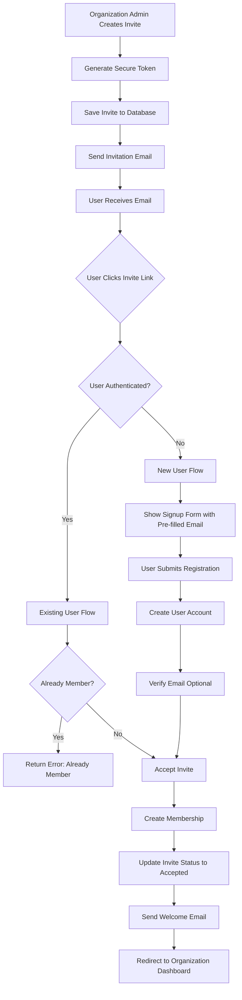
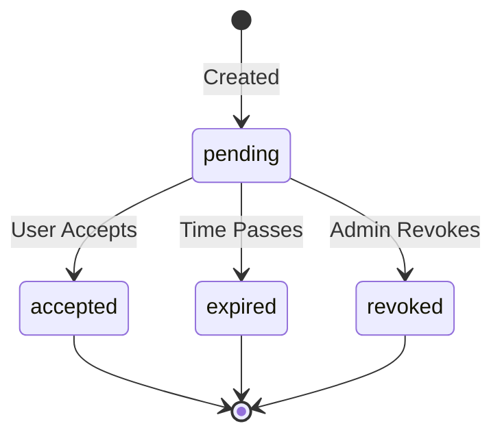

# User Invitation Flow

## Overview

The VAS-DJ SaaS platform implements a comprehensive user invitation system that allows organization owners and admins to invite team members to join their organization. This document describes the complete user invitation flow, from invitation creation to acceptance and user onboarding.

## Key Features

- **Email-Based Invitations**: Secure token-based invitation system
- **Role Assignment**: Specify user role during invitation (admin, member, etc.)
- **Expiration Management**: Configurable invitation expiration (default: 7 days)
- **New User Support**: Invited users can create accounts if they don't exist
- **Existing User Support**: Existing users can join additional organizations
- **Multi-Organization Support**: Users can belong to multiple organizations
- **Security**: Cryptographically secure tokens with expiration
- **Audit Trail**: Track who invited whom and when

## Invitation Target Audience

This invitation flow is designed for:
- **Team Members**: Employees joining their company's organization
- **Collaborators**: Partners or contractors invited to specific projects
- **Existing Users**: Users joining additional organizations
- **New Users**: First-time users joining via invitation link

## Invitation vs Organization Registration

**Important Distinction**: This flow is for joining EXISTING organizations, not creating new ones.

### User Invitation Flow (This Document)
- **Purpose**: Join an existing organization via invitation
- **Who**: Team members, employees, invited collaborators
- **Frontend**: Simple user signup via invite link (`/accept-invite?token=xyz`)
- **Result**: User joins existing organization as specified role
- **Fields**: Personal info only (organization pre-determined)
- **Authentication**: Can be authenticated (existing user) or unauthenticated (new user)

### Organization Registration (Separate Process)
- **Purpose**: Create a new organization + first owner account
- **Who**: Business owners, team leads, decision makers
- **Frontend**: Dedicated organization registration page (`/register-organization`)
- **Result**: New organization + user becomes owner/admin
- **Fields**: Personal info + organization details + subdomain

---

## Data Flow Diagram



---

## Invitation Flow Steps

### Phase 1: Invitation Creation (Organization Admin)

#### Step 1: Admin Initiates Invitation

**Endpoint**: `POST /api/v1/organizations/{org_id}/invites/`

**Required Permissions**:
- User must be organization member
- User must have `can_invite_users` permission (owners and admins)

**Required Fields**:
```json
{
  "email": "newmember@example.com",
  "role": "member"
}
```

**Optional Fields**:
```json
{
  "message": "Welcome to our team! We're excited to have you."
}
```

**Role Options**:
- `owner`: Full organization control (transfer ownership)
- `admin`: Can manage users and settings
- `member`: Standard user access

#### Step 2: Token Generation

**Implementation**: [`apps/organizations/models/invite.py:160-173`](apps/organizations/models/invite.py#L160-L173)

```python
import secrets

token = secrets.token_urlsafe(32)  # 256-bit secure random token
expires_at = timezone.now() + timedelta(days=7)  # Default 7 days

invite = Invite.objects.create(
    organization=organization,
    email=email,
    role=role,
    token=token,
    expires_at=expires_at,
    invited_by=request.user,
    status="pending"
)
```

**Token Security**:
- 256-bit cryptographically secure random token
- URL-safe encoding
- Unique database constraint
- Time-limited validity

#### Step 3: Invitation Email Sent

**Email Contents**:
- Invitation link with token: `https://app.example.com/accept-invite?token=abc123...`
- Organization name and inviter details
- Role being offered
- Expiration date/time
- Custom message (if provided)

**Email Template Variables**:
```python
{
    'organization_name': 'Acme Corp',
    'inviter_name': 'John Doe',
    'role': 'Member',
    'invite_url': 'https://app.example.com/accept-invite?token=abc123',
    'expires_at': '2024-01-22 10:30:00 UTC',
    'custom_message': 'Welcome to our team!'
}
```

#### Step 4: Invitation Created Response

**Success Response** (HTTP 201 Created):
```json
{
  "code": "ORG_INVITE_CREATED_201",
  "message": "Invitation sent successfully",
  "data": {
    "id": "789e0123-e89b-12d3-a456-426614174002",
    "email": "newmember@example.com",
    "role": "member",
    "status": "pending",
    "expiresAt": "2024-01-22T10:30:00Z",
    "inviteUrl": "https://app.example.com/accept-invite?token=abc123...",
    "invitedBy": {
      "id": "123e4567-e89b-12d3-a456-426614174000",
      "name": "John Doe",
      "email": "john@example.com"
    },
    "createdAt": "2024-01-15T10:30:00Z"
  }
}
```

---

### Phase 2: Invitation Acceptance (Invited User)

#### Step 5: User Clicks Invitation Link

**Frontend Route**: `/accept-invite?token=abc123...`

**Token Validation** (Frontend):
1. Extract token from URL query parameter
2. Check if user is authenticated
3. Route to appropriate flow:
   - **Authenticated**: Direct to acceptance confirmation
   - **Unauthenticated**: Show signup/login options

#### Step 6A: Existing User Acceptance Flow (Authenticated)

**Endpoint**: `POST /api/v1/organizations/invites/accept/`

**Authentication**: Required (JWT Bearer token)

**Request Body**:
```json
{
  "token": "abc123def456ghi789..."
}
```

**Backend Validation**:
1. **Token Validation**: Check token exists and is valid
2. **Expiration Check**: Ensure invite hasn't expired
3. **Status Check**: Verify invite status is "pending"
4. **Email Match**: Confirm invite email matches authenticated user's email
5. **Duplicate Check**: Ensure user isn't already a member

**Implementation**: [`apps/organizations/serializers.py:245-270`](apps/organizations/serializers.py#L245-L270)

```python
@transaction.atomic
def save(self, user):
    invite = self.validated_data['invite']
    
    # Check if already member
    if OrganizationMembership.objects.filter(
        organization=invite.organization,
        user=user
    ).exists():
        raise ValidationError("User is already a member")
    
    # Create membership
    membership = OrganizationMembership.objects.create(
        organization=invite.organization,
        user=user,
        role=invite.role,
        status="active"
    )
    
    # Update invite status
    invite.status = "accepted"
    invite.accepted_at = timezone.now()
    invite.accepted_by = user
    invite.save()
    
    return membership
```

**Success Response** (HTTP 200 OK):
```json
{
  "code": "ORG_INVITE_ACCEPTED_200",
  "message": "Welcome to Acme Corp!",
  "data": {
    "membership": {
      "id": "456e7890-e89b-12d3-a456-426614174003",
      "organization": {
        "id": "789e0123-e89b-12d3-a456-426614174001",
        "name": "Acme Corp",
        "subdomain": "acme-corp"
      },
      "role": "member",
      "status": "active",
      "joinedAt": "2024-01-15T11:00:00Z"
    }
  }
}
```

#### Step 6B: New User Acceptance Flow (Unauthenticated)

**Frontend Flow**:
1. Display signup form with pre-filled email (read-only)
2. Require password and additional user details
3. Submit registration + invite acceptance in single transaction

**Endpoint**: `POST /api/v1/auth/register-with-invite/` *(Proposed)*

**Request Body**:
```json
{
  "token": "abc123def456ghi789...",
  "password": "SecurePassword123!",
  "passwordConfirm": "SecurePassword123!",
  "firstName": "Jane",
  "lastName": "Smith",
  "phone": "+1234567890"
}
```

**Backend Process** (Atomic Transaction):
```python
@transaction.atomic
def create_user_and_accept_invite(invite_token, user_data):
    # 1. Validate invite token
    invite = Invite.objects.get(token=invite_token, status='pending')
    invite.validate()  # Check expiration, etc.
    
    # 2. Create user account
    user = Account.objects.create_user(
        email=invite.email,  # Use invite email
        password=user_data['password'],
        first_name=user_data['first_name'],
        last_name=user_data['last_name'],
        status='ACTIVE',  # Active immediately (trusted via invitation)
        is_email_verified=False  # Will verify later
    )
    
    # 3. Create membership
    membership = OrganizationMembership.objects.create(
        organization=invite.organization,
        user=user,
        role=invite.role,
        status='active'
    )
    
    # 4. Update invite
    invite.status = 'accepted'
    invite.accepted_by = user
    invite.accepted_at = timezone.now()
    invite.save()
    
    # 5. Send verification email (optional)
    user.send_verification_email()
    
    return user, membership
```

**Success Response** (HTTP 201 Created):
```json
{
  "code": "AUTH_REGISTER_INVITE_201",
  "message": "Account created successfully! Welcome to Acme Corp!",
  "data": {
    "access": "eyJ0eXAiOiJKV1QiLCJhbGc...",
    "refresh": "eyJ0eXAiOiJKV1QiLCJhbGc...",
    "user": {
      "id": "123e4567-e89b-12d3-a456-426614174004",
      "email": "jane.smith@example.com",
      "firstName": "Jane",
      "lastName": "Smith",
      "fullName": "Jane Smith",
      "role": "USER",
      "isEmailVerified": false,
      "status": "ACTIVE"
    },
    "organization": {
      "id": "789e0123-e89b-12d3-a456-426614174001",
      "name": "Acme Corp",
      "subdomain": "acme-corp",
      "role": "member"
    }
  }
}
```

---

## Email Verification (Optional for Invited Users)

**Design Decision**: Email verification is optional for invited users because:
1. **Trusted Source**: Invitation validates email ownership
2. **Faster Onboarding**: Immediate access improves user experience
3. **Organization Trust**: Organization admin already vetted the email

**Implementation Options**:
- **Option A**: Skip email verification entirely (faster onboarding)
- **Option B**: Verify later (allow login but prompt verification)
- **Option C**: Verify before full access (most secure)

**Current Implementation**: Option B (Verify Later)
- User can login and access organization immediately
- Email verification reminder shown in dashboard
- Some features may require verified email

---

## Multi-Organization Support

### User Switching Between Organizations

When a user belongs to multiple organizations:

**Organization Selection Methods**:
1. **Subdomain-Based**: `https://acme.app.example.com` vs `https://widgets.app.example.com`
2. **Header-Based**: `X-Organization-ID` header in API requests
3. **JWT-Based**: Organization ID in access token
4. **Org Selector**: UI dropdown to switch active organization

**JWT Token with Multiple Orgs**:
```json
{
  "user_id": "123e4567-e89b-12d3-a456-426614174000",
  "email": "user@example.com",
  "organizations": [
    {
      "id": "789e0123-e89b-12d3-a456-426614174001",
      "role": "owner",
      "is_primary": true
    },
    {
      "id": "789e0123-e89b-12d3-a456-426614174005",
      "role": "member",
      "is_primary": false
    }
  ],
  "active_org_id": "789e0123-e89b-12d3-a456-426614174001"
}
```

### Primary Organization

**Primary Organization Logic**:
- First organization user creates becomes primary
- First organization user joins via invitation becomes primary (if no owned org)
- User can change primary organization in settings
- Primary org used for default context

---

## Security Features

### 1. Token Security
- 256-bit cryptographically secure random tokens
- URL-safe encoding (no special characters)
- Unique database constraint
- Time-limited validity (default: 7 days)
- One-time use (status changes to "accepted")

### 2. Email Verification
- Invite email must match user email
- Constant-time comparison prevents timing attacks
- Invitations tied to specific email address

### 3. Expiration Management
```python
def is_expired(self):
    return timezone.now() > self.expires_at

def validate(self):
    if self.is_expired():
        raise ValidationError("Invitation has expired")
    if self.status != 'pending':
        raise ValidationError("Invitation is no longer valid")
```

### 4. Permission Checks
- Only users with `can_invite_users` permission can create invites
- Organization owners and admins have this permission by default
- Invites scoped to organization (can't invite to other orgs)

### 5. Rate Limiting
- Invitation creation: 10 invites per hour per user
- Invitation acceptance: 5 attempts per hour per IP
- Prevents spam and abuse

### 6. Audit Trail
- Track who invited whom (`invited_by`)
- Track when invitation was accepted (`accepted_at`, `accepted_by`)
- Immutable invitation history

---

## Invitation States

### State Diagram



### State Descriptions

| State      | Description                           | Can Transition To                | User Action    |
| ---------- | ------------------------------------- | -------------------------------- | -------------- |
| `pending`  | Invitation sent, awaiting acceptance  | `accepted`, `expired`, `revoked` | Can accept     |
| `accepted` | User accepted and joined organization | None (final state)               | Already member |
| `expired`  | Invitation validity period passed     | None (final state)               | Cannot accept  |
| `revoked`  | Admin canceled invitation             | None (final state)               | Cannot accept  |

---

## Error Handling

### Common Invitation Errors

| Error Code             | HTTP Status | Reason                          | User Action                 |
| ---------------------- | ----------- | ------------------------------- | --------------------------- |
| `INVITE_TOKEN_INVALID` | 400         | Token not found or malformed    | Request new invitation      |
| `INVITE_EXPIRED`       | 400         | Invitation validity expired     | Request new invitation      |
| `INVITE_ALREADY_USED`  | 400         | Invitation already accepted     | Login with existing account |
| `INVITE_REVOKED`       | 400         | Admin canceled invitation       | Contact organization admin  |
| `USER_ALREADY_MEMBER`  | 400         | User already in organization    | Login to existing account   |
| `EMAIL_MISMATCH`       | 400         | Invite email doesn't match user | Use correct email address   |
| `NO_INVITE_PERMISSION` | 403         | User can't create invitations   | Contact organization owner  |

### Invitation Creation Errors

| Error Code              | HTTP Status | Reason                            | User Action                           |
| ----------------------- | ----------- | --------------------------------- | ------------------------------------- |
| `INVALID_EMAIL`         | 400         | Email format invalid              | Correct email format                  |
| `INVALID_ROLE`          | 400         | Role not recognized               | Use valid role (owner, admin, member) |
| `USER_ALREADY_MEMBER`   | 400         | Email already organization member | No action needed                      |
| `PENDING_INVITE_EXISTS` | 400         | Active invitation already sent    | Wait or resend existing invitation    |
| `RATE_LIMIT_EXCEEDED`   | 429         | Too many invitations sent         | Wait before sending more              |

---

## API Endpoints Reference

### Invitation Management Endpoints

| Endpoint                                                     | Method | Auth | Description                           |
| ------------------------------------------------------------ | ------ | ---- | ------------------------------------- |
| `/api/v1/organizations/{org_id}/invites/`                    | GET    | Yes  | List all invitations for organization |
| `/api/v1/organizations/{org_id}/invites/`                    | POST   | Yes  | Create new invitation                 |
| `/api/v1/organizations/{org_id}/invites/{invite_id}/`        | GET    | Yes  | Get invitation details                |
| `/api/v1/organizations/{org_id}/invites/{invite_id}/`        | DELETE | Yes  | Revoke invitation                     |
| `/api/v1/organizations/{org_id}/invites/{invite_id}/resend/` | POST   | Yes  | Resend invitation email               |

### Invitation Acceptance Endpoints

| Endpoint                                  | Method | Auth | Description                             |
| ----------------------------------------- | ------ | ---- | --------------------------------------- |
| `/api/v1/organizations/invites/accept/`   | POST   | Yes  | Accept invitation (existing user)       |
| `/api/v1/organizations/invites/validate/` | GET    | No   | Validate invitation token               |
| `/api/v1/auth/register-with-invite/`      | POST   | No   | Register + accept invitation (new user) |

---

## Frontend Integration

### Page Structure

**1. Organization Invite Users Page** (`/dashboard/team/invite`)
- Form to enter email and role
- List of pending invitations
- Ability to resend or revoke invitations

**2. Accept Invitation Page** (`/accept-invite?token=xyz`)
- Check if user is authenticated
- Show signup form for new users
- Show acceptance confirmation for existing users
- Display organization details and role being offered

**3. Organization Switcher** (`/dashboard`)
- Dropdown showing all user's organizations
- Switch between organizations
- Manage organization memberships

### Frontend Flow Example

```typescript
// 1. Check if user is authenticated
const isAuthenticated = !!authToken;

// 2. Validate invite token
const invite = await validateInviteToken(token);

if (!invite.valid) {
  showError(invite.error);
  return;
}

// 3. Route based on auth status
if (isAuthenticated) {
  // Existing user flow
  showAcceptanceConfirmation(invite);
} else {
  // New user flow
  showSignupForm(invite);
}

// 4. Handle acceptance
async function acceptInvitation() {
  if (isAuthenticated) {
    // Existing user
    await acceptInvite(token);
  } else {
    // New user - register + accept
    await registerWithInvite(token, userData);
  }
  
  // Redirect to organization dashboard
  redirectTo(`/dashboard?org=${invite.organizationId}`);
}
```

---

## Database Schema

### Affected Tables

1. **organizations_invite**
   - Stores invitation details
   - Links to organization and inviter

2. **organizations_organizationmembership**
   - Created when invitation is accepted
   - Links user to organization with role

3. **accounts_account**
   - User account (created for new users)
   - May belong to multiple organizations

### Invite Model Schema

```python
class Invite(models.Model):
    id = models.UUIDField(primary_key=True, default=uuid.uuid4)
    organization = models.ForeignKey(Organization, on_delete=models.CASCADE)
    email = models.EmailField()
    role = models.CharField(max_length=20, choices=ROLE_CHOICES)
    token = models.CharField(max_length=255, unique=True)
    status = models.CharField(max_length=20, choices=STATUS_CHOICES)
    message = models.TextField(blank=True)
    
    # Timestamps
    created_at = models.DateTimeField(auto_now_add=True)
    expires_at = models.DateTimeField()
    accepted_at = models.DateTimeField(null=True, blank=True)
    
    # Relations
    invited_by = models.ForeignKey(Account, related_name='sent_invites')
    accepted_by = models.ForeignKey(Account, null=True, related_name='accepted_invites')
```

---

## Testing

### Test Coverage

**Test Files**:
- `apps/organizations/tests/test_invites.py`: Invitation CRUD tests
- `apps/organizations/tests/test_invite_acceptance.py`: Acceptance flow tests
- `apps/organizations/tests/test_serializers.py`: Serializer tests
- `apps/organizations/tests/test_models.py`: Model method tests

### Test Scenarios

1. **Invitation Creation**
   - Valid invitation creation
   - Invalid email format
   - Invalid role
   - Duplicate pending invitation
   - User already member
   - Permission checks

2. **Invitation Acceptance (Existing User)**
   - Valid token acceptance
   - Expired token
   - Invalid token
   - Already accepted token
   - Email mismatch
   - Already organization member

3. **Invitation Acceptance (New User)**
   - Register and accept invitation
   - Email pre-filled from invitation
   - Immediate organization membership
   - JWT token with organization context

4. **Invitation Management**
   - List invitations
   - Revoke invitation
   - Resend invitation email
   - Invitation expiration

5. **Security**
   - Token uniqueness
   - Token expiration enforcement
   - Permission validation
   - Rate limiting

### Running Tests

```bash
# All invitation tests
make test-organizations

# Specific test file
docker compose -f ./docker/docker-compose.yml run --rm web pytest apps/organizations/tests/test_invites.py -v

# With coverage
make test-coverage
```

---

## Best Practices

### For Organization Admins

1. **Verify Email Addresses**: Double-check email addresses before sending invitations
2. **Use Custom Messages**: Add context to help invitees understand the invitation
3. **Set Appropriate Roles**: Start with "member" role, upgrade later if needed
4. **Monitor Pending Invitations**: Resend or revoke expired/unused invitations
5. **Review Members Regularly**: Audit organization membership periodically

### For Developers

1. **Validate Tokens Server-Side**: Never trust client-side validation alone
2. **Use Transactions**: Wrap acceptance flow in database transactions
3. **Handle Race Conditions**: Use database constraints to prevent duplicate memberships
4. **Implement Rate Limiting**: Prevent invitation spam and abuse
5. **Log Invitation Events**: Track invitation lifecycle for audit and debugging

---

## Future Enhancements

### Planned Features

1. **Bulk Invitations**: Invite multiple users via CSV upload
2. **Custom Expiration**: Allow admins to set custom expiration periods
3. **Invitation Templates**: Pre-defined invitation messages for common scenarios
4. **Guest Access**: Limited-time guest access without full membership
5. **Invitation Analytics**: Track invitation acceptance rates
6. **Role-Based Invitations**: Pre-configure permissions with invitation
7. **SSO Integration**: Auto-accept invitations for SSO users
8. **Slack/Teams Integration**: Send invitations via chat platforms

---

## Related Documentation

- [Organization Registration Flow](./org-registration-flow.md)
- [Multi-Tenancy Architecture](../architecture/multi-tenancy.md)
- [Organization Management](./organization-management.md)
- [Role-Based Access Control](../security/rbac.md)
- [API Documentation](http://localhost:8000/api/docs/)

---

## Support & Troubleshooting

### Common Issues

**Issue**: Invitation email not received
- Check spam/junk folder
- Verify email address is correct
- Check email service logs
- Resend invitation

**Issue**: "Invitation expired" error
- Request new invitation from organization admin
- Check system time is synchronized

**Issue**: "Already a member" error
- User is already in the organization
- Login with existing account
- Contact admin if access issues persist

**Issue**: Email mismatch error
- Use the email address the invitation was sent to
- Contact admin to send new invitation to correct email

### Getting Help

- **Documentation**: http://localhost:8000/api/docs/
- **Error Logs**: Check Sentry or application logs
- **Email Issues**: Check email service logs (Celery worker logs)
- **Support**: Contact organization admin or platform support

---

## Conclusion

The user invitation flow provides a secure, flexible, and user-friendly way for organization admins to grow their teams. Key benefits include:

✅ **Secure Token-Based System**: Cryptographically secure invitations with expiration
✅ **Seamless Onboarding**: Support for both new and existing users
✅ **Multi-Organization Support**: Users can join multiple organizations
✅ **Role-Based Access**: Assign appropriate permissions from the start
✅ **Audit Trail**: Complete tracking of invitation lifecycle
✅ **Flexible Integration**: Works with email/password and social authentication

This architecture complements the organization registration flow by providing a clear path for team growth while maintaining security and user experience standards.
