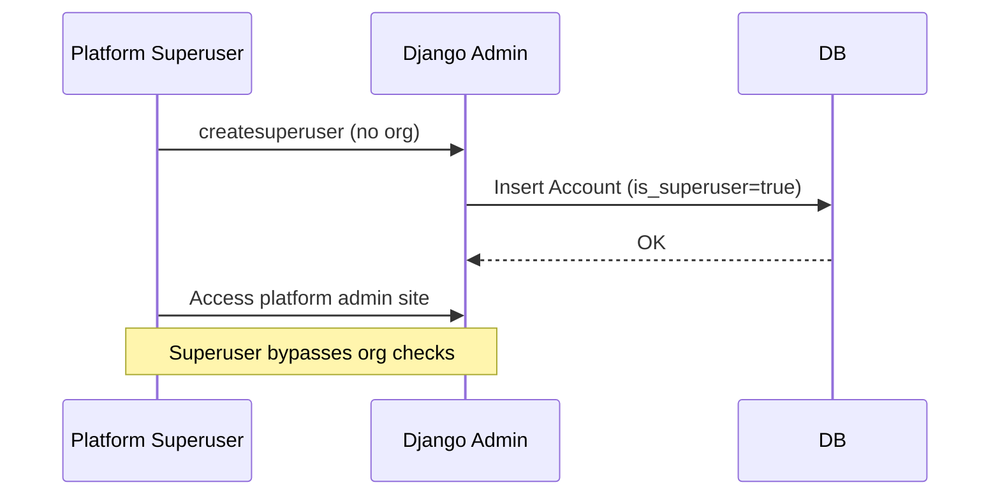
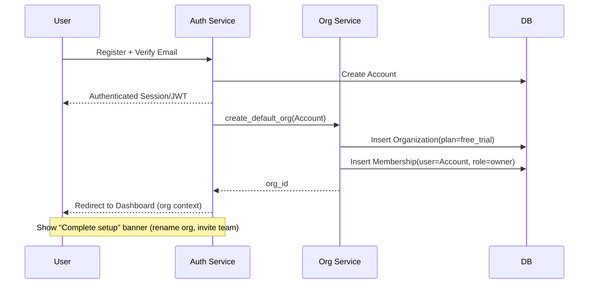
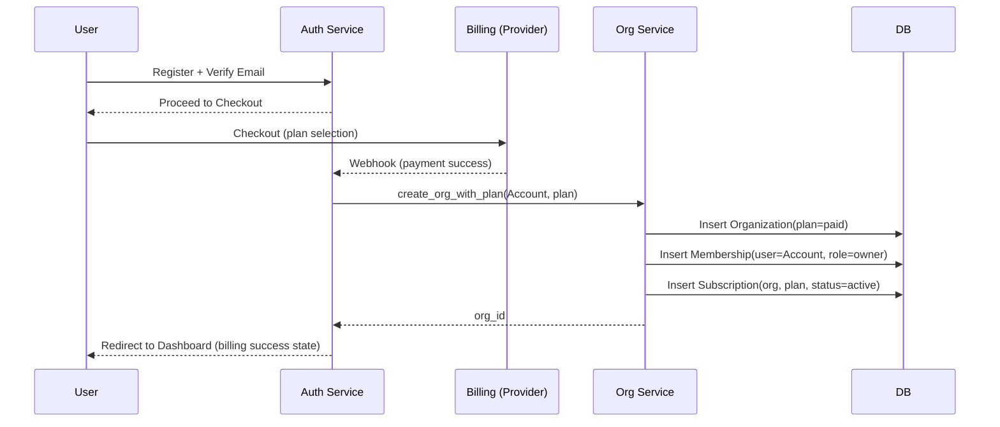
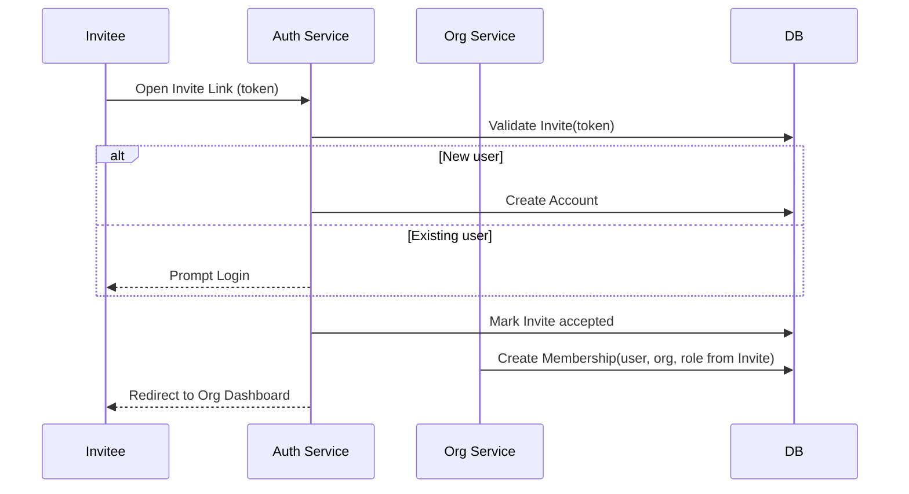
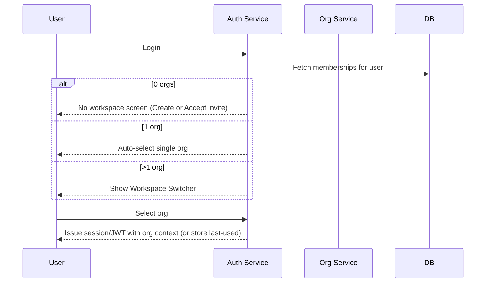

# VAS-DJ • Membership-Based Tenancy Architecture

> **Purpose**: Define the tenancy model, personas, and onboarding flows for a scalable multi-tenant SaaS where users can exist without being tied to a single organization. This doc is UI/implementation-agnostic and focuses on **ER relationships**, **persona journeys**, and **system invariants**. Use this as the source of truth across backend, frontend, and product.

---

## 1) Core Principles

- **Global Identity**: `Account` is not hard-coupled to any `Organization`.
- **Tenancy via Memberships**: `OrganizationMembership(user, organization, role, status)` governs access.
- **Org-Scoped Everything**: Data, configs, API keys, webhooks, billing are scoped to an `Organization`.
- **Platform Admin Separate**: Superusers operate at platform scope (Django Admin) and bypass tenant constraints.
- **Progressive Disclosure**: Create minimal friction in onboarding (auto-create default org for self-serve trial), defer heavy setup.

---

## 2) ER Model (High-Level)

```mermaid
erDiagram
    Account ||--o{ OrganizationMembership : "memberships"
    Organization ||--o{ OrganizationMembership : "memberships"
    Account ||--o{ Invite : "sent_invites"
    Organization ||--o{ Invite : "org_invites"

    Organization ||--o| Subscription : "active_subscription"
    Subscription }o--|| BillingProvider : "provider"

    Account {
      uuid id PK
      string email UNIQUE
      bool is_active
      bool is_staff
      bool is_superuser
      -- no required org FK (users can exist without org)
    }

    Organization {
      uuid id PK
      string name
      string slug UNIQUE
      string plan           -- free_trial | starter | pro | enterprise
      bool is_active
      uuid created_by FK Account
    }

    OrganizationMembership {
      uuid id PK
      uuid organization_id FK
      uuid user_id FK
      string role           -- owner | admin | member
      string status         -- invited | active | suspended
      datetime joined_at
      UNIQUE (organization_id, user_id)
    }

    Invite {
      uuid id PK
      uuid organization_id FK
      uuid invited_by_id FK Account
      string email
      string role           -- desired role on accept
      string token UNIQUE
      string status         -- pending | accepted | expired | revoked
      datetime expires_at
    }

    Subscription {
      uuid id PK
      uuid organization_id FK UNIQUE -- one active subscription per org
      string plan
      string status         -- trialing | active | past_due | canceled
      string external_id    -- provider subscription id (e.g., Stripe)
      datetime current_period_end
    }

    BillingProvider {
      string provider PK     -- e.g., stripe
      jsonb meta
    }
```

**Notes**

- `OrganizationMembership` provides N↔N between `Account` and `Organization`.
- `Invite` decouples onboarding and role assignment.
- `Subscription` is 1:1 with `Organization` (active record), simplifying billing logic.

---

## 3) Personas

1. **Platform Superuser** – Internal operator (global scope). No org required.
2. **Solo Trial User (Self-serve)** – Registers and gets a default org as `owner`.
3. **Paid Self-Serve Owner** – Registers, pays, then org is created and linked.
4. **Invited Teammate** – Joins an existing org via invite token.
5. **Multi-Org User** – Has multiple memberships, chooses workspace on login.
6. **Org Billing Admin** – Owner/Admin with billing permission.
7. **Suspended Member** – Membership `status=suspended` (org-level block only).

---

## 4) Onboarding Journeys (Sequence Diagrams)

### 4.1 Platform Superuser (Global)



### 4.2 Solo Trial User (Self-Serve)



### 4.3 Paid Self-Serve Owner



### 4.4 Invited Teammate



### 4.5 Multi-Org User (Workspace Switcher)



---

## 5) Access Control Model

- **Auth**: Global (session/JWT) at `Account` scope.
- **Scope**: Org-level via `OrganizationMembership`. All tenant endpoints require a valid `request.org`.
- **Superuser bypass**: `is_superuser` skips membership check for support/ops.
- **DRF Permissions**:
  - `IsOrgMember` – requires active membership in `request.org`.
  - `IsOrgOwner` – requires role `owner` in `request.org`.
  - Feature flags – check org plan/toggles for capabilities (e.g., manage billing).

---

## 6) Org Resolution (Middleware)

**Responsibility**: Attach `request.org` and enforce membership for authenticated users.

Resolution strategies (prefer in order):

1. **Subdomain**: `{slug}.app.com` → resolve by slug.
2. **Header**: `X-Org-Slug` (API)
3. **Query param**: `?org=slug` (dev/tools fallback)

**Rules**:

- If `request.org` set and `user` authenticated & not superuser → verify active membership.
- If invalid/absent → return 403/404 for tenant endpoints.

---

## 7) System Invariants & Policies

- A user can exist with **no org memberships**.
- Each org must have **≥ 1 owner** membership (enforce on role changes/deletes).
- `(organization_id, user_id)` unique in `OrganizationMembership`.
- `Subscription` is **1:1 with Organization** (active record); historical invoices live elsewhere.
- Tenant routes must **never** proceed without a resolved `request.org`.
- Superuser access is audited; consider read-only impersonation for support.

---

## 8) Migration Plan (Zero-Downtime Path)

1. **Introduce** `OrganizationMembership` model.
2. **Make** `Account.organization` **nullable** (deprecate use; keep help\_text warning).
3. **Backfill** memberships from existing FK (owner if staff/superuser else member).
4. **Switch** all authorization/scoping checks to memberships + `request.org`.
5. **Run** with feature flag `TENANCY_ENFORCE_MEMBERSHIP=True` to detect legacy FK use.
6. **After stability**, drop `Account.organization` FK entirely.

---

## 9) Admin Strategy

- **Django Admin**: Platform operations (superusers). View/manage any org, account, membership, plan catalogs.
- **Tenant Admin UX**: Build in your app with org context + permissions. Avoid exposing Django Admin to tenants.

---

## 10) UX Surfaces Required

- Auth: Register, Login, Email Verify.
- Workspace: No-workspace screen, Workspace Switcher, Org Settings (rename, members, keys, webhooks).
- Invites: Accept Invite (token), Resend Invite.
- Billing: Plan overview, Payment methods, Invoices (owner/admin).
- Observability (internal): Audit logs for invites, membership changes, billing changes.

---

## 11) Open Questions / Decisions

- **Billing roles**: Owner-only or Admin with capability flag?
- **Impersonation**: Allow support impersonation with audit logs?
- **Org deletion**: Soft-delete with grace period + data retention policy?
- **API keys**: Org-scoped with fine-grained permissions (future section).

---

## 12) Acceptance Criteria (Go/No-Go)

- `createsuperuser` works without org.
- User can exist with zero memberships.
- Self-serve trial creates default org+owner membership automatically.
- Invite path never creates default org for invitees.
- Multi-org switcher renders when `>1` memberships; persists last-used.
- DRF permissions enforce membership/owner where required; superuser bypass works.
- All tenant endpoints fail safely when org is missing/invalid.
- Code registry validations pass for new problem types and codes.

---

> **Next**: Wire these flows into API endpoints and middleware, then align frontend workspace navigation with the sequence diagrams above.

